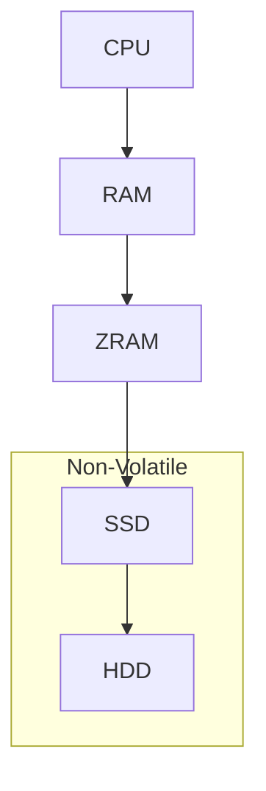

---
hide:
  - navigation
---

# Virtual Memory Under Linux

## Why does hydrus keep crashing under Linux when it has lots of virtual memory?

### Symptoms
- Hydrus crashes without a crash log
- Standard error reads `Killed`
- System logs say OOMKiller
- Programs appear to havevery high virtual memory utilization despite low real memory.

### tl;dr :: The fix

Add the followng line to the end of `/etc/sysctl.conf`. You will need admin, so use

 `sudo nano /etc/sysctl.conf` or
 `sudo gedit /etc/sysctl.conf`

```ini
vm.min_free_kbytes=1153434
vm.overcommit_memory=1
```

Check that you have (enough) swap space or you might still run out of memory.
```sh
sudo swapon --show
```

If you need swap
```sh
sudo fallocate -l 16G /swapfile #make 16GiB of swap
sudo chmod 600 /swapfile
sudo mkswap /swapfile
```
Add to `/etc/fstab` so your swap is mounted on reboot
```
/swapfile swap swap defaults 0 0
```

You may add as many swapfiles as you like, and should add a new swapfile before you delete an old one if you plan to do so, as unmounting a swapfile will evict its contents back in to real memory.  You may also wish to use a swapfile type that uses compression, this saves you some disk space for a little bit of a performance hit, but also significantly saves on mostly empty memory.

Reboot for all changes to take effect, or use `sysctl` to set `vm` variables.

### Details
Linux's memory allocator is lazy and does not perform opportunistic reclaim.  This means that the system will continue to give your process memory from the real and virtual memory pool(swap) until there is none left.

Linux will only cleanup if the available total real and virtual memory falls below the **watermark** as defined in the system control configuration file `/etc/sysctl.conf`.
The watermark's name is `vm.min_free_kbytes`, it is the number of kilobytes the system keeps in reserve, and therefore the maximum amount of memory the system can allocate in one go before needing to reclaim memory it gave eariler but which is no longer in use.

The default value is `vm.min_free_kbytes=65536`, which means 66MiB (megabytes).  

If for a given request the amount of memory asked to be allocated is under `vm.min_free_kbytes`, but this would result in an ammount of total free memory less than `vm.min_free_kbytes` then the OS will clean up memory to service the request.

If `vm.min_free_kbytes` is less than the ammount requested and there is no virtual memory left, then the system is officially unable to service the request and will lauch the OOMKiller (Out of Memory Killer) to free memory by kiling memory glut processes.

Increase the `vm.min_free_kbytes` value to prevent this scenario.

#### The OOM Killer
The OOM kill decides which program to kill to reclaim memory, since hydrus loves memory it is usually picked first, even if another program asking for memory caused the OOM condition.  Setting the minimum free kilobytes higher will avoid the running of the OOMkiller which is always preferable, and almost always preventable.

#### Memory Overcommmit
We mentioned that Linux will keep giving out memory, but actually it's possible for Linux to launch the OOM killer if it just feel like our program is aking for too much memory too quickly.  Since hydrus is a heavyweight scientific processing package we need to turn this feature off.  To turn it off change the value of `vm.overcommit_memory` which defaults to `2`.

Set `vm.overcommit_memory=1` this prevents the OS from using a heuristic and it will just always give memory to anyone who asks for it.

#### What about swappiness?
Swapiness is a setting you might have seen, but it only determines Linux's desire to spend a little bit of time moving memory you haven't touched in a while out of real memory and into virtual memory, it will not prevent the OOM condition it just determines how much time to use for moving things into swap.

## Why does my Linux system studder or become unresponsive when hydrus has been running a while?

You are running out of pages because Linux releases I/O buffer pages only when a file is closed, OR memory fragmentation in Hydrus is high because you have a big session weight or had a big I/O spike. Thus the OS is waiting for you to hit the watermark(as described in "why is hydrus crashing") to start freeing pages, which causes the chug.

When contents is written from memory to disk the page is retained so that if you reread that part of the disk the OS does not need to access disk it just pulls it from the much faster memory.  This is usually a good thing, but Hydrus makes many small writes to files you probably wont be asking for again soon it eats up pages over time.  

Hydrus also holds the database open and red/wrires new areas to it often even if it will not acess those parts again for ages.  It tends to accumulate lots of I/O cache for these small pages it will not be interested in. This is really good for hydrus (because it will over time have the root of the most important indexes in memory) but sucks for the responsiveness of other apps, and will cause hydrus to consume pages after doing a lengthy operation in anticipation of needing them again, even when it is thereafter idle.  You need to set `vm.dirtytime_expire_seconds` to a lower value.

> `vm.dirtytime_expire_seconds`
> When a lazytime inode is constantly having its pages dirtied, the inode with
> an updated timestamp will never get chance to be written out.  And, if the
> only thing that has happened on the file system is a dirtytime inode caused
> by an atime update, a worker will be scheduled to make sure that inode
> eventually gets pushed out to disk.  This tunable is used to define when dirty
> inode is old enough to be eligible for writeback by the kernel flusher threads.
> And, it is also used as the interval to wakeup dirtytime writeback thread.

On many distros this happens only once every 12 hours, try setting it close to every one hour or 2.  This will cause the OS to drop pages that were written over 1-2 hours ago.  Returning them to the free store for use by other programs.

https://www.kernel.org/doc/Documentation/sysctl/vm.txt


## Why does everything become clunky for a bit if I have tuned all of the above settings? (especially if I try to do something on the system that isn't hydrus)

The kernel launches a process called `kswapd` to swap and reclaim memory pages, after hydrus has used pages they need to be returned to the OS (unless fragmentation is preventing this).  The OS needs to scan for pages allocated to programs which are not in use, it doens't do this all the time because holding the required locks would have a serious performance impact.  The behaviour of `kswapd` is goverened by several important values.  If you are using a classic system with a reasonably sized amount of memoery and a swapfile you should tune these.  If you are using memory compression (or should be using memory compression because you have a cheap system) read this whole document for info specific to that configuration.

- `vm.watermark_scale_factor`
This factor controls the aggressiveness of kswapd. It defines the amount of memory left in a node/system before kswapd is woken up and how much memory needs to be free before kswapd goes back to sleep. The unit is in fractions of 10,000. The default value of 10 means the distances between watermarks are 0.1% of the available memory in the node/system. The maximum value is 1000, or 10% of memory. A high rate of threads entering direct reclaim (allocstall) or kswapd going to sleep prematurely (kswapd_low_wmark_hit_quickly) can indicate that the number of free pages kswapd maintains for latency reasons is too small for the allocation bursts occurring in the system. This knob can then be used to tune kswapd aggressiveness accordingly.

- `vm.watermark_boost_factor`: If memory fragmentation is high raise the scale factor to look for reclaimable/swappable pages more agressively.

I like to keep `watermark_scale_factor` at 70 (70/10,000)=0.7%, so kswapd will run until at least 0.7% of system memory has been reclaimed.
i.e. If 32GiB (real and virt) of memory, it will try to keep at least 0.224 GiB immediately available.


- `vm.dirty_ratio`: The absolute maximum number of un-synced memory(as a percentage of available memory) that the system will buffer before blocking writing processes.  This **protects you against OOM, but does not keep your system responsive**.
  - **Note**: A default installation of Ubuntu sets this way too high (60%) as it does not expect your workload to just be hammering possibly slow disks with written pages. **Even with memory overcomitting this can make you OOM**, because you will run out of real memory before the system pauses the program that is writing so hard.  A more reasonable value is 10 (10%)

- `vm.dirty_background_ratio`: How many the number of unsynced pages that can exist before the system starts comitting them in the background.  If this is set too low the system will constantly spend cycles trying to write out dirty pages.  If it is set too high it will be way to lazy.  I like to set it to 8.

- `vm.vfs_cache_pressure` The tendancy for the kernel to reclaim I/O cache for files and directories.  This is less important than the other values, but hydrus opens and closes lots of file handles so you may want to boost it a bit higher than default. Default=100, set to 110 to bias the kernel into reclaiming I/O pages over keeping them at a "fair rate" compared to other pages.  Hydrus tends to write a lot of files and then ignore them for a long time, so its a good idea to prefer freeing pages for infrequent I/O.
**Note**: Increasing `vfs_cache_pressure` significantly beyond 100 may have negative performance impact. Reclaim code needs to take various locks to find freeable directory and inode objects. With `vfs_cache_pressure=1000`, it will look for ten times more freeable objects than there are.

### Virtual Memory Under Linux 4: Unleash the memory

An example `/etc/sysctl.conf` section for virtual memory settings.

```ini
########
# virtual memory
########

#1 always overcommit, prevents the kernel from using a heuristic to decide that a process is bad for asking for a lot of memory at once and killing it.
#https://www.kernel.org/doc/Documentation/vm/overcommit-accounting
vm.overcommit_memory=1

#force linux to reclaim pages if under a gigabyte 
#is available so large chunk allocates don't fire off the OOM killer
vm.min_free_kbytes = 1153434

#Start freeing up pages that have been written but which are in open files, after 2 hours.
#Allows pages in long lived files to be reclaimed
vm.dirtytime_expire_seconds = 7200

#Have kswapd try to reclaim .7% = 70/10000 of pages before returning to sleep
#This increases responsiveness by reclaiming a larger portion of pages in low memory condition
#So that the next time you make a large allocation the kernel doesn't have to stall and look for pages to free immediately.
vm.watermark_scale_factor=70

#Have the kernel prefer to reclaim I/O pages at 110% of the rate at which it frees other pages.
#Don't set this value much over 100 or the kernel will spend all its time reclaiming I/O pages
vm.vfs_cache_pressure=110
```

## Virtual Memory Under Linux 5: Phenomenal Cosmic Power; Itty bitty living space
Are you trying to __run hydrus on a 200 dollar miniPC__, this is suprisingly doable, but you will need to really understand what you are tuning.

To start lets explain memory tiers.  As memory moves further away from the CPU it becomes slower.  Memory close to the CPU is volatile, which means if you remove power from it, it disappears forever.  Conversely disk is called non-volatile memory, or persistant storage.  We want to get files written to non-volatile storage, and we don't want to have to compete to read non-volatile storage, we would also prefer to not have to compete for writing, butthis is harder.

The most straight forward way of doing this is to seperate where hydrus writes its SQLITE database(index) files, from where it writes the imported files.  But we can make a more flexible setup that will also keep our system responsive, we just need to make sure that the system writes to the fastest possible place first.  So let's illustrate the options.



1. **RAM**: Information must be in RAM for it to be operated on
2. **ZRAM**: A compressed area of RAM that cannot be directly accessed.  Like a zip file but in memory.  Or for the more technical, like a compressed ramdisk.
3. **SSD**: Fast non-volatile storage,good for random access about 100-1000x slower than RAM.
4. **HDD**: Slow non-volatile storage good for random access.  About 10000x slowee than RAM.
5. **Tape**(Not shown): Slow archival storage or backup. surprisingly fast actually but can only be accessed sequentially.

The objective is to make the most of our limited hardware so we definitely want to go through zram first.  Depending on your configuration you might have a bulk storage (NAS) downstream that you can write the files to, if all of your storage is in the same tower as you are running hydrus, then make sure the SQLITE .db files are on an SSD volume.

Next you should enable [ZRAM](https://wiki.archlinux.org/title/Zram) devices (__**Not to be confused with ZWAP**__). A ZRAM device is a compressed swapfile that lives in RAM.

ZRAM can drastically improve performance, and RAM capacity. Experimentally, a 1.7GB partition usually shrinks to around 740MiB.  Depending on your system ZRAM may generate several partitions. The author asked for 4x2GB=8GIB partitions, hence the cited ratio.

**ZRAM must be created every boot as RAM-disks are lost when power is removed**
Install a zram generator as part of your startup process.  If you still do not have enough swap, you can still create a swapfile.  RAM can be configured to use a partition as fallback, but not a file.  However you can enable a standard swapfile as described in the prior section.  ZRAM generators usually create ZRAM partitions with the highest priority (lowest priority number) so ZRAM will fill up first, before normal disk swaping.

To check your swap configuration
```sh
swapon #no argument
cat /proc/swapinfo
```

To make maximum use of your swap make sure to **__SET THE FOLLOWING VM SETTINGS__**

```sh
#disable IO clustering we are writing to memroy which is super fast
#IF YOU DO NOT DO THIS YOUR SYSTEM WILL HITCH as it tries to lock multiple RAM pages.  This would be desirable on non-volatile storages but is actually bad on RAM.
vm.page-cluster=0

#Tell the system that it costs almost as much to swap as to write out dirty pages. But bias it very slightly to completing writes.  This is ideal since hydrus tends to hammer the system with writes, and we want to use ZRAM to eat spikes, but also want the system to slightly prefer writing dirty pages
vm.swappiness=99
```

----

The above is good for most users.  If however you also need to speed up your storage due to a high number of applications on your network using it you may wish to install cache, provided you have at least one or two avialable SSD slots, and the writing pattern is many small random writes.

You should never create a write cache without knowing what you are doing. You need two SSDs to crosscheck eachother, and ideally ressilant server SSDs with large capacitors that ensure all content is always written.  If you go with a commercial storage solution they will probably check this already, and give you a nice interface for just inserting and assigning SSD cache.

You can also create a cach manually wit the **Logical Volume** using the LVM.  If you do this you can group together storage volumes.  In particular you can put a [read or write cache](https://access.redhat.com/documentation/en-us/red_hat_enterprise_linux/6/html/logical_volume_manager_administration/lvm_cache_volume_creation) with an SSD in front of slower HDD. 
