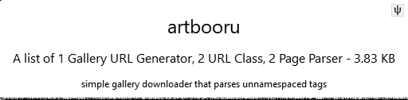

# adding new downloaders

## all downloaders are user-creatable and -shareable { id="anonymous" }

The client starts with no downloaders, but all downloaders can be created, edited, and shared by any user. Creating one from scratch is not simple, and it takes a little technical knowledge, but importing what someone else has created is easy.

Many Hydrus objects can be shared as data encoded into png files, like this:

This simple png is encoded with data that hydrus can read. It contains all the information needed for a client to add an [artbooru](https://artbooru.com) tag search entry to the list you select from when you start a new download or subscription.

You can get these pngs from anyone who has experience in the downloader system. An archive of more is maintained by users [here](https://github.com/CuddleBear92/Hydrus-Presets-and-Scripts/tree/master/Downloaders).

To 'add' the easy-import pngs to your client, hit _network->downloaders->import downloaders_. A little image-panel will appear. You can:

- Drag and drop a png file from a folder
- Drag and drop a (full-size) png from your web browser
- Click the image to open a file selection dialog for the png
- Copy the png bitmap ('Copy image'), file path, or raw downloader JSON into your clipboard and then hit the paste button

The client will then decode and go through the png, looking for interesting new objects. It gives you a 'does this look correct?' check, just to make sure there isn't some mistake or other glaring problem, and then automatically imports and links everything up.

## updates

Objects imported this way will try to take precedence over existing functionality, so if one of your downloaders breaks due to a site change, importing a fixed png here will generally overwrite the broken entries and become the new default.

Behind the scenes, downloaders are actually several different objects that are loosely connected. If successive updates break something or you are left with duplicate entries because of a rename, have a look around _network->downloader components_ and you will see what is actually imported by these pngs. The best solution is to delete any 'GUGs' and 'parsers' with names related to your downloader so you have a fresh slate and then try a fresh import once more.
