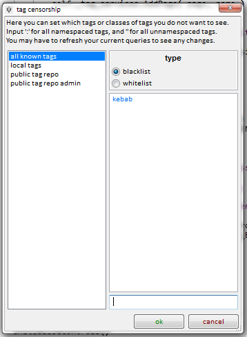
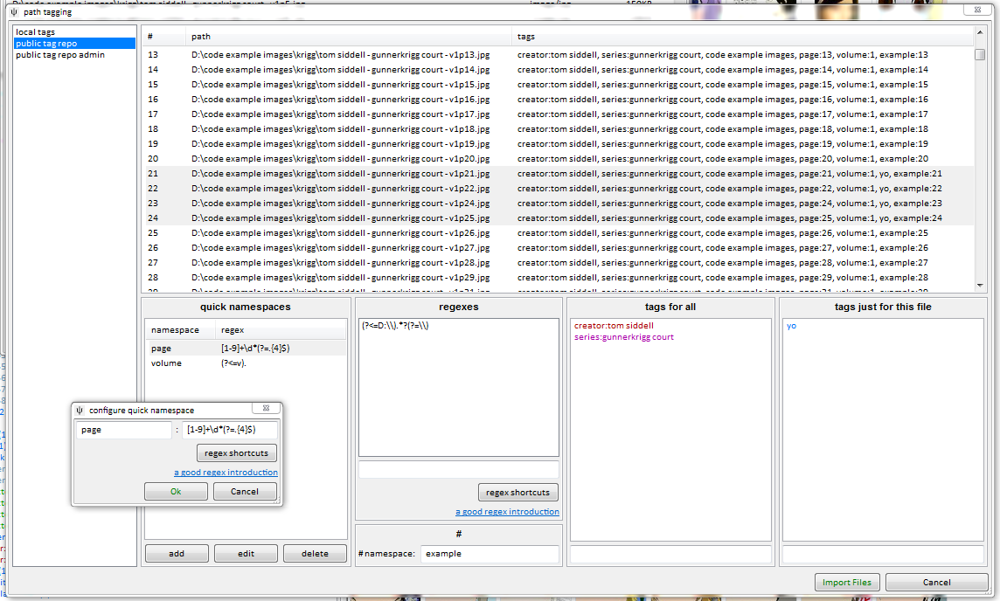
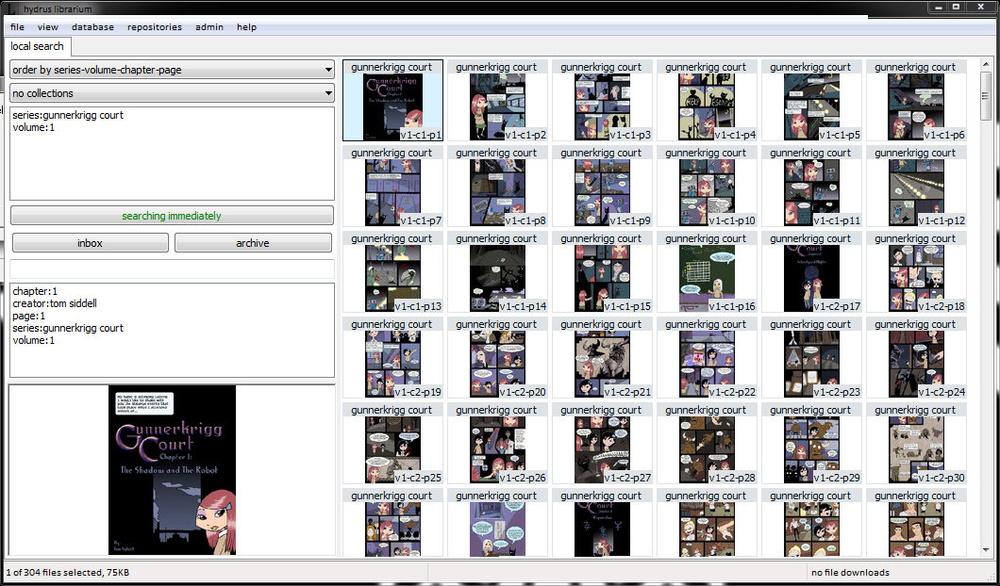
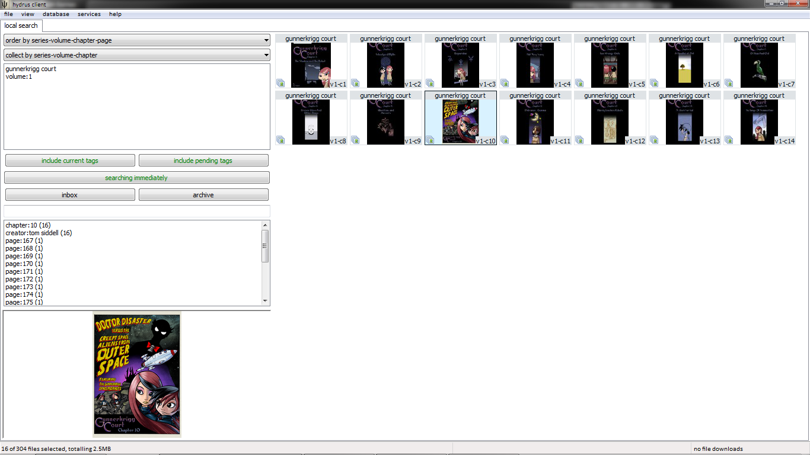
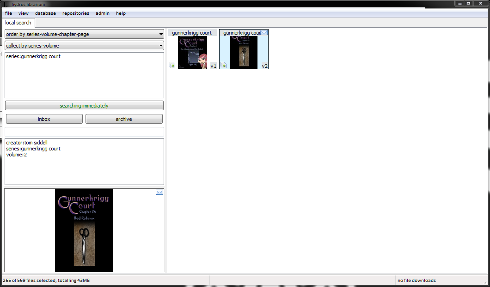
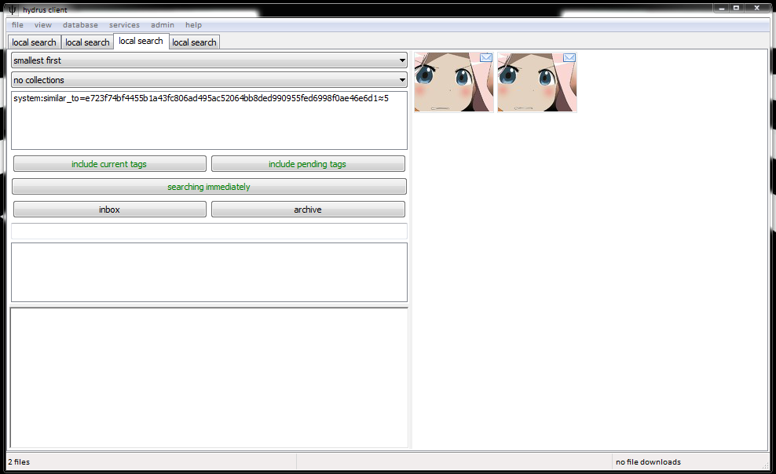

# general clever tricks

!!! note "this is non-comprehensive"
	I am always changing and adding little things. The best way to learn is just to look around. If you think a shortcut should probably do something, try it out! If you can't find something, let me know and I'll try to add it!

## advanced mode { id="advanced_mode" }

To avoid confusing clutter, several advanced menu items and buttons are hidden by default. When you are comfortable with the program, hit _help->advanced mode_ to reveal them!

## exclude deleted files { id="exclude_deleted_files" }

In the client's options is a checkbox to exclude deleted files. It recurs pretty much anywhere you can import, under 'import file options'. If you select this, any file you ever deleted will be excluded from all future remote searches and import operations. This can stop you from importing/downloading and filtering out the same bad files several times over. The default is off. You may wish to have it set one way most of the time, but switch it the other just for one specific import or search.

## inputting non-english lanuages { id="ime" }

If you typically use an IME to input Japanese or another non-english language, you may have encountered problems entering into the autocomplete tag entry control in that you need Up/Down/Enter to navigate the IME, but the autocomplete steals those key presses away to navigate the list of results. To fix this, press Insert to temporarily disable the autocomplete's key event capture. The autocomplete text box will change colour to let you know it has released its normal key capture. Use your IME to get the text you want, then hit Insert again to restore the autocomplete to normal behaviour.

## tag display { id="tag_display" }

If you do not like a particular tag or namespace, you can easily hide it with _tags->manage tag display and search_:

_This image is out of date, sorry!_

You can exclude single tags, like as shown above, or entire namespaces (enter the colon, like 'species:'), or all namespaced tags (use ':'), or all unnamespaced tags (''). 'all known tags' will be applied to everything, as well as any repository-specific rules you set.

A blacklist excludes whatever is listed; a whitelist excludes whatever is _not_ listed.

This censorship is local to your client. No one else will experience your changes or know what you have censored.

## importing and adding tags at the same time { id="importing_with_tags" }

_Add tags before importing_ on _file->import files_ lets you give tags to the files you import _en masse_, and intelligently, using regexes that parse filename:

This should be somewhat self-explanatory to anyone familiar with regexes. I hate them, personally, but I recognise they are powerful and exactly the right tool to use in this case. [This](http://www.aivosto.com/vbtips/regex.html) is a good introduction.

Once you are done, you'll get something neat like this:

Which you can more easily manage by collecting:

Collections have a small icon in the bottom left corner. Selecting them actually selects many files (see the status bar), and performing an action on them (like archiving, uploading) will do so to every file in the collection. Viewing collections fullscreen pages through their contents just like an uncollected search.

Here is a particularly zoomed out view, after importing volume 2:

Importing with tags is great for long-running series with well-formatted filenames, and will save you literally hours' finicky tagging.

## tag migration { id="tag_migration" }

!!! danger
	At _some_ point I will write some better help for this system, which is powerful. Be careful with it!

Sometimes, you may wish to move thousands or millions of tags from one place to another. These actions are now collected in one place: _services->tag migration_.

It proceeds from left to right, reading data from the source and applying it to the destination with the certain action. There are multiple filters available to select which sorts of tag mappings or siblings or parents will be selected from the source. The source and destination can be the same, for instance if you wanted to delete all 'clothing:' tags from a service, you would pull all those tags and then apply the 'delete' action on the same service.

You can import from and export to Hydrus Tag Archives (HTAs), which are external, portable .db files. In this way, you can move millions of tags between two hydrus clients, or share with a friend, or import from an HTA put together from a website scrape.

Tag Migration is a powerful system. Be very careful with it. Do small experiments before starting large jobs, and if you intend to migrate millions of tags, make a backup of your db beforehand, just in case it goes wrong.

This system was once much more simple, but it still had HTA support. If you wish to play around with some HTAs, there are some old user-created ones [here](https://www.mediafire.com/folder/yoy1dx6or0tnr/tag_archives).

## custom shortcuts { id="shortcuts" }

Once you are comfortable with manually setting tags and ratings, you may be interested in setting some shortcuts to do it quicker. Try hitting _file->shortcuts_ or clicking the keyboard icon on any media viewer window's top hover window.

There are two kinds of shortcuts in the program--_reserved_, which have fixed names, are undeletable, and are always active in certain contexts (related to their name), and _custom_, which you create and name and edit and are only active in a media viewer when you want them to. You can redefine some simple shortcut commands, but most importantly, you can create shortcuts for adding/removing a tag or setting/unsetting a rating.

Use the same 'keyboard' icon to set the current and default custom shortcuts.

## finding duplicates { id="finding_duplicates" }

_system:similar_to_ lets you run the duplicates processing page's searches manually. You can either insert the hash and hamming distance manually, or you can launch these searches automatically from the thumbnail _right-click->find similar files_ menu. For example:

## truncated/malformed file import errors { id="file_import_errors" }

Some files, even though they seem ok in another program, will not import to hydrus. This is usually because they file has some 'truncated' or broken data, probably due to a bad upload or storage at some point in its internet history. While sophisticated external programs can usually patch the error (often rendering the bottom lines of a jpeg as grey, for instance), hydrus is not so clever. Please feel free to send or link me, hydrus developer, to these files, so I can check them out on my end and try to fix support.

If the file is one you particularly care about, the easiest solution is to open it in photoshop or gimp and save it again. Those programs should be clever enough to parse the file's weirdness, and then make a nice clean saved file when it exports. That new file should be importable to hydrus.

## setting a password { id="password" }

the client offers a very simple password system, enough to keep out noobs. You can set it at _database->set a password_. It will thereafter ask for the password every time you start the program, and will not open without it. However none of the database is encrypted, and someone with enough enthusiasm or a tool and access to your computer can still very easily see what files you have. The password is mainly to stop idle snoops checking your images if you are away from your machine.
