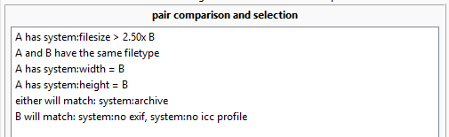

**Hey, this is all for a system that is close to launching but still has some rough edges. If you are new to hydrus, please come back in a few months!**

## the problem with duplicates processing

The duplicates filter can get pretty tedious. Pairs that are obvious resizes or pixel duplicates are easy to resolve but boring to work through.

If only there were some way to automate common decisions! Hydrus could solve these trivial duplicates in the background using a certain decision logic, leaving us with less, more interesting work to do.

!!! warning "Be careful!"
    Automated systems are powerful magic wands, and we should always be careful waving them around. Make sure you are hesitant rather than confident and always check the preview tab to make sure what you are about to do makes sense. Starting _any_ new rule in semi-automatic mode is a great idea, too. There are some undo tools if things go wrong, but they aren't perfect.
    
    If you plan to do something huge, like deleting 50,000 files, plan it around your next scheduled backup.

!!! info "Everything is off by default"
    Resolving duplicates is a highly subjective issue. Maybe you think EXIF data is the best, or maybe you always want it gone. Maybe you never want to delete low quality files, or always merge URLs, or set an artist correction as a duplicate instead of an alternate. People simply differ.
    
    This system has templated quick-start suggestions, but they are not mandatory. I have made general decisions that will work for many users, but if you care, you should double-check anything before starting it. The whole system is highly configurable, and you are encouraged to set it up exactly as you want. Everything is off by default!

## philosophy

**This system is designed mostly for setting simple and clear "A is better than B" duplicate actions. I do not recommend trying to set up "alternates" rules or anything else overly clever at this stage--it is too easy to make a mistake.**

Generally speaking, for most situations, the original versions of files are better than derived copies. When a file is converted, the best case is only that the data is preserved losslessly. Most of the time, a little entropy is added. A scaling down will decimate pixels, a new compression pass will add subtle visual artifacts, and creating the new file header might strip or malform previously interesting additional metadata like EXIF. The conversions a file has passed through in its lifetime is a downward slope of ever-decreasing quality. 

Determining which of two files is the more 'original' is difficult in edge cases, but most of the time, we will be seeing files that are:

- Older
- Larger
- Higher resolution
- Higher quality
- Posessing more file header metadata

We might want to say 'posessing more tags' or 'posessing an url for site x' too, but in the wishy-washy world of external metadata, which can be applied at different times depending on how you acquired a file, that's better left to a human to think about. Let's generally have our automated system examine attributes of just the file itself.

!!! info "AI Upscaling"
    We are entering a world of increasingly intelligent interpolation. waifu2x has been an interesting project that could, to arguable ability, improve the quality of a source image, but with modern AI this question is exploding in many directions. We aren't at the point where it is the same as hiring a human artist to remaster a work, but the old assumptions are eroding. The idea of an 'original' being the better of any potential duplicate is still in some human, soulful way true, but perhaps in a decade many of us will be regularly upscaling and recolouring works with intelligent 'correction' models. For instance, imagine a model that could, at least for certain classes of image, reliably undo rough jpeg artifacts or subsampling.
    
    Some people hate this idea, others love it. Again, these questions are subjective. If you are someone who is keen to interpolate your video to 60 or 120fps or enhance your legacy sRGB jpegs to HDR JpegXLs, the fundamental principle of 'copy = additive entropy' may no longer hold quite as strong. Maybe we are heading towards a world of 'copy = asymptote towards model average'. This is a tricky problem that this auto-resolution system is not specifically designed to answer. We'll see how it all shakes out.
    
    Whatever happens, we'll want to keep all true originals, or confidently lossless copies, just to be safe.

## duplicates auto-resolution

We will now look at the Duplicates Auto-Resolution system, which runs on multiple 'rules' that describe a pair search to run, a test to assert and arrange AB, and then an action to apply. Let's start with a simple and generally non-controversial example: pixel-duplicate jpeg & png pairs.

When saving an image, if you save a jpeg, the output file will usually have some small new 'fuzzy' artifacts, but if you save a png, it is always pixel perfect to the original. This is one of the reasons why jpegs of rich images tend to be smaller than pngs--jpegs are a _lossy_ simulation and compress well, pngs are a _lossless_ copy and so bloat up to account for everything perfectly.

Thus, when you have a normal (i.e. not some weird edge case like a 1x1 image) potential duplicate pair that is pixel-duplicates (i.e. they have exactly the same pixel image content) where one is a jpeg and the other a png, you _know_, for certain, that the png is a derivative copy of the jpeg. The lossless pixel-perfect copy was made from the lossy original. This happens most often when someone is posting from one application to another, or with a phone, where rather than uploading the source jpeg, they do 'copy image' and paste that into the upload box--the browser eats the clipboard bitmap and creates the accursed 'Clipboard.png', and this eventually percolates to our clients as duplicate spam.

In this case, we always want to keep the (usually smaller, original) jpeg and ditch the (bloated, derived) png. This violates our earlier idea that larger files tend to be better, but since the file formats are different, we can ignore it for this comparison. The important thing is we know the jpegs are always a 'more original' version of the image than the png.

In the normal manual duplicates filter, this would be:

- A two-part duplicates search, for 'system:filetype is jpeg' and 'system:filetype is png', with 'must be pixel dupes'.
- Arranging each incoming pair as 'the jpeg is A, the png is B'
- Sending the duplicate action of 'set A as better than B, and delete B'.

We could follow this script every time and be happy with it. Let's do it!

!!! info "Duplicates are one-in-a-million tricky, but do not worry too much about it"
    There are ways of copying jpegs while maintaining exactly the same pixel data, so we don't actually _know_ the png is a direct copy of that jpeg file you are looking at. If the original file is a jpeg A, perhaps you have a jpeg B (A stripped of header metadata) and a png C (A copied to clipboard).
    
    It doesn't really matter. We'll always hit some edge cases, and better to have jpeg data stored in the jpeg format. If we ever encounter A, we'll try to recognise it has more full header metadata and perform A>B, which achieves the originally desired A>C by transitivity.

### auto-resolution tab

Go to the duplicates filtering page and switch to the 'auto-resolution' tab. This shows all your active auto-resolution rules and what they are currently doing. Hit `edit rules` to get started.

### search

Each rule represents a search, a way of testing pairs, and then a duplicate action. There's a button to add suggested rules. Try adding 'pixel-perfect jpegs vs pngs'.

Note that in addition to the jpeg/png filetype predicates, I have added `width > 128` and `height > 128` to each search. I said above that we are confident of this rule for _normal_ images, but what about 16x16 icons? There a jpeg might, by chance, be a pixel-perfect match of a png. Maybe we want to keep the png of icons anyway for odd cases--this is a human question, so we'll exclude it from our search.

!!! info "Specific search is good"
    Note, of course, that we didn't have to add our width and height predicates to the 'png' side, since both files in a pixel-perfect pair will have the same resolution. However, several different components of the duplicates auto-resolution system runs faster with more specific searches, since this reduces the number of files and pairs it needs to track for a specific rule.
    
    Try to make a specific search if you can--not always 'system:everything'.

### comparison

Although we have two searches to match our pair of files, the pairs that come in will always do so in random order. We need to define our A and B using the comparison tab:

If we imagine the files coming in as 1 and 2, the auto-resolution rule will test every rule here as if 1 were A and 2 were B. If any tests fail, it tries again with 2 as A and 1 as B. If either way fits, that sets our AB pair order. If the pair does not fit either way around, this counts as a test failure and no action is taken. Complicated rules that want to select a small subset of pairs (e.g. selecting an AB where `A has > 1.25x the num_pixels of B`) will have many test failures--this is normal.

Since for our example rule we know that every incoming search pair will include one jpeg and one png, we can simply define that A has to be the jpeg, and we know that every pair will be ordered A-jpeg, B-png. In this case, since the search ensures that every pair has one jpeg, every single pair will pass the test exactly one way around; none will fail.

You can get more complicated:

### action

The 'action' tab simply sets what we want to do. This all works the same way as in the duplicate filter. For our rule, we want to say A, the jpeg, is better, and we want to delete B, the worse png. We'll leave the content merge options as the default, merging tags and ratings and so on just as we would for a 'set better than' in a normal duplicate filter.

### preview

**This system is complicated, and it is easy to set something up you did not intend. Always check your ideas carefully.**

Lastly, we want to check what we are about to do. We'll see how many pairs the search produces and how many pass or fail our comparison test.

This may run a little slow, but bear with it. You can double-click a row to see the pair in a duplicate-filter-like media viewer. You will see the pairs in A/B order, if you'd like to just do some manual duplicate processing then and there.

Note also that, if you set ambiguous comparison rules, the matching pairs might not have a specific order. If a pair satisfies your AB test when ordered as 1,2 or 2,1, it will "either way around" rather than "this way around"--and if you spam the refresh button, you'll see those rows flip back and forth. Ambiguous AB order is fine if you are setting 'alternates' or 'same quality', but know that hydrus will choose 1,2 or 2,1 randomly when it does its work for real, so it is simply not appropriate for 'better than'. The dialog will moan at you if you try to save a rule that needs this without it. If you need to fix this situation, go back to the 'comparison' tab and tighten up the rules. Something like "A filesize > B" is what you are looking for.

There is also a preview of the content updates A and B will receive. This can get complicated, with tags, ratings, notes, urls, and more. If it looks wrong, check your duplicate metadata merge options!

Once we are happy, we can apply the dialogs and save our rule. It will start working immediately--if it doesn't, check the cog icon to make sure the system is allowed to work in 'normal' time.

!!! info "incidence"
    In my testing, you can expect to encounter a pixel-perfect jpeg/png pair every ~25,000 files you import. Having a rule here is not going to cut a huge swath through your potential duplicates queue, but it is nice to learn on.

### semi and fully automatic

Rules can either be 'semi-automatic' or 'fully automatic'. They have the all same settings, and they will search and test pairs the same way, but semi-automatic rules will not perform their final duplicate action without your approval. Fully automatic rules are fire-and-forget and will do everything without your interference.

I strongly recommend you start any new rules in semi-automatic. Go through them manually, approving pairs through the 'pending actions' interface, and if you don't encounter any 'deny' situations after a good number of pairs, then you can more confidently switch it to fully automatic.

## so, how does this all work?

When you add a new rule, hydrus will throw all the current potential duplicate pairs at it. It will chip away at them in brief background packets, searching for pairs and then running them against the comparsion test. Semi-automatic rules will queue ready-to-action pairs for your approval, but fully automatic rules action them immediately. If you have both potential duplicate pair discovery (the 'preparation' tab of the duplicates page) and duplicates auto-resolution set to work in "normal" time, they should trigger on any new files within moments of them being imported. The list on the duplicates page will update with a live summary.

Click 'review actions' to see it in more detail:

This panel shows pairs a semi-automatic rule is prepared to action. Select those that are good and click 'approve', click 'deny' for any that are false positives. You can also double-click on a pair to load up the queue in a normal duplicate-filter-like media viewer, but this time with 'approve/deny' buttons on the right-hand duplicate hover window. **I recommend using this filter to process semi-automatic rules.**

If a rule ever needs you to click 'deny', it needs tighter search or comparison before you can set it to fully automatic. The ideal of these rules is automation!

This shows the pairs the rule has most recently actioned. The 'undo' button is ok, but it cannot undo the content merge. Try not to rely on it.

And there is now an 'actions denied' tab, if you need to review or undo some pairs you previously abstained on. Hitting undo here will queue them up for another search-and-test on this rule.

I strongly recommend you stay on semi-automatic to start. If you have tuned them to the point where they are boringly reliable, then you are good to try automatic. Once you let them do their own thing, you probably aren't going to look at them much any more!

## now what?

Once you have played with easy jpg/png pixel duplicates and have a feel for the UI, let's look at the other suggested rules. Try adding them, and browse through their options.

### pixel-perfect pairs

What about two regular files that are pixel duplicates? They are certainly copies of one another, but which is the better?

There are two important parts to the search settings:

- **must be pixel dupes** - Obviously, we need this to capture all the pixel dupes and discard anything that just matches roughly
- **system:filetype is image** - This is very important, and you should add it to any duplicates auto-resolution rule. Just like the "width/height > 128" test we saw with 'pixel-perfect jpegs and pngs', we should be careful not to accidentally include a PSD or other rich image-like file in our rule here. Figuring out which of those to keep amongst the various pairs they might match is a human decision.

And now for the real meat:

What's going on here?

- **A is larger than B** - When two files are pixel-perfect duplicates, the larger filesize is probably the more original. The file header might be interesting, like an AI prompt or EXIF information, or it might be rubbish, like a 189KB XML document defining brushes and layers that was carried over from some PSD conversion, but either way the file is very probably more original, and, as makes sense, we lose less data by deleting the smaller.
- **filetype the same** - A jpeg/png pixel pair has special rules, and so would a jpeg/jpeg xl, or a gif/tiff. Let's not get too clever and just compare like with like.
- **EXIF** - This logic block is ugly, but it means "Do not allow an AB pair where A has no EXIF but B does have EXIF". We don't want to accidentally delete a B with EXIF.
- **ICC Profile** - Same deal as EXIF. ICC Profiles are tricky because many IRL examples are inserted stubs. They don't always always point to originality. Let's be careful anyway.

Note we don't have to compare resolution because pixel-perfect files always have the same resolution.

!!! info "incidence"
    In my testing, you will encounter one of these pairs every ~30 files you import. Having a rule here is excellent and will catch 90%+ of your pixel-perfect duplicates.

### visually similar pairs

I wrote an algorithm specifically for this auto-resolution system that renders the two images and inspects them with a lot of math to determine if they are "visual duplicates". You may have seen it in the manual duplicate filter too. Imagine it as a much more precise version of the original similar file search that populates the "potential duplicates" queue. It ignores compression artifacts or resizes but will notice artist corrections, watermarks, or recolours. Because we want to trust it to make automatic decisions, the algorithm is intended to be as very confident when it does say "yes they are visual duplicates", so I have tuned it to err on the side of a false negative (it sometimes says that a pair of files are not duplicates when they actually are, but it will very rarely say that two files are duplicates when they are not). It is hacky voodoo, but it works pretty good!

The 'visually similar pairs' suggested rules use this tool. Let's first look at the search:

- **must not be pixel dupes** - We don't care about pixel dupes, so we'll exclude them
- **maximum search distance: 0** - Let's stick with 'exact match' for now. The visual duplicates algorithm is not going to get many hits at higher search distances.
- **system:filetype is image** - Again, this is important, just leave it in there like the width/height tests.
- **system:no transparency** - The algorithm doesn't support transparency yet, so including these files is just wasted work.

Now the comparators:

- **A and B are almost certainly visual duplicates** - My algorithm has several confidence levels. You can change it if you like. I am still working on it, but I trust it at 'almost certainly' confidence.
- **A is larger or equal to B** - We want bigger files. (We'll also accept equal-size files, even though that is extremely rare.)
- **A is taller or equal to B** - We want bigger files, but we'll definitely accept the same resolution too.
- **A is wider or equal to B** - We want bigger files, but we'll definitely accept the same resolution too.
- **A was imported earlier than B** - This is optional, depending on which suggested rule you add. It acts as another safety barrier. I'm an old guy with many old files, and I like it and recommend it.

Note that a visual duplicates calculation is CPU expensive--often a second of time for each pair actioned. Be careful where you deploy it--don't have it operate on five different rules at a similar files search distance of 12, for instance!

I am still tuning this tool, but I consider it ready for automatic mode at 'almost certainly' confidence. If you discover any false positive pairs at any distance, I am very interested in seeing them!

!!! info "incidence"
    In my testing, you will encounter one of these pairs every ~100 files you import. Having a rule here is heavy work, but it will clear out many boring duplicate pairs, about 5-10% of all potential duplicates at 0 search distance.
    
    As I improve the tool's confidence across differing jpeg subsampling and wider ranges of jpeg encoding quality, the percentage of easy duplicates it will cover will only increase.

## future

I'd like to make a few more comparators, mostly tag stuff since some users have specific workflows in mind for it. I may start thinking about the whole problem from the opposite angle, also, by detecting and actioning specific types of alternates.

I'd also love if auto-resolution rules applied to files _as_ they are imported, so, in the vein of a 'previously deleted' import result, you could have an instant result of 'duplicate discarded: (rule name)'. I was concerned this would add too much lag to file imports, but I have been optimising the single-job overhead of potential duplicate discovery and auto-resolution search/test, and I think it may be feasible.

If you try out the system, thank you. Let me know how it works and I'll keep iterating. I'm also super interested in your action ratios for the three suggested rules, if you use them. Do you get one action per 25,000, 30, and 100 files, or something very different?
