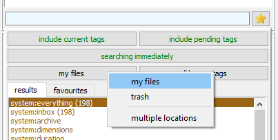
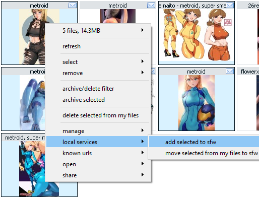
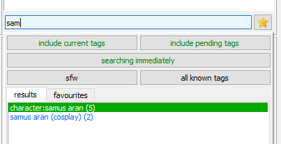
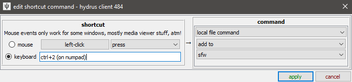
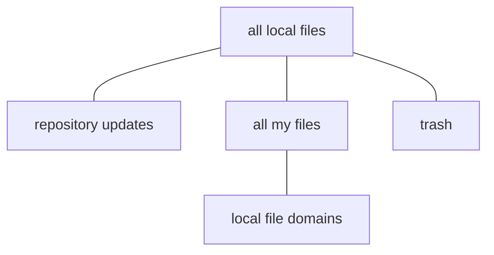
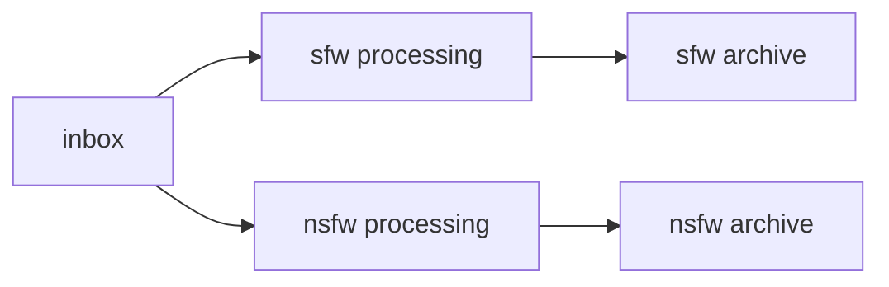
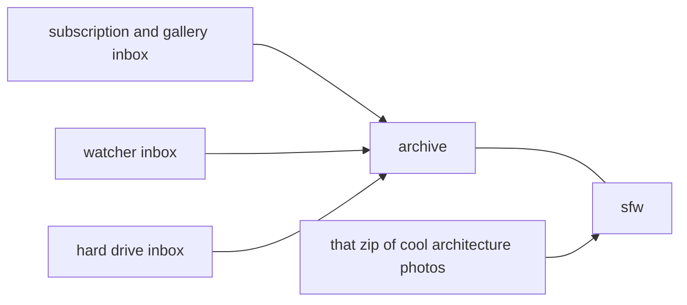
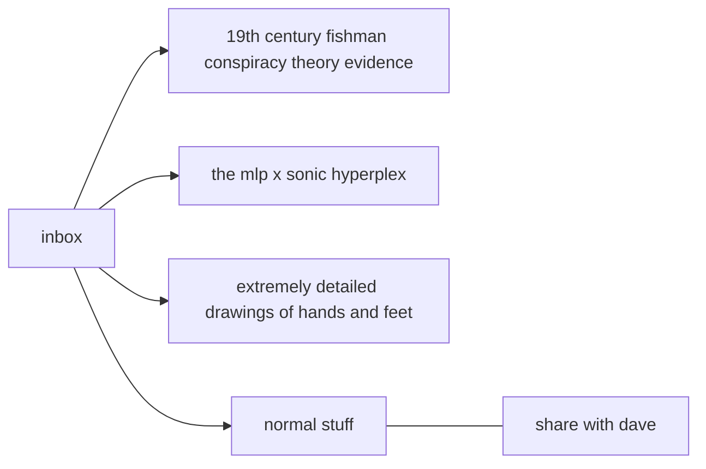

---
title: Multiple Local File Services
--- 

# multiple local file services

The client lets you store your files in different overlapping partitions. This can help management workflows and privacy.

## what's the problem? { id="the_problem" }

Most of us end up storing all sorts of things in our clients, often from different parts of our lives. With everything in the same 'my files' domain, some personal photos might be sitting right beside nsfw content, a bunch of wallpapers, and thousands of comic pages. Different processing jobs, like 'go through those old vidya screenshots I imported' and 'filter my subscription files' and 'load up my favourite pictures of babes' all operate on the same gigantic list of files and must be defined through careful queries of tags, ratings, and other file metadata to separate what you want from what you don't.

The problem is aggravated the larger your client grows. When you are trying to sift the 500 art reference images out 850,000 random internet files from the last ten years, it can be difficult getting good tag counts or just generally browsing around without stumbling across other content. This particularly matters when you are typing in search tags, since the tag you want, 'anatomy drawing guide', is going to come with thousands of others, starting 'a...', 'an...', and 'ana...' as you type. If someone is looking over your shoulder as you load up the images, you want to preserve your privacy.

Wouldn't it be nice if you could break your collection into separate areas?

## multiple file domains { id="file_domains" }

_tl;dr: you can have more than one 'my files', add them in 'manage services'._

A _file domain_ (or _file service_) in the hydrus context, is, very simply, a list of files. There is a bit of extra metadata like the time each file was imported to the domain, and a ton of behind the scenes calculation to accelerate searching and aggregate autocomplete tag counts and so on, but overall, when you search in 'my files', you are telling the client "find all the files _in this list_ that have tag x, y, z on any tag domain". If you switch to searching 'trash', you are then searching that list of trashed files.

A search page's _tag domain_ is similar. Normally, you will be set to 'all known tags', which is basically the union of all your tag services, but if you need to, you can search just 'my tags' or 'PTR', which will make your search "find all the files in _my files_ that have tag x, y, z on _my tags_". You are setting up an intersection of a file and a tag domain.

Changing the tag domain to 'PTR' or 'all known tags' would make for a different blue circle with a different intersection of search results ('PTR' probably has a lot more 'pretty dress', although maybe not for your files, and 'all known tags', being the union of all the blue circles, will make the same or larger intersection).

This idea of dynamically intersecting domains is very important to hydrus. Each service stands on its own, and the 'my tags' domain is not linked to 'my files'. It does not care where its tagged files are. When you delete a file, no tags are changed. But when you delete a file, the 'file domain' circle will shrink, and that may change the search results in the intersection.

With _multiple local file services_, you can create new file lists beyond 'my files', letting you make different red circles. You can move and copy files between your local file domains to make new sub-collections and search them separately for a very effective filter.

You can add and remove them under _services->manage services_:

## what does this actually mean? { id="sfw" }

I think the best simple idea for most regular users is to try a sfw/nsfw split. Make a new 'sfw' local file domain and start adding some images to it. You might eventualy plan to send all your sfw images there, or just your 'IRL' stuff like family photos, but it will be a separate area for whitelisted safe content you are definitely happy for others to glance at.

Search up some appropriate images in your collection and then add them to 'sfw':

This 'add' command is a copy. The files stay in 'my files', but they also go to 'sfw'. You still only have one file on your hard drive, but the database has its identifier in both file lists. Now make a new search page, switch it to 'sfw', and try typing in a search.

The tag results are limited to the files we added to 'sfw'. Nothing from 'my files' bleeds over. The same is true of a file search. Note the times the file was added to 'my files' and 'sfw' are both tracked.

Also note that these files now have two 'delete' commands. You will be presented with more complicated delete and undelete dialogs for files in multiple services. Files only end up in the trash when they are no longer in any local file domain.

You can be happy that any search in this new domain--for tags or files--is not going to provide any unexpected surprises. You can also do 'system:everything', 'system:limit=64' for a random sample, or any other simple search predicate for browsing, and the search should run fast and safe.

If you want to try multiple local file services out, I recommend this split to start off. If you don't like it, you can delete 'sfw' later with no harm done.

!!! note
    While 'add to y' copies the files, 'move from x to y' deletes the files from the original location. They get a delete timestamp ("deleted from my files 5 minutes ago"), and they can be undeleted or 'added' back, and they will get their old import timestamp back. 

## using it { id="using_it" }

The main way to add and move files around is the thumbnail/media viewer right-click menu.

You can make shortcuts for the add/move operations too. Check _file->shortcuts_ and then the 'media actions' set.

In the future, I expect to have more ways to move files around, particularly integration into the archive/delete filter, and ideally a 'file migration' system that will allow larger operations such as 'add all the files in search x to place y'.

I also expect to write a system to easily merge clients together. Several users already run several different clients to get their 'my files' separation (e.g. a sfw client and a nsfw client), and now we have this tech supported in one client, it makes a lot of efficiency sense to merge them together. 

Note that when you select a file domain, you can select 'multiple locations'. This provides the union of whichever domains you like. Tag counts will be correct but imprecise, often something like 'blonde hair (2-5)', meaning 'between two and five files', due to the complexity of quickly counting within these complicated domains.

As soon as you add another local file service, you will also see a 'all my files' service listed in the file domain selector. This is a virtual service that provides a very efficient and accurate search space of the union of all your local file domains. 

This whole system is new. I will keep working on it, including better 'at a glance' indications of which files are where (current thoughts are custom thumbnail border colours and little indicator icons). Let me know how you get on with it!

## advanced: a word on the meta file domains { id="meta_file_domains" }

If you are in _help->advanced mode_, your file search file domain selectors will see 'all known files'. This domain is similar to 'all known tags', but it is not useful for normal browsing. It represents not filtering your tag services by any file list, fetching all tagged file results regardless of what your client knows about them.

If you search 'all known files'/'PTR', you can search all the files the PTR knows about, the vast majority of which you will likely never import. The client will show these files with a default hydrus thumbnail and offer very limited information about them. For file searches, this search domain is only useful for debug and janitorial purposes. You cannot combine 'all known files' with 'all known tags'. It also has limited sibling/parent support.

You can search for deleted files under 'multiple domains' too. These may or may not still be in your client, so they might get the hydrus icon again. You won't need to do this much, but it can be super useful for some maintenance operations like 'I know I deleted this file by accident, what was its URL so I can find it again?'.

Another service is 'all local files'. This is a larger version of 'all my files'. It essentially means 'all the files on your hard disk', which strictly means the union of all the files in your local file domains ('my files' and any others you create, i.e. the 'all my files' domain), 'repository updates' (which stores update files for hydrus repository sync), and 'trash'. This search can be useful for some advanced maintenance jobs.

If you select 'repository updates' specifically, you can inspect this advanced domain, but I recommend you not touch it! Otherwise, if you search 'all local files', repository files are usually hidden from view.

Your client looks a bit like this:

Repository files, your media, and the trash are actually mutually exclusive. When a file is imported, it is added to 'all local files' and either repository updates or 'all my files' and one or more local file domains. When it is deleted from all of those, it is taken from 'all my files' and moved to trash. When trashed files are cleared, the files are removed from 'trash' and then 'all local files' and thus your hard disk.

## more advanced usage { id="advanced" }

!!! warning
    Careful! It is easy to construct a massively overcomplicated Mind Palace here that won't actually help you due to the weight of overhead. If you want to categorise things, tags are generally better. But if you do want strict search separations for speed, workflow, or privacy, try this out. 

If you put your files through several layers of processing, such as `inbox/archive->tags->rating`, it might be helpful to create different file domains for each step. I have seen a couple of proposals like this that I think make sense:

Where the idea would be to make the 'is this sfw/nsfw?' choice early, probably at the same time as archive/delete, and splitting files off to either side before doing tagging and rating. I expect to expand the 'archive/delete' filter to support more actions soon to help make these workflows easy.

File Import Options allows you to specify which service it will import to. You can even import to multiple, although that is probably a bit much. If your inbox filters are overwhelming you--or each other--you might like to have more than one 'landing zone' for your files:

Some users have floated the idea of storing your archive on one drive and the inbox on another. This makes a lot of sense for network storage situations--the new inbox could be on a local disk, but the less-accessed archive on cheap network storage. File domains would be a great way to manage this in future, turning the workflow into nice storage commands.

Another likely use of this in future is in the Client API, when sharing with others. If you were to put the files you wanted to share in a file domain, and the Client API were set up to search just on that domain, this would guarantee great privacy. I am still thinking about this, and it may ultimately end up just being something that works that way behind the scenes.

