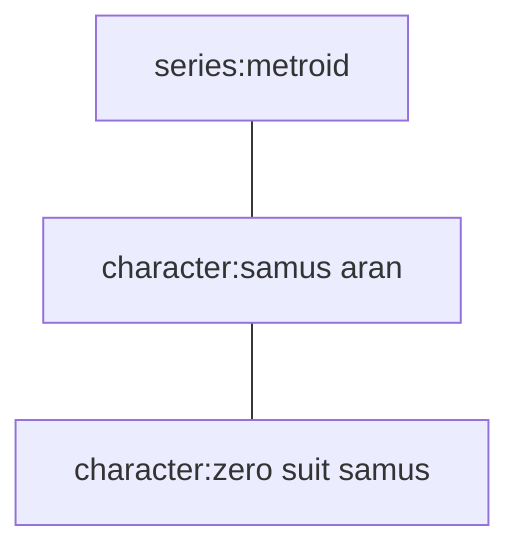
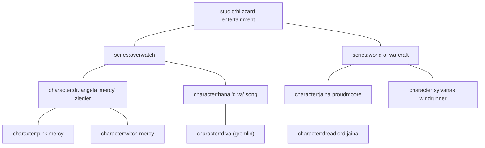
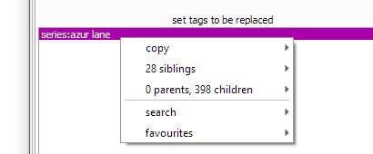
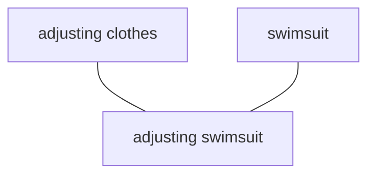
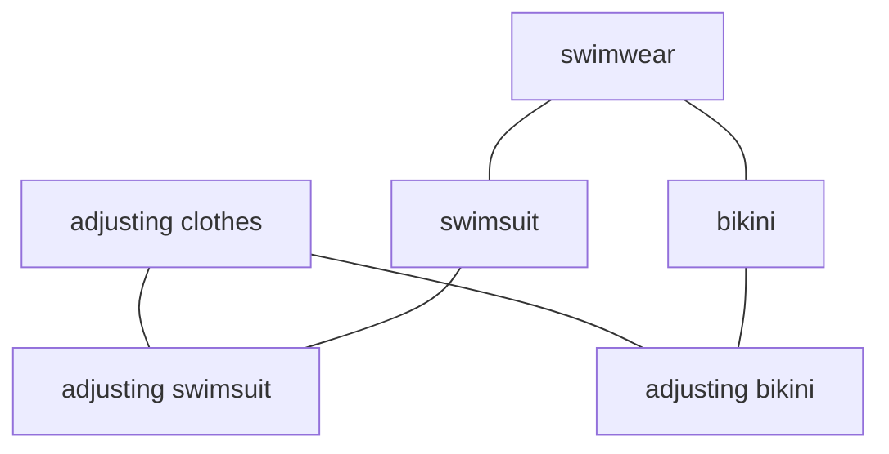
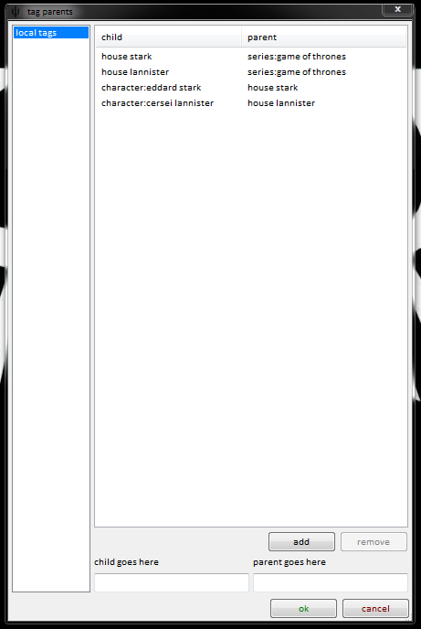
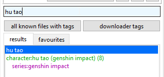

# tag parents

Tag parents let you automatically add a particular tag every time another tag is added. The relationship will also apply retroactively.

## what's the problem? { id="the_problem" }

Tags often fall into certain heirarchies. Certain tags _always_ imply other tags, and it is annoying and time-consuming to type them all out individually every time.

As a basic example, a `car` _is_ a `vehicle`. It is a _subset_. Any time you see a car, you also see a vehicle. Similarly, a `rifle` _is_ a `firearm`, `face tattoo` implies `tattoo`, and `species:pikachu` implies `species:pokémon` which also implies `series:pokémon`.

Another way of thinking about this is considering what you would expect to see when you search these terms. If you search `vehicle`, you would expect the result to include _all_ `cars`. If you search `series:league of legends`, you would expect to see all instances of `character:ahri` (even if, on rare occasion, she were just appearing in cameo or in a crossover).

For hydrus terms, `character x is in series y` is a common relationship, as is `costume x is of character y`: 

In this instance, anything with `character:zero suit samus` would also have `character:samus aran`. Anything with `character:samus aran` (and thus anything with `character:zero suit samus`) would have `series:metroid`.

Remember that the reverse is not true. Samus comes inextricably from Metroid, but not everything Metroid is Samus (e.g. a picture of just Ridley).

Even a small slice of these relationships can get complicated:

Some franchises are bananas:

Also, unlike siblings, which as we previously saw are `n->1`, some tags have more than one implication (`n->n`):

`adjusting swimsuit` implies both a `swimsuit` and `adjusting clothes`. Consider how `adjusting bikini` might fit on this chart--perhaps this:

Note this is not a loop--like with siblings, loops are not allowed--this is a family tree with three 'generations'. `adjusting bikini` is a child to both `bikini` and `adjusting clothes`, and `bikini` is a child to the new `swimwear`, which is also a parent to `swimsuit`. `adjusting bikini` and `adjusting swimsuit` are both grandchildren to `swimwear`.

This can obviously get as complicated and over-engineered as you like, but be careful of being too confident. Reasonable people disagree on what is 'clearly' a parent or sibling, or what is an excessive level of detail (e.g. `person:scarlett johansson` may be `gender:female`, if you think that useful, but `species:human`, `species:mammal`, and `species:animal` may be going a little far). Beyond its own intellectual neatness, ask yourself the purpose of what you are creating.

Of course you can create any sort of parent tags on your local tags or your own tag repositories, but this sort of thing can easily lead to arguments between reasonable people on a shared server like the PTR.

Just like with normal tags, try not to create anything 'perfect' or stray away from what you actually search with, as it usually ends up wasting time. Act from need, not toward purpose.

## tag parents { id="tag_parents" }

Let's define the child-parent relationship 'C->P' as saying that tag P is the semantic superset/superclass of tag C. **All files that have C should also have P, without exception.**

Any file that has C should appear to have P. Any search for P will include all of C implicitly.

Tags can have multiple parents, and multiple tags have the same parent. Loops are not allowed.

!!! note
    In hydrus, tag parents are _virtual_. P is not actually added to every file by C, it just appears as if it is. When you look at a file in _manage tags_, you will see the implication, just like you see how tags will be renamed by siblings, but you won't see the parent unless it actually happens to also be there as a 'hard' tag. If you remove a `C->P` parent relationship, all the implied P tags will disappear!
    
    It also takes a bunch of CPU to figure this stuff out. Please bear with this system, sometimes it can take time.

## how you do it { id="how_to_do_it" }

Go to _services->manage tag parents_:

Which looks and works just like the manage tag siblings dialog.

Note that when you hit ok, the client will look up all the files with all your added tag Cs and retroactively apply/pend the respective tag Ps if needed. This could mean thousands of tags!

Once you have some relationships added, the parents and grandparents will show indented anywhere you 'write' tags, such as the manage tags dialog:

Hitting enter on cersei will try to add _house lannister_ and _series:game of thrones_ as well.

## remote parents { id="remote_parents" }

Whenever you add or remove a tag parent pair to a tag repository, you will have to supply a reason (like when you petition a tag). A janitor will review this petition, and will approve or deny it. If it is approved, all users who synchronise with that tag repository will gain that parent pair. If it is denied, only you will see it.

## parent 'favourites' { id="parent_favourites" }

As you use the client, you will likely make several processing workflows to archive/delete your different sorts of imports. You don't always want to go through things randomly--you might want to do some big videos for a bit, or focus on a particular character. A common search page is something like `[system:inbox, creator:blah, limit:256]`, which will show a sample of a creator in your inbox, so you can process just that creator. This is easy to set up and save in your favourite searches and quick to run, so you can load it up, do some archive/delete, and then dismiss it without too much hassle.

But what happens if you want to search for multiple creators? You might be tempted to make a large OR search predicate, like `creator:aaa OR creator:bbb OR creator:ccc OR creator:ddd`, of all your favourite creators so you can process them together as a 'premium' group. But if you want to add or remove a creator from that long OR, it can be cumbersome. And OR searches can just run slow sometimes. One answer is to use the new tag parents tools to apply a 'favourite' parent on all the artists and then search for that favourite.

Let's assume you want to search bunch of 'creator' tags on the PTR. What you will do is:

*   Create a new 'local tag service' in _manage services_ called 'my parent favourites'. This will hold our subjective parents without uploading anything to the PTR.
*   Go to _tags->manage where tag siblings and parents apply_ and add 'my parent favourites' as the top priority for parents, leaving 'PTR' as second priority.
*   Under _tags->manage tag parents_, on your 'my parent favourites' service, add:
    
    *   `creator:aaa->favourite:aesthetic art`
    *   `creator:bbb->favourite:aesthetic art`
    *   `creator:ccc->favourite:aesthetic art`
    *   `creator:ddd->favourite:aesthetic art`
    
    Watch/wait a few seconds for the parents to apply across the PTR for those creator tags.
    
*   Then save a new favourite search of `[system:inbox, favourite:aesthetic art, limit:256]`. This search will deliver results with any of the child 'creator' tags, just like a big OR search, and real fast!

If you want to add or remove any creators to the 'aesthetic art' group, you can simply go back to _tags->manage tag parents_, and it will apply everywhere. You can create more umbrella/group tags if you like (and not just creators--think about clothing, or certain characters), and also use them in regular searches when you just want to browse some cool files.
