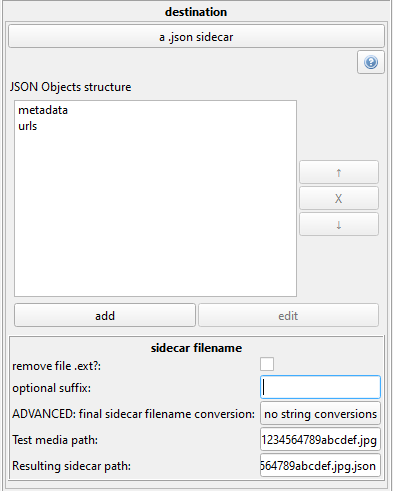

# sidecars

Sidecars are files that provide additional metadata about a master file. They typically share the same basic filename--if the master is 'Image_123456.jpg', the sidecar will be something like 'Image_123456.txt' or 'Image_123456.jpg.json'. This obviously makes it easy to figure out which sidecar goes with which file.

Hydrus does not use sidecars in its own storage, but it can import data from them and export data to them. It currently supports raw data in .txt files and encoded data in .json files, and that data can be either tags or URLs. I expect to extend this system in future to support XML and other metadata types such as ratings, timestamps, and inbox/archive status.

We'll start with .txt, since they are simpler.

## Importing Sidecars

Imagine you have some jpegs you downloaded with another program. That program grabbed the files' tags somehow, and you want to import the files with their tags without messing around with the Client API.

If your extra program can export the tags to a simple format--let's say newline-separated .txt files with the same basic filename as the jpegs, or you can, with some very simple scripting, convert to that format--then importing them to hydrus is easy!

Put the jpegs and the .txt files in the same directory and then drag and drop the directory onto the client, as you would for a normal import. The .txt files should not be added to the list. Then click 'add tags/urls with the import'. The sidecars are managed on one of the tabs:

[](images/sidecars_example_manual_import.png)

This system can get quite complicated, but the essential idea is that you are selecting one or more sidecar `sources`, parsing their text, and sending that list of data to one hydrus service `destination`. Most of the time you will be pulling from just one sidecar at a time.

### The Source Dialog

The `source` is a description of a sidecar to load and how to read what it contains.

In this example, the texts are like so:

``` title="4e01850417d1978e6328d4f40c3b550ef582f8558539b4ad46a1cb7650a2e10b.jpg.txt"
flowers
landscape
blue sky
```

``` title="5e390f043321de57cb40fd7ca7cf0cfca29831670bd4ad71622226bc0a057876.jpg.txt"
fast car
anime girl
night sky
```

Since our sidecars in this example are named (filename.ext).txt, and use newlines as the separator character, we can leave things mostly as default.

If you do not have newline-separated tags, for instance comma-separated tags (`flowers, landscape, blue sky`), then you can set that here. Be careful if you are making your own sidecars, since any separator character obviously cannot be used in tag text!

If your sidecars are named (filename).txt instead of (filename.ext).txt, then just hit the checkbox, but if the conversion is more complicated, then play around with the filename string converter and the test boxes.

If you need to, you can further process the texts that are loaded. They'll be trimmed of extra whitespace and so on automatically, so no need to worry about that, but if you need to, let's say, add the `creator:` prefix to everything, or filter out some mis-parsed garbage, this is the place.

### The Router Dialog

A 'Router' is a single set of orders to grab from one or more sidecars and send to a destination. You can have several routers in a single import or export context.

You can do more string processing here, and it will apply to everything loaded from every sidecar.

The destination is either a tag service (adding the loaded strings as tags), or your known URLs store.

### Previewing

Once you have something set up, you can see the results are live-loaded in the dialog. Make sure everything looks all correct, and then start the import as normal and you should see the tags or URLs being added as the import works.

It is good to try out some simple situations with one or two files just to get a feel for the system.

### Import Folders

If you have a constant flow of sidecar-attached media, then you can add sidecars to Import Folders too. Do a trial-run of anything you want to parse with a manual import before setting up the automatic system.

## Exporting Sidecars

The rules for exporting are similar, but now you are pulling from one or more hydrus service `sources` and sending to a single `destination` sidecar every time. Let's look at the UI:

[](images/sidecars_example_manual_export.png)

I have chosen to select these files' URLs and send them to newline-separated .urls.txt files. If I wanted to get the tags too, I could pull from one or more tag services, filter and convert the tags as needed, and then output to a .tags.txt file.

The best way to learn with this is just to experiment. The UI may seem intimidating, but most jobs don't need you to work with multiple sidecars or string processing or clever filenames.

## JSON Files

JSON is more complicated than .txt. You might have multiple metadata types all together in one file, so you may end up setting up multiple routers that parse the same file for different content, or for an export you might want to populate the same export file with multiple kinds of content. Hydrus can do it!

### Importing

Since JSON files are richly structured, we will have to dip into the Hydrus parsing system:

[](images/sidecars_example_json_import.png)

If you have made a downloader before, you will be familiar with this. If not, then you can brave [the help](downloader_parsers_formulae.md#json_formula) or just have a play around with the UI. In this example, I am getting the URL(s) of each JSON file, which are stored in a list under the `file_info_urls` key.

It is important to paste an example JSON file that you want to parse into the parsing testing area (click the paste button) so you can test on read data live.

Once you have the parsing set up, the rest of the sidecar UI is the same as for .txt. The JSON Parsing formula is just the replacement/equivalent for the .txt 'separator' setting.

_Note that you could set up a second Router to import the tags from this file!_

### Exporting

In Hydrus, the exported JSON is typically a nested Object with a similar format as in the Import example. You set the names of the Object keys.

[](images/sidecars_example_json_export.png)

Here I have set the URLs of each file to be stored under `metadata->urls`, which will make this sort of structure:

``` json
{
    "metadata" : {
        "urls" : [
            "http://example.com/123456",
            "https://site.org/post/45678"
        ]
    }
}
```

The cool thing about JSON files is I can export multiple times to the same file and it will update it! Lets say I made a second Router that grabbed the tags, and it was set to export to the same filename but under `metadata->tags`. The final sidecar would look like this:

``` json
{
    "metadata" : {
        "tags" : [
            "blonde hair",
            "blue eyes",
            "skirt"
        ],
        "urls" : [
            "http://example.com/123456",
            "https://site.org/post/45678"
        ]
    }
}
```

You should be careful that the location you are exporting to does not have any old JSON files with conflicting filenames in it--hydrus will update them, not overwrite them! This may be an issue if you have an synchronising Export Folder that exports random files with the same filenames.

## Note on Notes

You can now import/export notes with your sidecars. Since notes have two variables--name and text--but the sidecars system only supports lists of single strings, I merge these together! If you export notes, they will output in the form 'name: text'. If you want to import notes, arrange them in the same form, 'name: text'.

If you do need to select a particular note out of many, see if a String Match (regex `^name: `) in the String Processor will do it.

If you need to work with multiple notes that have newlines, I recommend you use JSON rather than txt. If you have to use txt on multiple multi-paragraph-notes, then try a different separator than newline. Go for `||||` or something, whatever works for your job.

Depending on how awkward this all is, I may revise it.
