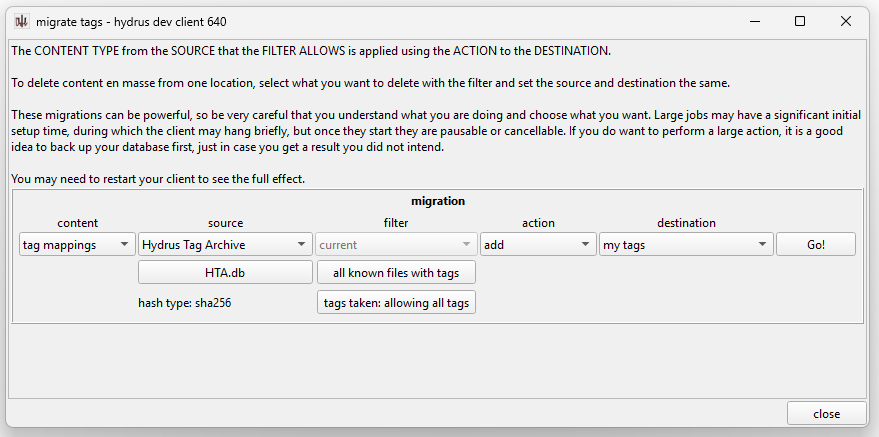

If you have been running multiple clients and would like to merge the files and metadata from one to another, there are several options. Choosing which to use depends on what you want to preserve and how many things you have to move.

Unfortunately, hydrus does not have an excellent way to tell one client to automatically and universally suck the contents of another yet. You will be setting up a general job of 'export everything from source' and then 'import everything to new client'.

You may wish to review the [database migration](database_migration.md) help so you are familiar with hydrus's high-level database and file storage structure.

### what do you want?

Before you start, think about what you want to preserve. In my experience, this is what most people care about:

- The files
- Tags for them
- archive/inbox status
- ratings

And sometimes URLs.

Stuff like archive or import timestamps can be nice to keep, but it is pretty fiddly to set it all up, so only go for this if it is worth it.

## simple file import

If you just want to move some files across, no metadata preservation, I recommend simply drag-and-dropping the 256 'fxx' folders in your old database's 'client_files' folder onto your new client, and telling it to import everything. If you sync with the PTR on the source, the file parser will tell you several of the files did not parse; no worries, these are the PTR update files and you can ignore them.

If you have hundreds of thousands or millions of files, break the 256 'fxx' folders into smaller batches that your destination client can handle. Most computers start to get laggy somewhere around 10-50k files per import.

## file exports

If you only want a subset of your files, or if you want to attach some metadata, we will be looking at export the files from the source to a new folder, and then importing from there.

You have two options:

- For a smaller number of files, load them up in a normal search page and do `ctrl+a->share->export files`.
- For very large numbers of files, set up an _export folder_ under the `file` menu.

If you want to attach metadata, export the files with [sidecars](advanced_sidecars.md) and then import them to the destination by parsing those sidecars. The sidecar system cannot handle everything, and it is not super user friendly, but it can do a bunch of stuff with some work. Do a test on 10 files first to make sure you have it all correct before you fire off a megajob of 300,000.

If you want to preserve inbox/archive status, a good solution here is just to do this whole migration in two jobs--once for `system:inbox`, then for `system:archive`. For the archive job, set up the 'file import options' to archive everything on import, or just `ctrl+a->F7`.

Like with the export, if you have a simple job, run it through the manual import process, but if you have a complicated or large job, look into an temporary import folder. Generally speaking, very large jobs run faster without having to do UI stuff like thumbnail drawing and updating, so an import folder or export folder is always going to handle bigger things better.

## migrating many tags

If you only want to migrate tags, or you have millions of tags and would rather something faster or more powerful than sidecars, look at `tags->migrate tags`. You can choose to export your tags from the source to a Hydrus Tag Archive (HTA), which is an external file that holds all the info hydrus needs to apply a tag to a file, and then on the destination, the same dialog allows you to pull tags from an HTA.

The source will look something like this:

And the destination like this:

Note that I have set 'all known files with tags' as the domain in both source and destination. It isn't super important, but setting that rather than 'my files' means you don't have to worry about which order you do the file/tag import to the destination, and it covers a bit more data from the source for deleted files and stuff.

## perfect preservation

I would like to add a 'eat this client' wizard to the program one day that will have sophisticated service interrogation and UI for defining content sources and destinations. Something like 'migrate tags' but for all content types. I'd also like 'universal' sidecar templates that you can setup with one click. Unfortunately we aren't there yet.

If you want to preserve as much as possible in a clever way, or just something that isn't covered by sidecars, like duplicate file relations, your best bet is writing your own script that uses the [Client API](client_api.md).
