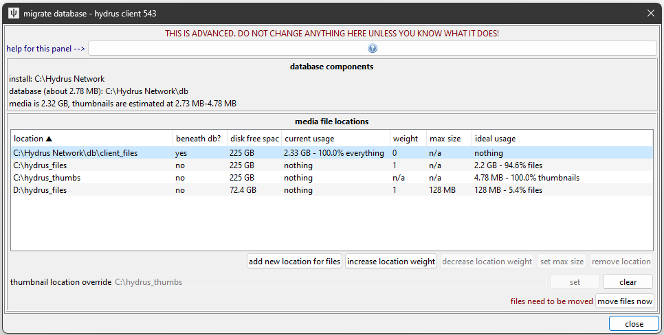
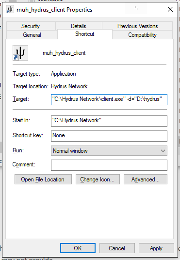
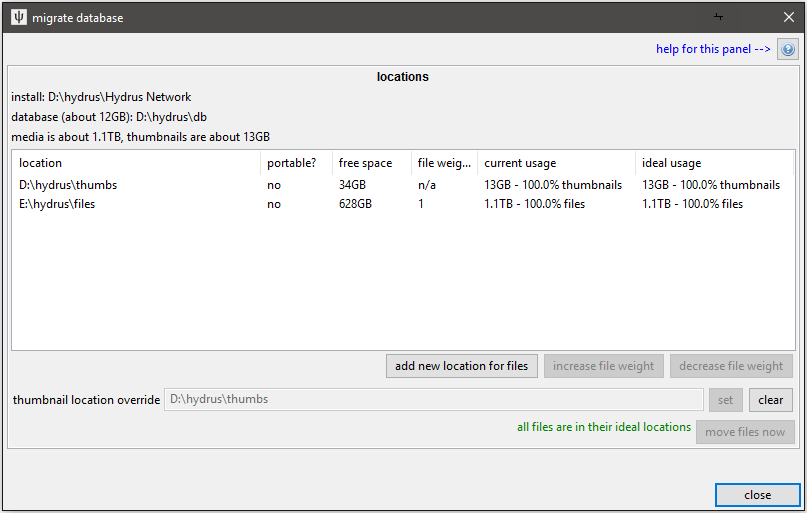

!!! warning
    I am working on this system right now and will be moving the 'move files now' action to a more granular, always-on background migration. This document will update to reflect those changes!

# database migration

## the hydrus database { id="intro" }

A hydrus client consists of three components:

1.  **the software installation**
    
    This is the part that comes with the installer or extract release, with the executable and dlls and a handful of resource folders. It doesn't store any of your settings--it just knows how to present a database as a nice application. If you just run the hydrus_client executable straight, it looks in its 'db' subdirectory for a database, and if one is not found, it creates a new one. If it sees a database running at a lower version than itself, it will update the database before booting it.
    
    It doesn't really matter where you put this. An SSD will load it marginally quicker the first time, but you probably won't notice. If you run it without command-line parameters, it will try to write to its own directory (to create the initial database), so if you mean to run it like that, it should not be in a protected place like _Program Files_.
    
    If you run from source, things are basically the same, but you are building a virtual environment in the `venv` folder and launching hydrus_client.py from the activated venv instead. Note: a venv includes absolute path links, so you will have to rebuild your venv every time you move your install directory!
    
2.  **the actual SQLite database**
    
    The client stores all its preferences and current state and knowledge _about_ files--like file size and resolution, tags, ratings, inbox status, and so on and on--in a handful of SQLite database files, defaulting to _install_dir/db_. Depending on the size of your client, these might total 1MB in size or be as much as 10GB.
    
    In order to perform a search or to fetch or process tags, the client has to interact with these files in many small bursts, which means it is best if these files are on a drive with low latency. An SSD is ideal, but a regularly-defragged HDD with a reasonable amount of free space also works well.
    
3.  **your media files**
    
    All of your jpegs and webms and so on (and their thumbnails) are stored in a single complicated directory that is by default at _install\_dir/db/client\_files_. All the files are named by their hash and stored in efficient hash-based subdirectories. In general, it is not navigable by humans, but it works very well for the fast access from a giant pool of files the client needs to do to manage your media.
    
    Thumbnails tend to be fetched dozens at a time, and very randomly, so it is, again, ideal if they are stored on an SSD. Your regular media files--which on many clients total hundreds of GB--are usually fetched one at a time for human consumption and do not benefit from the expensive low-latency of an SSD. They are best stored on a cheap HDD, and, if desired, also work well across a network file system.
    
    There are 256 file folders, named using the hexadecimal prefix of the files they store, from f00 to fff, and 256 thumbnail folders, from t00 to tff. Thus you should expect to have 512 folders total. This is likely to change in future to 4096/8192 (i.e. three hex chars).
    

## these components can be put on different drives { id="different_drives" }

Although an initial install will keep these parts together, it is possible to, say, run the SQLite database on a fast drive but keep your media in cheap slow storage. This is an excellent arrangement that works for many users. And if you have a very large collection, you can even spread your files across multiple drives. It is not very technically difficult, but I do not recommend it for new users.

Backing such an arrangement up is obviously more complicated, and the internal client backup is not sophisticated enough to capture everything, so I recommend you figure out a broader solution with a third-party backup program like FreeFileSync.

## pulling your media apart { id="pulling_media_apart" }

!!! danger
    **As always, I recommend creating a backup before you try any of this, just in case it goes wrong.**

If you would like to move your files and thumbnails to new locations, hit _database->move media files_, giving you this dialog:

The buttons let you add more locations and remove old ones. The operations on this dialog are simple and atomic--at no point is your db ever invalid.

**Beneath db?** means that the path is beneath the main db dir and so is stored internally as a relative path. Portable paths will still function if the database changes location between boots (for instance, if you run the client from a USB drive and it mounts under a different location).

**Weight** means the relative amount of media you would like to store in that location. It only matters if you are spreading your files across multiple locations. If location A has a weight of 1 and B has a weight of 2, A will get approximately one third of your files and B will get approximately two thirds.

**Max Size** means the max total size of files the client will want to store in that location. Again, it only matters if you are spreading your files across multiple locations, but it is a simple way to ensure you don't go over a particular smaller hard drive's size. One location must always be limitless. This is not precise, so give it some padding. When one location is maxed out, the remaining locations will distribute the remainder of the files according to their respective weights. _For the meantime, this will not update by itself. If you import many files, the location may go over its limit and you will have to revisit 'move media files' to rebalance your files again. Bear with me--I will fix this soon with the background migrate._ 

Let's set up an example move:

I made several changes:

* Added `C:\hydrus_files` to store files.
* Added `D:\hydrus_files` to store files, with a max size of 128MB.
* Set `C:\hydrus_thumbs` as the location to store thumbnails.
* Removed the original `C:\Hydrus Network\db\client_files` location.

While the ideal usage has changed significantly, note that the current usage remains the same. Nothing moves until you click 'move files now'. Moving files will take some time to finish. Once done, it looks like this:

The current and ideal usages line up, and the defunct `C:\Hydrus Network\db\client_files` location, which no longer stores anything, is removed from the list.

!!! note "Missing Locations"
    If any of the 512 file/thumbnail media folders are not where the client expects them to be on program boot, a repair dialog appears to let you update the record. This is not impossible to figure out, _and in some situations doing this on purpose can be faster than letting the client migrate things itself_. I generally do not recommend moving folders around while the client is not up, but if you are feeling confident, go for it. You made a backup, right? :^)
    
    Note that you cannot boot a client until it has located all the file subfolders.
    
    Also, if your folders are in the 'wrong' locations but all those locations are known to the client, you will not get the repair dialog--it'll just give you a popup and shuffle its internal knowledge around.
    

## informing the software that the SQLite database is not in the default location { id="launch_parameter" }

A straight call to the hydrus_client executable will look for a SQLite database in _install_dir/db_. If one is not found, it will create one. If you move your database and then try to run the client again, it will try to create a new empty database in that old location!

To tell it about the new database location, pass it a `-d` or `--db_dir` command line argument, like so:

*   `hydrus_client -d="D:\media\my_hydrus_database"`
*   _--or--_
*   `hydrus_client --db_dir="G:\misc documents\New Folder (3)\DO NOT ENTER"`
*   _--or, from source--_
*   `python hydrus_client.py -d="D:\media\my_hydrus_database"`
*   _--or, for macOS--_
*   `open -n -a "Hydrus Network.app" --args -d="/path/to/db"`

And it will instead use the given path. If no database is found, it will similarly create a new empty one at that location. You can use any path that is valid in your system.

!!! danger "Bad Locations"
    **Do not install to a network location!** (i.e. on a different computer's hard drive) The SQLite database is sensitive to interruption and requires good file locking, which network interfaces often fake. There are [ways of splitting your client up](database_migration.md) so the database is on a local SSD but the files are on a network--this is fine--but you really should not put the database on a remote machine unless you know what you are doing and have a backup in case things go wrong.
    
    **Be careful installing to a location with filesystem-level compression or versioning enabled!** It may work ok to start, but when the SQLite database grows to large size, this can cause extreme access latency. I have been told that BTRFS works well these days, and they have been working specifically to improve SQLite performance, but keep it in mind if you are using anything else. Using NTFS compression mode on the database files is not a good idea. Compressing a hydrus database backup is fine, but the live db is sensitive.

Rather than typing the path out in a terminal every time you want to launch your external database, create a new shortcut with the argument in. Something like this:

Note that an install with an 'external' database no longer needs access to write to its own path, so you can store it anywhere you like, including protected read-only locations (e.g. in 'Program Files'). Just double-check your shortcuts are good.

## backups { id="finally" }

If your database now lives in one or more new locations, make sure to update your backup routine! You should be maintaining a copy of everything. As your collection grows, you may want to similarly store your db + thumbs on a low-latency SSD USB stick (a nice 3.2 USB drive can sustain 350MB/s write of the db files and 4,000 thumbs/s) but the media files on a big cheap multi-TB regular USB drive.

## moving to an SSD { id="to_an_ssd" }

As an example, let's say you started using the hydrus client on your HDD, and now you have an SSD available and would like to move your thumbnails and main install to that SSD to speed up the client. Your database will be valid and functional at every stage of this, and it can all be undone. The basic steps are:

1.  Move your 'fast' files to the fast location.
2.  Move your 'slow' files out of the main install directory.
3.  Move the install and db itself to the fast location and update shortcuts.

Specifically:

1. Update your backup if you maintain one.
* Create an empty folder on your HDD that is outside of your current install folder. Call it 'hydrus_files' or similar.
* Create two empty folders on your SSD with names like 'hydrus\_db' and 'hydrus\_thumbnails'.
* Set the 'thumbnail location override' to 'hydrus_thumbnails'. You should get that new location in the list, currently empty but prepared to take all your thumbs.
* Hit 'move files now' to actually move the thumbnails. Since this involves moving a lot of individual files from a high-latency source, it will take a long time to finish. The hydrus client may hang periodically as it works, but you can just leave it to work on its own--it will get there in the end. You can also watch it do its disk work under Task Manager.
* Now hit 'add location' and select your new 'hydrus\_files'. 'hydrus\_files' should be appear and be willing to take 50% of the files.
* Select the old location (probably 'install\_dir/db/client\_files') and hit 'remove location' or 'decrease weight' until it has weight 0 and you are prompted to remove it completely. 'hydrus_files' should now be willing to take all 100% of the files from the old location.
* Hit 'move files now' again to make this happen. This should be fast since it is just moving a bunch of folders across the same partition.
* With everything now 'non-portable' and hence decoupled from the db, you can now easily migrate the install and db to 'hydrus_db' simply by shutting the client down and moving the install folder in a file explorer.
* Update your shortcut to the new hydrus_client.exe location and try to boot.
* Update your backup scheme to match your new locations.
* Enjoy a much faster client.

You should now have _something_ like this (let's say the D drive is the fast SSD, and E is the high capacity HDD):

## moving to a new machine { id="to_new_OS" }

The hydrus database is completely portable. As well as moving it about within the same system, you can move your whole hydrus client to another computer quite easily. It all runs on Windows/Linux/macOS with no big modifications needed. The only thing you need to watch out for are the paths the database uses to talk to other parts of the system--for instance the location of an Export Folder.

If the OSes are the same (e.g. Windows to Windows), moving from one machine to another is usually pretty easy--just drag and drop the whole install from one drive to another, via a network share or USB drive--but going from one OS type to another introduces a couple of extra wrinkles.

??? note "OS Paths"
    Remember that Windows has paths that start with drive letters, like `D:\` and uses backslashes to split paths; but Linux and macOS all start with root `/` and use regular slashes. If your OS suddenly changes, your absolute `D:\hydrus_files` is going to be seen as a relative path by Linux and you'll end up with like `/home/you/hydrus/db/D:\hydrus_files`. There's no huge worry here--hydrus won't rush to break anything, and the worst case is generally it just freaking out that the thing doesn't exist. You just need to tell it the correct new path.

Before any system migration, make sure you:

- finish any hard drive import pages that were working
- pause your import folders
- pause your export folders
- MAKE A BACKUP

Install a fresh new hydrus on the new machine and then, using a network share or a USB drive, copy the database folder, files, and thumbnails from the old to the new. You can insert the db directly into your new `install_dir/db` folder, or if you want to set up a new `--db_dir`, put the db in that location and set up the new shortcut.

??? note "source installs"
    If the type of OS hasn't changed, you can usually get away with copying a built install folder around. If you run from source, however, you _must_ recreate a new source install folder with that OS's `git` and then build a new venv (then obviously migrate your source db dir as needed). Do not try to migrate a source installation folder!

??? note "macOS App"
    If you are moving to or from the macOS App, recall that the App cannot store the hydrus db inside it, so the correct 'default' location (i.e. without `--db_dir`), analogous to `install_dir/db` on other installs, is `~/Library/Hydrus`. You can always go `file->open->database directory` on any running client to find out where it is currently running from.

Boot up your newly assembled client, and if your files or thumbnails are stored outside of `install_folder/db/client_files`, there's a good chance it will complain about them being missing. Don't panic! Just tell the repair dialog the correct new locations, and it'll stitch itself back together.

Then:

- check `options->external programs` and update anything as needed
- check `options->exporting` and update the default export directory
- check a file's `right-click->share->export files` window to see what the default export path there is
- check `database->move media files` and remove any empty stubs from the old system
- edit your import folders to point at the correct locations
- edit your export folders to point at the correct locations
- unpause import/export folders

Then you should be good! Let me know if you run into any trouble.

## p.s. running multiple clients { id="multiple_clients" }

Since you now know how to tell the software about an external database, you can, if you like, run multiple clients from the same install (and if you previously had multiple install folders, now you can now just use the one). Just make multiple shortcuts to the same hydrus_client executable but with different database directories. They can run at the same time. You'll save yourself a little memory and update-hassle.
