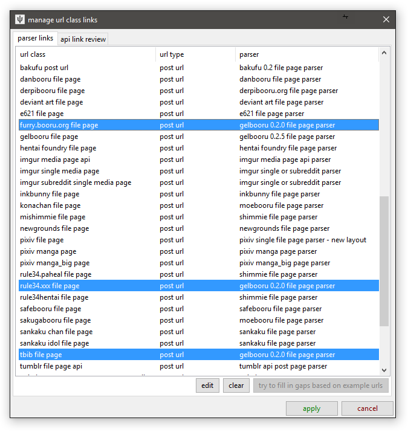

# Putting it all together

Now you know what GUGs, URL Classes, and Parsers are, you should have some ideas of how a downloader steers URLs around. If there is a matching URL Class, we suddenly know if a URL should be slotted into a particular space and parsed in a particular way.

You may have noticed in the Edit GUG ui that it lists if a current URL Class matches the example URL output. We need a matching URL Class to 'catch' the GUG's output. If the GUG's output URL has no matching URL Class, then Hydrus won't know what to do with it, and it won't be listed in the main 'gallery selector' button's list--it'll be relegated to the 'non-functioning' section. If we have a matching URL Class, though, we know which parser to assign it. Where do we link URL Classes and Parsers? Under _network->downloader components->manage url class links_:

Here you simply set which goes with which. If you have URL Classes that do not have a parser linked (which is the default for new URL Classes), you can use the 'try to fill in gaps...' button to automatically fill the gaps based on guesses using the parsers' example URLs. This auto-connection happens a bunch behind the scenes, so don't be surprised if hydrus has figured out where things should go by itself. If there are multiple potential parsers with example URLs matching that URL Class, it'll usually go by the parser name earliest in the alphabet. It is good to double-check any complicated situation yourself.

If the URL Class has no parser set or the parser is broken or otherwise invalid, the respective URL's file import object in the downloader or subscription is going to throw some kind of error when it runs.

_manage url class links_ also shows 'api/redirect link review', which summarises which URL Classes redirect to others. In these cases, only the redirected-to URL gets a parser entry in the first 'parser links' window, since the first will never be fetched for parsing (in the downloader, it will always be converted to the Redirected URL, and _that_ is fetched and parsed).

Once your GUG has a URL Class and your URL Classes have parsers linked, test your downloader! Note that Hydrus's URL drag-and-drop import uses URL Classes, so if you don't have the GUG and gallery stuff done but you have a Post URL set up, you can test that just by dragging a Post URL from your browser to the client, and it should be added to a new URL Downloader and just work. It feels pretty good once it does!

If you make and share some parsers, it may well break one day. The first indication that something is wrong is going to be several users saying 'I got this error: (_copy notes_ from file log window)'. if you can, load the parser or URL Class or GUG back up in the manage dialogs (it is usually the parser, after the site formatting changes) and try to figure out what changed and roll out an update.
