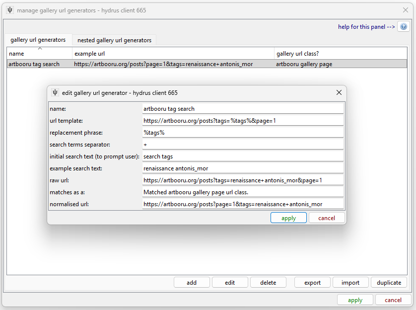

# Gallery URL Generators

Gallery URL Generators, or **GUGs** are simple objects that take a simple string from the user, like:

*   blue_eyes
*   blue\_eyes blonde\_hair
*   InCase
*   elsa dandon_fuga
*   wlop
*   goth* order:id_asc

And convert them into an initialising Gallery URL, such as:

*   [http://safebooru.org/index.php?page=post&s=list&tags=blue_eyes&pid=0](http://safebooru.org/index.php?page=post&s=list&tags=blue_eyes&pid=0)
*   [https://konachan.com/post?page=1&tags=blonde\_hair+blue\_eyes](https://konachan.com/post?page=1&tags=blonde_hair+blue_eyes)
*   [https://www.hentai-foundry.com/pictures/user/InCase/page/1](https://www.hentai-foundry.com/pictures/user/InCase/page/1)
*   [http://rule34.paheal.net/post/list/elsa dandon_fuga/1](http://rule34.paheal.net/post/list/elsa dandon_fuga/1)
*   [https://www.deviantart.com/wlop/favourites/?offset=0](https://www.deviantart.com/wlop/favourites/?offset=0)
*   [https://danbooru.donmai.us/posts?page=1&tags=goth*+order:id_asc](https://danbooru.donmai.us/posts?page=1&tags=goth*+order:id_asc)

These are all the 'first page' of the results if you type or click-through to the same location on those sites. We are essentially emulating their own simple search-url generation inside the hydrus client.

## actually doing it { id="doing_it" }

Although it is usually a fairly simple process of just substituting the inputted tags into a string template, there are a couple of extra things to think about. Let's look at the ui under _network->downloader components->manage gugs_:

The client will split whatever the user enters by whitespace, so `blue_eyes blonde_hair` becomes two search terms, `[ 'blue_eyes', 'blonde_hair' ]`, which are then joined back together with the given 'search terms separator', to make `blue_eyes+blonde_hair`. Different sites use different separators, although ' ', '+', and ',' are most common. The new string is substituted into the `%tags%` in the template phrase, and the URL is made.

Note that you will not have to make %20 or %3A percent-encodings for reserved characters here--the network engine handles all that before the request is sent. For the most part, if you need to include or a user puts in ':' or ' ' or 'おっぱい', you can just pass it along straight into the final URL without worrying.

This ui should update as you change it, so have a play and look at how the output example url changes to get a feel for things. Look at the other defaults to see different examples. Even if you break something, you can just cancel out.

The name of the GUG is important, as this is what will be listed when the user chooses what 'downloader' they want to use. Make sure it has a clear unambiguous name.

The initial search text is also important. Most downloaders just take some text tags, but if your GUG expects a numerical artist id (like pixiv artist search does), you should specify that explicitly to the user. You can even put in a brief '(two tag maximum)' type of instruction if you like.

Notice that the Deviart Art example above is actually the stream of wlop's _favourites_, not his works, and without an explicit notice of that, a user could easily mistake what they have selected. 'gelbooru' or 'newgrounds' are bad names, 'type here' is a bad initialising text.

## Nested GUGs { id="nested_gugs" }

Nested Gallery URL Generators are GUGs that hold other GUGs. Some searches actually use more than one stream (such as a Hentai Foundry artist lookup, where you might want to get both their regular works and their scraps, which are two separate galleries under the site), so NGUGs allow you to generate multiple initialising URLs per input. You can experiment with this ui if you like--it isn't too complicated--but you might want to hold off doing anything for real until you are comfortable with everything and know how producing multiple initialising URLs is going to work in the actual downloader.
