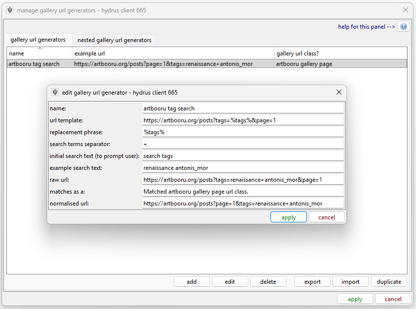

# Gallery URL Generators

Gallery URL Generators, or **GUGs** are simple objects that take a simple string from the user, like:

*   blue_eyes
*   blue\_eyes blonde\_hair
*   ArtistName
*   user\_name
*   gothic* order:id_asc

And convert them into an initialising Gallery URL, such as:

*   `http://somebooru.com/index.php?page=post&s=list&tags=blue_eyes&pid=0`
*   `https://anotherbooru.org/post?page=1&tags=blonde_hair+blue_eyes`
*   `https://gallerysite.net/gallery/ArtistName/page/1`
*   `https://www.coolstuff.org/user_name/favourites/?offset=0`
*   `https://mappainters.communityboorus.org/posts?page=1&tags=gothic*+order:id_asc`

These would all be the 'first page' of the results if you type or click-through to the same location on those sites. We walking through their own simple search-url generation inside the hydrus client.

## actually doing it { id="doing_it" }

Although it is usually a fairly simple process of just substituting the inputted tags into a string template, there are a couple of extra things to think about. Check out _network->downloader components->manage gallery url generators_:

Edit a particular GUG and try typing some different things into the "example search text". See how the output changes. Note that the client will splits whatever the user enters by whitespace, so `tag_a tag_b` becomes two search terms, `[ 'tag_a', 'tag_b' ]`, which are then joined back together with the given 'search terms separator' `+` to make `tag_a+tag_b`. Different sites use different separators, although ' ', '+', and ',' are most common. The new string is substituted into the `%tags%` in the template phrase, and the URL is made.

Play with the other edit fields and see how he output example url changes. Look at the other defaults to see different examples. Even if you break something, you can just cancel out.

Note that you will not have to make %20 or %3A percent-encodings for reserved characters here--the network engine handles all that before the request is sent. For the most part, if you need to include or a user puts in ':' or ' ' or 'おっぱい', you can just pass it along straight into the final URL without worrying. If you are unsure, try pasting the example normalised URL into your browser and see if it works.

The name of the GUG is important, as this is what will be listed when the user chooses what 'downloader' they want to use. Make sure it has a clear unambiguous name.

The initial search text is also important. Most downloaders just take some text tags, but if your GUG expects a numerical artist id, you should specify that explicitly to the user. You can even put in a brief '(two tag maximum)' type of instruction if you like.

If you are searching a username's _favourites_, you should add an explicit notice that this searches favourites and not works.

## Nested GUGs { id="nested_gugs" }

Nested Gallery URL Generators are GUGs that hold other GUGs. Some sites provide multiple tabs of result types for a particular search, each their own gallery walk, so NGUGs allow you to generate multiple initialising URLs per input. You can experiment with this ui if you like--it isn't too complicated--but I strongly recommend holding off doing anything for real until you are comfortable with everything and know how producing multiple initialising URLs is going to work in the actual downloader.
