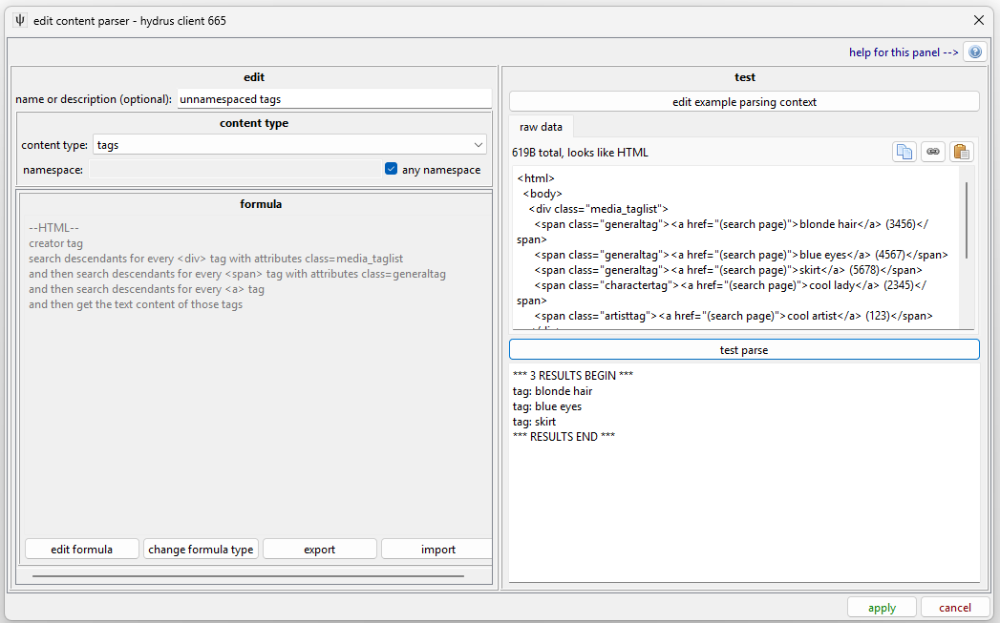
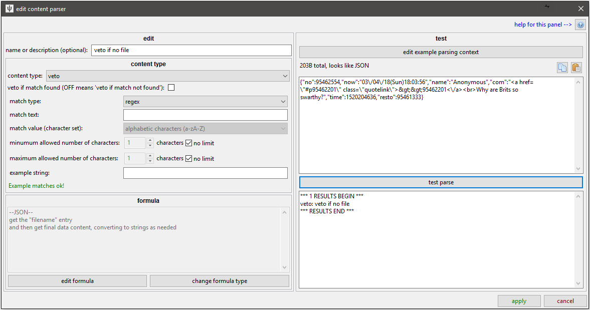

# Content Parsers

So, we can now generate some strings from a document. Content Parsers will let us apply a single metadata type to those strings to inform hydrus what they are.

A content parser has a name, a content type, and a formula. This example fetches the character tags from a danbooru post.

The name is just decorative, but it is generally a good idea so you can find things again when you next revisit them.

The current content types are:

## urls { id="intro" }

This should be applied to relative ('/image/smile.jpg') and absolute ('https://mysite.com/content/image/smile.jpg') URLs. If the URL is relative, the client will generate an absolute URL based on the original URL used to fetch the data being parsed (i.e. it should all just work).

You can set several types of URL:

*   **url to download/pursue** means a Post URL or a File URL in our URL Classes system, like a booru post or an actual raw file like a jpg or webm.
*   **url to associate** means an URL you want added to the list of 'known urls' for the file, but not one you want to client to actually download and parse. Use this to neatly add booru 'source' urls.
*   **next gallery page** means the next Gallery URL on from the current one.

The 'file url quality precedence' allows the client to select the best of several possible URLs. Given multiple content parsers producing URLs at the same 'level' of parsing, it will select the one with the highest value. Consider these two posts:

*   [https://danbooru.donmai.us/posts/3016415](https://danbooru.donmai.us/posts/3016415)
*   [https://danbooru.donmai.us/posts/3040603](https://danbooru.donmai.us/posts/3040603)

The Garnet image fits into a regular page and so Danbooru embed the whole original file in the main media canvas. One easy way to find the full File URL in this case would be to select the "src" attribute of the "img" tag with id="image".

The Cirno one, however, is much larger and has been scaled down. The src of the main canvas tag points to a resized 'sample' link. The full link can be found at the 'view original' link up top, which is an "a" tag with id="image-resize-link".

The Garnet post does not have the 'view original' link, so to cover both situations we might want two content parsers--one fetching the 'canvas' "src" and the other finding the 'view original' "href". If we set the 'canvas' one with a quality of 40 and the 'view original' 60, then the parsing system would know to select the 60 when it was available but to fall back to the 40 if not.

As it happens, Danbooru (afaik, always) gives a link to the original file under the 'Size:' metadata to the left. This is the same 'best link' for both posts above, but it isn't so easy to identify. It is a quiet "a" tag without an "id" and it isn't always in the same location, but if you could pin it down reliably, it might be nice to circumvent the whole issue.

Sites can change suddenly, so it is nice to have a bit of redundancy here if it is easy.

## tags { id="tags" }

These are simple--they tell the client that the given strings are tags. You set the namespace here as well. I recommend you parse 'splashbrush' and set the namespace 'creator' here rather than trying to mess around with 'append prefix "creator:"' string conversions at the formula level--it is simpler up here and it lets hydrus handle any edge case logic for you.

Leave the namespace field blank for unnamespaced tags.

## file hash { id="file_hash" }

This says 'this is the hash for the file otherwise referenced in this parser'. So, if you have another content parser finding a File or Post URL, this lets the client know early that that destination happens to have a particular MD5, for instance. The client will look for that hash in its own database, and if it finds a match, it can predetermine if it already has the file (or has previously deleted it) without ever having to download it. When this happens, it will still add tags and associate the file with the URL for it's 'known urls' just as if it _had_ downloaded it!

If you understand this concept, it is great to include. It saves time and bandwidth for everyone. Many site APIs include a hash for this exact reason--they want you to be able to skip a needless download just as much as you do.

The usual suite of hash types are supported: MD5, SHA1, SHA256, and SHA512. An old version of this required some weird string decoding, but this is no longer true. Select 'hex' or 'base64' from the encoding type dropdown, and then just parse the 'e5af57a687f089894f5ecede50049458' or '5a9XpofwiYlPXs7eUASUWA==' text, and hydrus should handle the rest. It will present the parsed hash in hex.

## timestamp { id="timestamp" }

This lets you say that a given number refers to a particular time for a file. At the moment, I only support 'source time', which represents a 'post' time for the file and is useful for thread and subscription check time calculations. It takes a Unix time integer, like 1520203484, which many APIs will provide.

If you are feeling very clever, you can decode a 'MM/DD/YYYY hh:mm:ss' style string to a Unix time integer using string converters, which use some hacky and semi-reliable python %d-style values as per [here](https://docs.python.org/2/library/datetime.html#strftime-and-strptime-behavior). Look at the existing defaults for examples of this, and don't worry about being more accurate than 12/24 hours--trying to figure out timezone is a hell not worth attempting, and doesn't really matter in the long-run for subscriptions and thread watchers that might care.

## watcher page title { id="page_title" }

This lets the watcher know a good name/subject for its entries. The subject of a thread is obviously ideal here, but failing that you can try to fetch the first part of the first post's comment. It has precendence, like for URLs, so you can tell the parser which to prefer if you have multiple options. Just for neatness and ease of testing, you probably want to use a string converter here to cut it down to the first 64 characters or so.

## veto { id="veto" }

This is a special content type--it tells the next highest stage of parsing that this 'post' of parsing is invalid and to cancel and not return any data. For instance, if a thread post's file was deleted, the site might provide a default '404' stock File URL using the same markup structure as it would for normal images. You don't want to give the user the same 404 image ten times over (with fifteen kinds of tag and source time metadata attached), so you can add a little rule here that says "If the image link is 'https://somesite.com/404.png', raise a veto: File 404" or "If the page has 'No results found' in its main content div, raise a veto: No results found" or "If the expected download tag does not have 'download link' as its text, raise a veto: No Download Link found--possibly Ugoira?" and so on.

They will associate their name with the veto being raised, so it is useful to give these a decent descriptive name so you can see what might be going right or wrong during testing. If it is an appropriate and serious enough veto, it may also rise up to the user level and will be useful if they need to report you an error (like "After five pages of parsing, it gives 'veto: no next page link'").