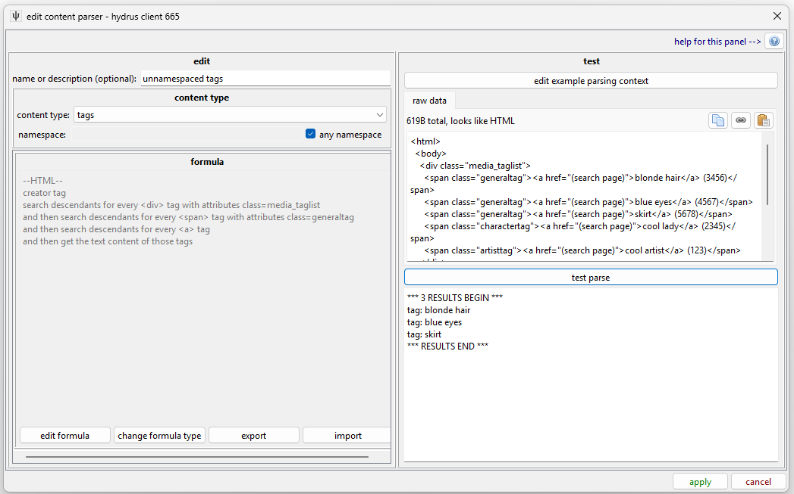
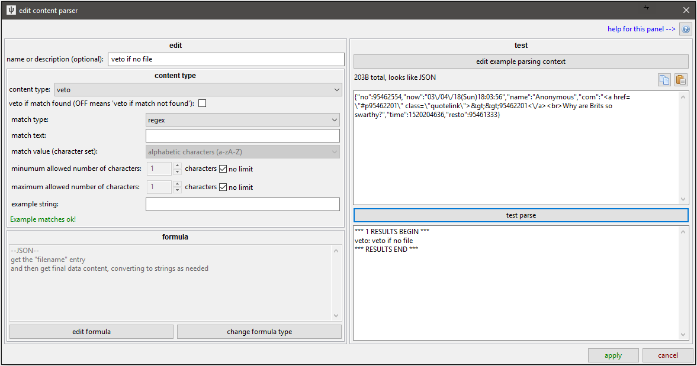

# Content Parsers

So, we can now generate some strings from a document. Content Parsers will let us apply a single metadata type to those strings to inform hydrus what they are.

A content parser has a name, a content type, and a formula. This example continues from what we saw in the formula discussion. We are telling hydrus that these strings are tags that have no specific namespace. Note that in the test area, the results are no longer raw strings but contextualised with their new metadata.

The name is just decorative, but it is generally a good idea so you can find things again when you next revisit them.

Let's look at the different content types:

## urls { id="intro" }

This should be applied to relative (`/image/smile.jpg`) and absolute (`https://mysite.com/content/image/smile.jpg`) URLs. If the URL is relative, the client will generate an absolute URL based on the original URL used to fetch the data being parsed (i.e. it should all just work most of the time).

You can set several types of URL:

*   **url to download/pursue** means a Post URL or a File URL in our URL Classes system, like a booru post or an actual raw file like a jpg or webm.
*   **url to associate** means an URL you want added to the list of 'known urls' for the file, but not one you want to client to actually download and parse. Use this to neatly add booru 'source' urls.
*   **next gallery page** means the next Gallery URL on from the current one.

The 'file url quality precedence' allows the client to select the best of several possible URLs. If you have multitple content parsers getting URLs, it will select the one with the highest value. If an 'original quality' link is preferred but not always present, you can add it with a higher precedence score than the generic URL (e.g. a score of 60 vs 40), and hydrus will prefer that 'original' one when it exists.

Sites can change suddenly, so it is nice to have a bit of redundancy here if it is easy. The file URL is the most important thing we want to parse!

## tags { id="tags" }

This is simple--it tells the client that the given strings are tags. You set the namespace here as well. Do not try to prefix tags with "creator:" using String Processing! Just parse the bare string and add 'creator'.

## file hash { id="file_hash" }

This says 'this is the hash for the file otherwise referenced in this parser'. This lets the client know early that that destination happens to have a particular MD5, for instance. Before doing any extra work, the client will look for that hash in its own database, and if it finds a match, it can predetermine if it already has the file--or has previously deleted it--and determine that it can safely skip a redundant file download. When this happens, it will still add tags and associate the file with the URL for it's 'known urls' just as if it _had_ downloaded it!

If you understand this concept, it is great to include. It saves time and bandwidth for everyone. Many site APIs include a hash for this exact reason--they want you to be able to skip a needless download just as much as you do.

The usual suite of hash types are supported: MD5, SHA1, SHA256, and SHA512. Select 'hex' or 'base64' from the encoding type dropdown, and then just parse the `474509d5166b37344f999c68e4de70ed` or `NDc0NTA5ZDUxNjZiMzczNDRmOTk5YzY4ZTRkZTcwZWQ=` text, and hydrus should handle the rest. It will present the parsed hash in hex.

## timestamp { id="timestamp" }

This lets you say that a given number refers to a particular 'post time' for a file. This is useful for thread and subscription check time calculations, and it propagates down to the 'modified time' store for the source domain. It takes a Unix time integer, like 1520203484, which many APIs will provide.

If the site delivers a datestring, parse it and apply the special 'datestring to timestamp' conversion rule under String Processing -> String Converter. Look at other parsers for examples of this, and don't worry about being more accurate than 12/24 hours--trying to figure out timezone is a hell not worth attempting and doesn't really matter in the long-run.

## watcher page title { id="page_title" }

This lets a watcher know a good name/subject for its entries. The subject of a thread is obviously ideal here, but failing that you can try to fetch the first part of the first post's comment. It has precendence, like for URLs, so you can tell the parser which to prefer if you have multiple options. Just for neatness and ease of testing, you probably want to use a string converter here to cut it down to the first 64 characters or so.

## veto { id="veto" }

This is a special content type--it tells the next highest stage of parsing that this 'post' of parsing is invalid and to cancel and not return any data. For instance, if a thread post's file was deleted, the site might provide a default '404' stock File URL using the same markup structure as it would for normal images. You don't want to give the user the same 404 image ten times over (with fifteen kinds of tag and source time metadata attached), so you can add a little rule here that says "If the image link is `https://somesite.com/404.png`, raise a veto: File 404" or "If the page has 'No results found' in its main content div, raise a veto: No results found" or "If the expected download tag does not have 'download link' as its text, raise a veto: No Download Link found--possibly Ugoira?" and so on.

These content parsers will attach their name with the veto being raised, so it is useful to give these a decent descriptive name so you can see what might be going right or wrong during testing. It may also percolate up to the user level, and they would appreciate something sensible.
