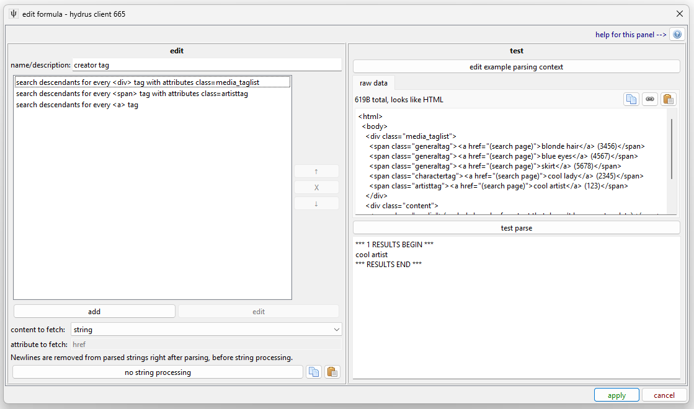
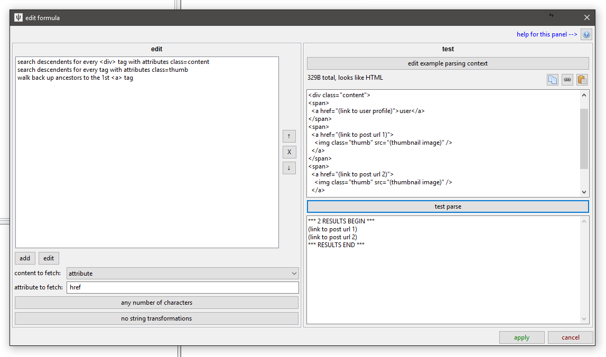
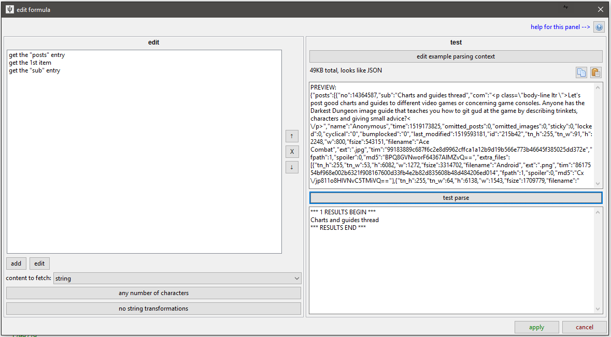
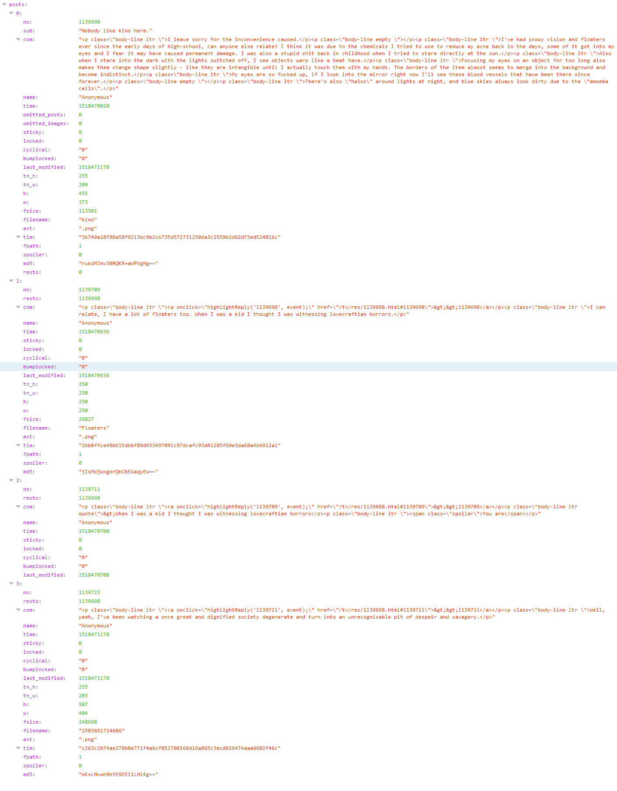
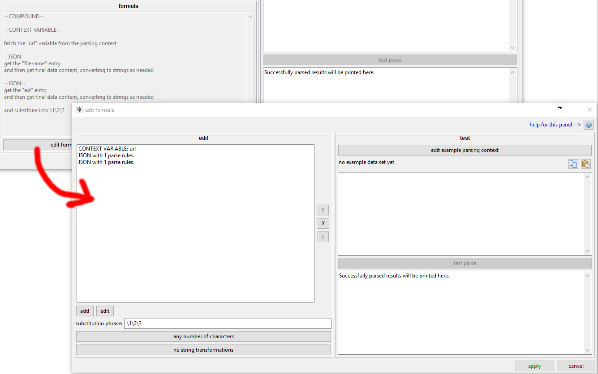

# Parser Formulae { id="formulae" }

Formulae are tools used by higher-level components of the parsing system. They take some data (typically some HTML or JSON) and return 0 to n strings. For our purposes, these strings will usually be tags, URLs, and timestamps. You will usually see them summarised with this panel:


The different types are currently [html](#html_formula), [json](#json_formula), [compound](#compound_formula), and [context variable](#context_variable_formula).

## html { id="html_formula" }

This takes a full HTML document or a sample of HTML--and any regular sort of XML _should_ also work. It starts at the root node and searches for lower nodes using one or more ordered rules based on tag name and attributes, and then returns string data from those final nodes.

For instance, if you have this:

```html
<html>
  <body>
    <div class="media_taglist">
      <span class="generaltag"><a href="(search page)">blonde hair</a> (3456)</span>
      <span class="generaltag"><a href="(search page)">blue eyes</a> (4567)</span>
      <span class="generaltag"><a href="(search page)">bodysuit</a> (5678)</span>
      <span class="charactertag"><a href="(search page)">samus aran</a> (2345)</span>
      <span class="artisttag"><a href="(search page)">splashbrush</a> (123)</span>
    </div>
    <div class="content">
      <span class="media">(a whole bunch of content that doesn't have tags in)</span>
    </div>
  </body>
</html>
```

_(Most boorus have a taglist like this on their file pages.)_

To find the artist, "splashbrush", here, you could:

*   search beneath the root tag (`#!html <html>`) for the `#!html <div>` tag with attribute `class="media_taglist"`
*   search beneath that `#!html <div>` for `#!html <span>` tags with attribute `class="artisttag"`
*   search beneath those `#!html <span>` tags for `#!html <a>` tags
*   and then get the string content of those `#!html <a>` tags

Changing the `artisttag` to `charactertag` or `generaltag` would give you `samus aran` or `blonde hair`, `blue eyes`, `bodysuit` respectively.

You might be tempted to just go straight for any `#!html <span>` with `class="artisttag"`, but many sites use the same class to render a sidebar of favourite/popular tags or some other sponsored content, so it is generally best to try to narrow down to a larger `#!html <div>` container so you don't get anything you don't mean.

### the ui

Clicking 'edit formula' on an HTML formula gives you this:



You edit on the left and test on the right.

### finding the right html tags

When you add or edit one of the specific tag search rules, you get this:


You can set multiple key/value attribute search conditions, but you'll typically be searching for 'class' or 'id' here, if anything.

Note that you can set it to fetch only the xth instance of a found tag, which can be useful in situations like this:

```html
<span class="generaltag">
  <a href="(add tag)">+</a>
  <a href="(remove tag)">-</a>
  <a href="(search page)">blonde hair</a> (3456)
</span>
```

Without any more attributes, there isn't a great way to distinguish the `#!html <a>` with "blonde hair" from the other two--so just set `get the 3rd <a> tag` and you are good.

Most of the time, you'll be searching descendants (i.e. walking down the tree), but sometimes you might have this:

```html
<span>
  <a href="(link to post url)">
    
  </a>
</span>
```

There isn't a great way to find the `#!html <span>` or the `#!html <a>` when looking from above here, as they are lacking a class or id, but you can find the `#!html ` ok, so if you find those and then add a rule where instead of searching descendants, you are 'walking back up ancestors' like this:



You can solve some tricky problems this way!

You can also set a String Match, which is the same panel as you say in with URL Classes. It tests its best guess at the tag's 'string' value, so you can find a tag with 'Original Image' as its text or that with a regex starts with 'Posted on: '. Have a play with it and you'll figure it out.

### content to fetch

Once you have narrowed down the right nodes you want, you can decide what text to fetch. Given a node of:

```html
<a href="(URL A)" class="thumb_title">Forest Glade</a>
```

Returning the `href` attribute would return the string "(URL A)", returning the string content would give "Forest Glade", and returning the full html would give `#!html <a href="(URL A)" class="thumb">Forest Glade</a>`. This last choice is useful in complicated situations where you want a second, separated layer of parsing, which we will get to later.

### string match and conversion

You can set a final String Match to filter the parsed results (e.g. "only allow strings that only contain numbers" or "only allow full URLs as based on (complicated regex)") and String Converter to edit it (e.g. "remove the first three characters of whatever you find" or "decode from base64").

You won't use these much, but they can sometimes get you out of a complicated situation.

### testing

The testing panel on the right is important and worth using. Copy the html from the source you want to parse and then hit the paste buttons to set that as the data to test with.

## json { id="json_formula" }

This takes some JSON and does a similar style of search:



It is a bit simpler than HTML--if the current node is a list (called an 'Array' in JSON), you can fetch every item or the xth item, and if it is a dictionary (called an 'Object' in JSON), you can fetch a particular entry by name. Since you can't jump down several layers with attribute lookups or tag names like with HTML, you have to go down every layer one at a time. In any case, if you have something like this:

[](images/json_thread_example.png)

!!! note
    It is a great idea to check the html or json you are trying to parse with your browser. Some web browsers have excellent developer tools that let you walk through the nodes of the document you are trying to parse in a prettier way than I would ever have time to put together. This image is one of the views Firefox provides if you simply enter a JSON URL.

Searching for "posts"->1st list item->"sub" on this data will give you "Nobody like kino here.".

Searching for "posts"->all list items->"tim" will give you the three SHA256 file hashes (since the third post has no file attached and so no 'tim' entry, the parser skips over it without complaint).

Searching for "posts"->1st list item->"com" will give you the OP's comment, <span class="dealwithit">\~AS RAW UNPARSED HTML\~</span>.

The default is to fetch the final nodes' 'data content', which means coercing simple variables into strings. If the current node is a list or dict, no string is returned.

But if you like, you can return the json beneath the current node (which, like HTML, includes the current node). This again will come in useful later.

## compound { id="compound_formula" }

If you want to create a string from multiple parsed strings--for instance by appending the 'tim' and the 'ext' in our json example together--you can use a Compound formula. This fetches multiple lists of strings and tries to place them into a single string using `\1` regex substitution syntax:



This is a complicated example taken from one of my thread parsers. I have to take a modified version of the original thread URL (the first rule, so `\1`) and then append the filename (`\2`) and its extension (`\3`) on the end to get the final file URL of a post. You can mix in more characters in the substitution phrase, like `\1.jpg` or even have multiple instances (`https://\2.muhsite.com/\2/\1`), if that is appropriate.

This is where the magic happens, sometimes, so keep it in mind if you need to do something cleverer than the data you have seems to provide.

## context variable { id="context_variable_formula" }

This is a basic hacky answer to a particular problem. It is a simple key:value dictionary that at the moment only stores one variable, 'url', which contains the original URL used to fetch the data being parsed.

If a different URL Class links to this parser via an API URL, this 'url' variable will always be the API URL (i.e. it literally is the URL used to fetch the data), not any thread/whatever URL the user entered.


Hit the 'edit example parsing context' to change the URL used for testing.

I have used this several times to stitch together file URLs when I am pulling data from APIs, like in the compound formula example above. In this case, the starting URL is `https://a.4cdn.org/tg/thread/57806016.json`, from which I extract the board name, "tg", using the string converter, and then add in 4chan's CDN domain to make the appropriate base file URL (`https:/i.4cdn.org/tg/`) for the given thread. I only have to jump through this hoop in 4chan's case because they explicitly store file URLs by board name. 8chan on the other hand, for instance, has a static `https://media.8ch.net/file_store/` for all files, so it is a little easier (I think I just do a single 'prepend' string transformation somewhere).

If you want to make some parsers, you will have to get familiar with how different sites store and present their data!