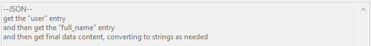
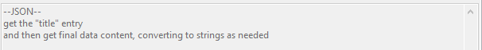
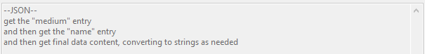

# api example  

Some sites offer API calls for their pages. Depending on complexity and quality of content, using these APIs may or may not be a good idea. Artstation has a good one--let's first review our URL Classes:

 

We convert the original Post URL, [https://www.artstation.com/artwork/mQLe1](https://www.artstation.com/artwork/mQLe1) to [https://www.artstation.com/projects/mQLe1.json](https://www.artstation.com/projects/mQLe1.json). Note that Artstation Post URLs can produce multiple files, and that the API url should not be associated with those final files.

So, when the client encounters an 'artstation file page' URL, it will generate the equivalent 'artstation file page json api' URL and use that for downloading and parsing. If you would like to review your API links, check out _network->downloader definitions->manage url class links->api links_. Using Example URLs, it will figure out which URL Classes link to others and ensure you are mapping parsers only to the final link in the chain--there should be several already in there by default.

Now lets look at the JSON. Loading clean JSON in a browser should present you with a nicer view:

I have highlighted the data we want, which is:

*   The File URLs.
*   Creator, title, medium, and unnamespaced tags.
*   Source time.

JSON is a dream to parse, and I will assume you are comfortable with Content Parsers from the previous examples, so I'll simply paste the different formulae one after another:

Each image is stored under a separate numbered 'assets' list item. This one has just two, but some Artstation pages have dozens of images. The only unusual part here is I also put a String Match of `^(?!.*assets\/covers).*$`, which filters out 'cover' images (such as on [here](https://www.artstation.com/projects/3KyXA.json)), which make for nice portfolio thumbs on the site but are not interesting to us.

This fetches the 'creator' tag. Artstation's API is great because it includes profile data in content requests. There's the creator's presentation name, username, profile link, avatar URLs, all that inside a regular request about this particular work. When that information is missing (like in yiff.party), it may make the API useless to you.

These are all simple. You can take or leave the title and medium tags--some people like them, some don't. This example has no unnamespaced tags, but [this one](https://www.artstation.com/projects/XRm50.json) does. Creator-entered tags are sometimes not worth parsing (on tumblr, for instance, you often get run-on tags like #imbored #whatisevengoingon that are irrelevent to the work), but Artstation users are all professionals trying to get their work noticed, so the tags are usually pretty good.

This again uses python's datetime to decode the date, which Artstation presents with millisecond accuracy, ha ha. I use a `(.+:..)\..*->\1` regex (i.e. "get everything before the period") to strip off the timezone and milliseconds and then decode as normal.

## summary { id="summary" }

APIs that are stable and free to access (e.g. do not require OAuth or other complicated login headers) can make parsing fantastic. They save bandwidth and CPU time, and they are typically easier to work with than HTML. Unfortunately, the boorus that do provide APIs often list their tags without namespace information, so I recommend you double-check you can get what you want before you get too deep into it. Some APIs also offer incomplete data, such as relative URLs (relative to the original URL!), which can be a pain to figure out in our system.