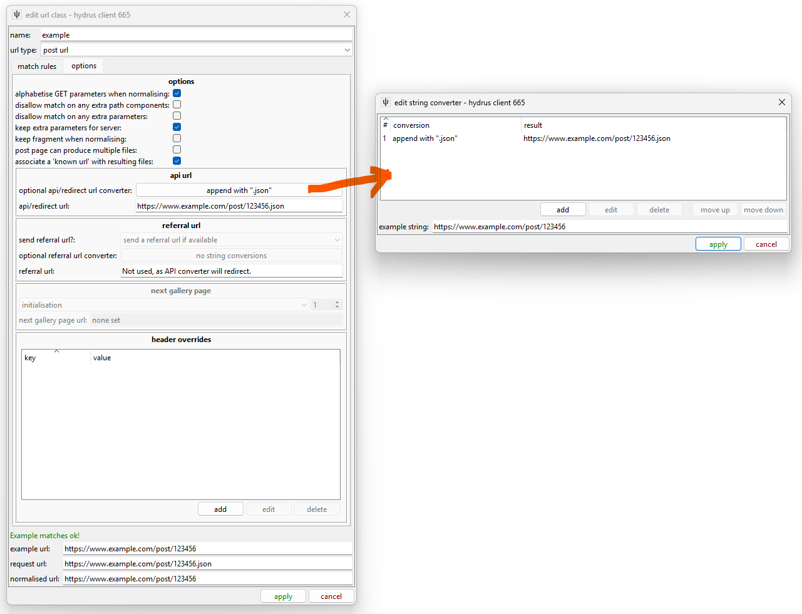
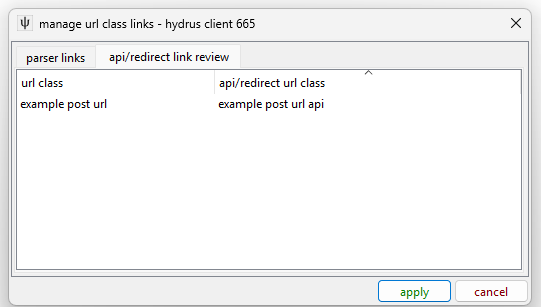
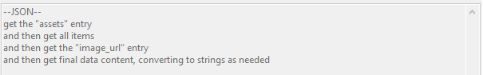

# api example  

This tutorial is very general. You might like to load up a JSON API parser you already have in this edit UI and follow along to see how it implements its specific solution. Pay particular attention to the URL Classes and how JSON parsing differs from HTML.

Some sites offer API calls for their pages. Depending on complexity and quality of content, using these APIs may or may not be a good idea. First of all, we need to think about URL Classes.

Let's say you have a human-facing URL like `https://www.example.com/post/123456` and a corresponding API URL of `https://www.example.com/post/123456.json`. The user wants to handle the former, but we will need to tell hydrus, 'hey, every time you get one of those URLs in a downloader or something, you actually want to look up this API version for the data to parse'. We do this with URL Classes:

Using a String Converter, we tell hydrus to convert all incoming URLs of this type to the same 'plus ".json"'.  Some situations are more complicated and might need regex. Notice that the 'request url' down the bottom has changed to the API URL.

You need a second, separate URL Class for the API URL. Once you have them both set up, check out _network->downloader components->manage url class links_ and check the 'api/redirect link review' tab:

Hydrus has looked at the example URLs generated by these URL Classes and seen that one is redirecting to another. When a downloader runs and sees an 'example post url', it will convert it to the corresponding 'example post url api' URL and send that off instead. In the same way, in the 'parser links' tab, you will only see an entry for 'example post url api'.

Now you will want to look at the JSON. All modern browsers will render a .json document beautifully, so load your document up and have a think about its structure--is it a list of separate posts? Is there tag data with explicit namespace information? Is there something like an artist field that would work as a 'creator' tag on our end?

JSON is itself a dream to parse (intentionally so!), and I will assume you are comfortable with Content Parsers from the previous examples. Make sure you are switched from HTML to JSON parsing formulae and then set some rules to navigate the lists and Objects you see. You'll be creating several rules that look something like this:

## summary { id="summary" }

APIs that are stable and free to access (e.g. do not require OAuth or other complicated login headers) can make parsing fantastic. They save bandwidth and CPU time, and they are typically easier to work with than HTML. Unfortunately, many APIs list their tags without namespace information, so I recommend you double-check you can get what you want before you get too deep into it. Some APIs also offer incomplete data, such as relative URLs (relative to the original URL, not the API URL, which may be on a different domain!), which can be a pain to figure out in our system.
