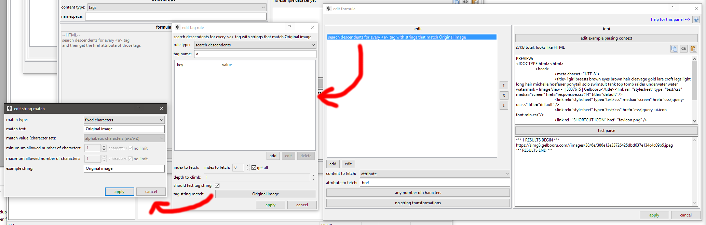
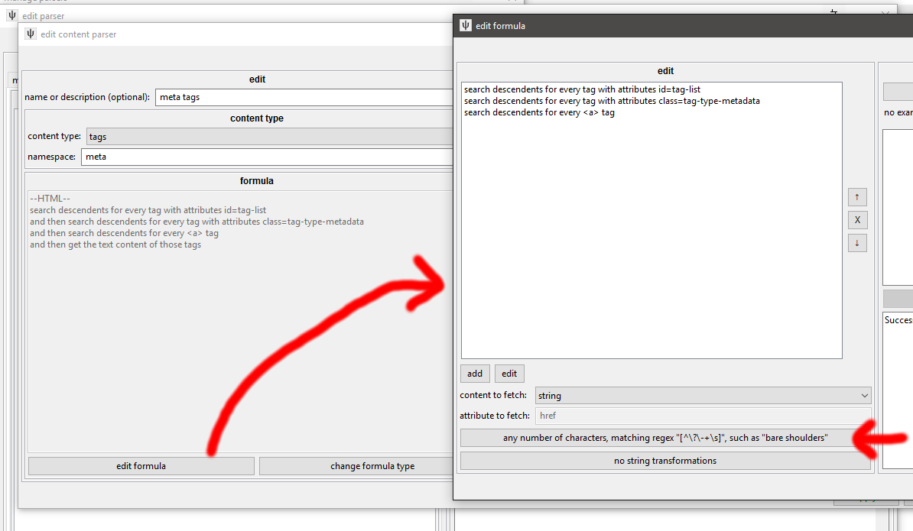
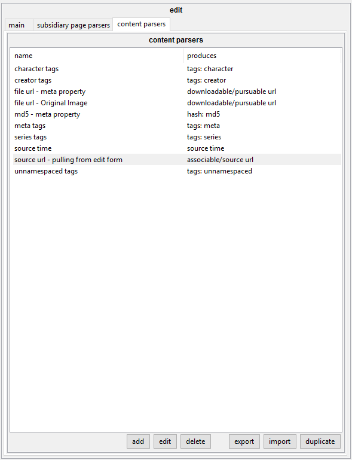

# file page example  

Let's look at this page: [https://gelbooru.com/index.php?page=post&s=view&id=3837615](https://gelbooru.com/index.php?page=post&s=view&id=3837615).

What sorts of data are we interested in here?

*   The image URL.
*   The different tags and their namespaces.
*   The secret md5 hash buried in the HTML.
*   The post time.
*   The Deviant Art source URL.

## the file url { id="the_file_url" }

A tempting strategy for pulling the file URL is to just fetch the src of the embedded `#!html ` tag, but:

*   If the booru also supports videos or flash, you'll have to write separate and likely more complicated rules for `#!html <video>` and `#!html <embed>` tags.
*   If the booru shows 'sample' sizes for large images--as this one does!--pulling the src of the image you see won't get the full-size original for large images.

If you have an account with the site you are parsing and have clicked the appropriate 'Always view original' setting, you may not see these sorts of sample-size banners! I recommend you log out of/go incognito for sites you are inspecting for hydrus parsing (unless a log-in is required to see content, so the hydrus user will have to set up hydrus-side login to actually use the parser), or you can easily NSFW-gates and other logged-out hurdles.

When trying to pin down the right link, if there are no good alternatives, you often have to write several File URL rules with different precedence, saying 'get the "Click Here to See Full Size" link at 75' and 'get the embed's "src" at 25' and so on to make sure you cover different situations, but as it happens Gelbooru always posts the actual File URL at:

*   `#!html <meta property="og:image" content="https://gelbooru.com/images/38/6e/386e12e33726425dbd637e134c4c09b5.jpeg" />` under the `#!html <head>`
*   `#!html <a href="https://simg3.gelbooru.com//images/38/6e/386e12e33726425dbd637e134c4c09b5.jpeg" target="_blank" style="font-weight: bold;">Original image</a>` which can be found by putting a String Match in the html formula.

`#!html <meta>` with `property="og:image"` is easy to search for (and they use the same tag for video links as well!). For the Original Image, you can use a String Match like so:

[](images/downloader_post_example_clean.png)

Gelbooru uses "Original Image" even when they link to webm, which is helpful, but like "og:image", it could be changed to 'video' in future.

I think I wrote my gelbooru parser before I added String Matches to individual HTML formulae tag rules, so I went with this, which is a bit more cheeky:


But it works. Sometimes, just regexing for links that fit the site's CDN is a good bet for finding difficult stuff.

## tags { id="tags" }

Most boorus have a taglist on the left that has a nice id or class you can pull, and then each namespace gets its own class for CSS-colouring:



Make sure you browse around the booru for a bit, so you can find all the different classes they use. character/artist/copyright are common, but some sneak in the odd meta/species/rating.

Skipping ?/-/+ characters can be a pain if you are lacking a nice tag-text class, in which case you can add a regex String Match to the HTML formula (as I do here, since Gelb offers '?' links for tag definitions) like \[^\\?\\-+\\s\], which means "the text includes something other than just '?' or '-' or '+' or whitespace".

## md5 hash { id="md5_hash" }

If you look at the Gelbooru File URL, [**https://gelbooru.com/images/38/6e/386e12e33726425dbd637e134c4c09b5.jpeg**](https://gelbooru.com/images/38/6e/386e12e33726425dbd637e134c4c09b5.jpeg), you may notice the filename is all hexadecimal. It looks like they store their files under a two-deep folder structure, using the first four characters--386e here--as the key. It sure looks like '386e12e33726425dbd637e134c4c09b5' is not random ephemeral garbage!

In fact, Gelbooru use the MD5 of the file as the filename. Many storage systems do something like this (hydrus uses SHA256!), so if they don't offer a `#!html <meta>` tag that explicitly states the md5 or sha1 or whatever, you can sometimes infer it from one of the file links. This screenshot is from the more recent version of hydrus, which has the more powerful 'string processing' system for string transformations. It has an intimidating number of nested dialogs, but we can stay simple for now, with only the one regex substitution step inside a string 'converter':


Here we are using the same property="og:image" rule to fetch the File URL, and then we are regexing the hex hash with `.*(\[0-9a-f\]{32}).*` (MD5s are 32 hex characters). We select 'hex' as the encoding type. Hashes require a tiny bit more data handling behind the scenes, but in the Content Parser test page it presents the hash again neatly in English: "md5 hash: 386e12e33726425dbd637e134c4c09b5"), meaning everything parsed correct. It presents the hash in hex even if you select the encoding type as base64.

If you think you have found a hash string, you should obviously test your theory! The site might not be using the actual MD5 of file bytes, as hydrus does, but instead some proprietary scheme. Download the file and run it through a program like HxD (or hydrus!) to figure out its hashes, and then search the View Source for those hex strings--you might be surprised!

Finding the hash is hugely beneficial for a parser--it lets hydrus skip downloading files without ever having seen them before!

## source time { id="source_time" }

Post/source time lets subscriptions and watchers make more accurate guesses at current file velocity. It is neat to have if you can find it, but:

<b class="dealwithit">FUCK ALL TIMEZONES FOREVER</b>

Gelbooru offers--

```html
<li>Posted: 2017-08-18 19:59:44<br /> by <a href="index.php?page=account&s=profile&uname=jayage5ds">jayage5ds</a></li>
```

--so let's see how we can turn that into a Unix timestamp:


I find the `#!html <li>` that starts "Posted: " and then decode the date according to the hackery-dackery-doo format from [here](https://docs.python.org/2/library/datetime.html#strftime-and-strptime-behavior). `%c` and `%z` are unreliable, and attempting timezone adjustments is overall a supervoid that will kill your time for no real benefit--subs and watchers work fine with 12-hour imprecision, so if you have a +0300 or EST in your string, just cut those characters off with another String Transformation. As long as you are getting about the right day, you are fine.

## source url { id="source_url" }

Source URLs are nice to have if they are high quality. Some boorus only ever offer artist profiles, like `https://twitter.com/artistname`, whereas we want singular Post URLs that point to other places that host this work. For Gelbooru, you could fetch the Source URL as we did source time, searching for "Source: ", but they also offer more easily in an edit form:

```html
<input type="text" name="source" size="40" id="source" value="https://www.deviantart.com/art/Lara-Croft-Artifact-Dive-699335378" />
```

This is a bit of a fragile location to parse from--Gelb could change or remove this form at any time, whereas the "Posted: " `#!html <li>` is probably firmer, but I expect I wrote it before I had String Matches in. It works for now, which in this game is often Good Enough™.

Also--be careful pulling from text or tooltips rather than an href-like attribute, as whatever is presented to the user may be clipped for longer URLs. Make sure you try your rules on a couple of different pages to make sure you aren't pulling "https://www.deviantart.com/art/Lara..." by accident anywhere!

## summary { id="summary" }

Phew--all that for a bit of Lara Croft! Thankfully, most sites use similar schemes. Once you are familiar with the basic idea, the only real work is to duplicate an existing parser and edit for differences. Our final parser looks like this:



This is overall a decent parser. Some parts of it may fail when Gelbooru update to their next version, but that can be true of even very good parsers with multiple redundancy. For now, hydrus can use this to quickly and efficiently pull content from anything running Gelbooru 0.2.5., and the effort spent now can save millions of combined _right-click->save as_ and manual tag copies in future. If you make something like this and share it about, you'll be doing a good service for those who could never figure it out.
