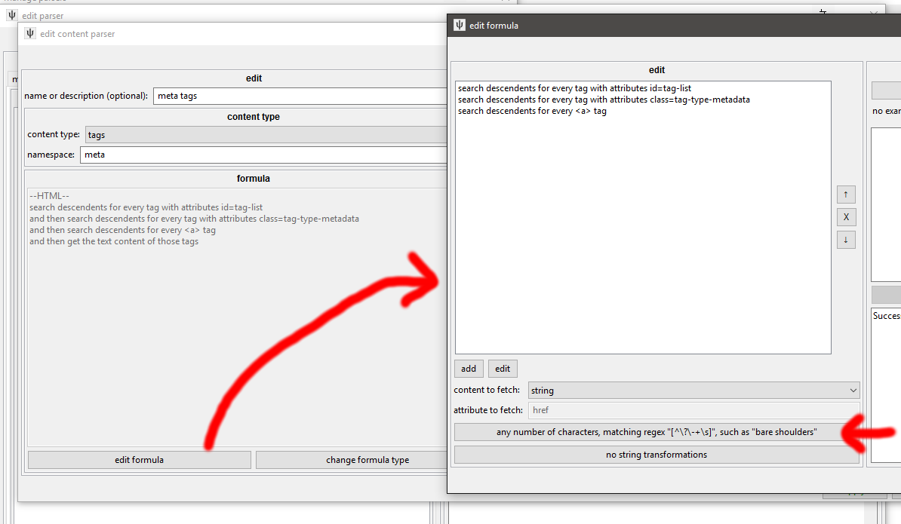
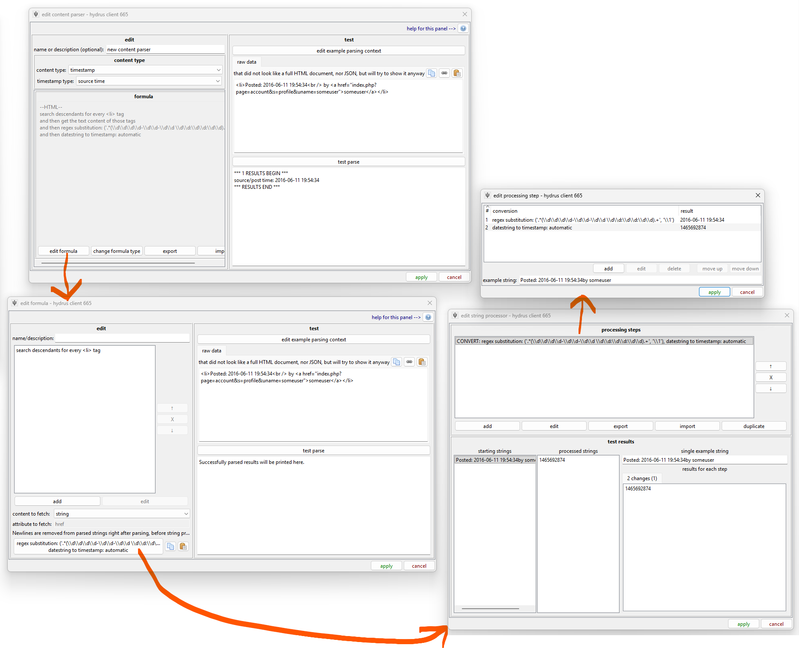
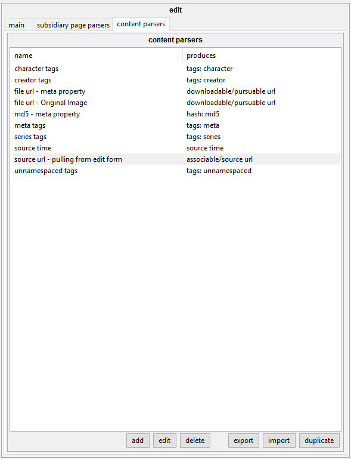

# file page example  

This tutorial is very general. You might like to load up a parser you already have in this edit UI and follow along to see how it implements its specific solution.

Load up a booru-style html 'post' page, where you'll typically have some tags on the left and a single image.

What sorts of data are we interested in here?

*   The highest quality image URL.
*   The different tags and their namespaces.
*   Any hash (e.g. md5) buried in the HTML.
*   The post time.
*   Any source URLs ("this originally came from").

## the file url { id="the_file_url" }

A tempting strategy for pulling the file URL is to just fetch the src of the embedded `#!html ` tag, but:

*   If the site also supports videos or flash, you'll have to write separate and likely more complicated rules for `#!html <video>` and `#!html <embed>` tags.
*   If the site shows 'sample' sizes for large images, pulling the src of the image you see won't get the full-size original for large images.

If you have an account with the site you are parsing and have clicked the appropriate 'Always view original' setting, you may not see these sorts of sample-size banners! I recommend you log out of/go incognito for sites you are inspecting for hydrus parsing (unless a log-in is required to see content, so the hydrus user will have to set up hydrus-side login to actually use the parser), or you can easily miss content gates and other logged-out surprises.

When trying to pin down the right link, if there are no reliable single answers, you often have to write several File URL content parsers. Make sure you set different precedence based on how good/reliable they are, for instance setting the 'get the "Click Here to See Full Size" link' at 75 and 'get the embed's "src"' at 25 and so on to make sure you cover different situations with a good failsafe.

## tags { id="tags" }

Most boorus have a taglist on the left that has a nice id or class you can pull. Each namespace often gets its own class for CSS-colouring:



Make sure you browse around the booru for a bit, so you can find all the different classes they use.

Skipping ?/-/+ characters can be a pain if you are lacking a nice tag-text class, in which case you can add a regex String Match to the HTML formula like this:

`^(?!(\?|\-|\+|\s)$).+$`

Which means "the text is something other than just '?' or '-' or '+' or ' '".

Or

`^(?![\?\-\+\s]+$).+$`

Which means "the text is something other than just the '?-+ ' characters".

## md5 hash { id="md5_hash" }

If you look at the file URL, you'll somettimes get something like '474509d5166b37344f999c68e4de70ed.jpeg', all hexadecimal. It might be stored under a path like `images/47/45/474509d5166b37344f999c68e4de70ed.jpeg`, with the `/47/45` prefix. It sure looks like '474509d5166b37344f999c68e4de70ed' is not random ephemeral garbage!

Many boorus use the md5 hash of the file as the filename. Many storage systems do something like this, either md5 or another hash type--hydrus uses sha256!--so if they don't offer a `#!html <meta>` tag that explicitly states the md5 or sha1 or whatever, you can sometimes infer it from one of the file links.

You might like to check an existing parser to see how hash parsing works, but in general you just want that hex, as hex. A regex in the style of `.*(\[0-9a-f\]{32}).*` (MD5s are 32 hex characters) can be helpful. If the hash comes in base64 format, just select that in the content parser.

If you think you have found a hash string, you should obviously test your theory! The site might not be using the actual MD5 of file bytes, as hydrus does, but instead some proprietary scheme. Download the file and run it through a program like HxD (or hydrus!) to figure out its hashes, and then search the View Source for those hex strings--you might be surprised! Some CDNs can also mess this up, where the file the site thinks it is hosting is optimised in a CloudFlare-style cache and actually differs. An incorrect hash is generally harmless, but a correct one is priceless, so if you can find a hash, even one only 80% reliable because of a flaky CDN, do it!

## source time { id="source_time" }

Post/source time lets subscriptions and watchers make more accurate guesses at current file velocity. It is neat to have if you can find it, but:

<b class="dealwithit">TIMEZONES ARE A PAIN</b>

If your timestamp is in UTC, great. If it has a timezone attached, do not try overly strong to correct for it--there are so many unusual exceptions to IRL timezone data that trying to accomodate it often makes you crazy and causes more problems than it solves. Swallow the +/- 12 hour imprecision and move on.

We want to get something that looks like a UNIX integer timestamp. You might see something like--

```html
<li>Posted: 2016-06-11 19:54:34<br /> by <a href="index.php?page=account&s=profile&uname=someuser">someuser</a></li>
```

--so we would want to grab the string help by the `#!html <li>` and then use a regex substitution in String Processing to capture the `2016-06-11 19:54:34` string--something like `.*(\d\d\d\d-\d\d-\d\d \d\d:\d\d:\d\d).* -> \1` is nice and KISS--and then apply the special 'datestring to timestamp' conversion rule. There's an 'easy/automatic' mode that uses a datestring parsing library to figure it out for you, but you can do a `%d/%m/%y %H:%M:%S`-style fixed parse if you like with the 'advanced' rule. I recommend the easy rule in all cases--it can handle other locales and does a decent job when given timezone info. Here's the kind of thing you want:



## source url { id="source_url" }

Source URLs are nice to have if they are high quality. Some boorus only ever offer artist social media profile landing pages, which are not so useful. We want singular Post URLs that point to other places that host this work.

Be careful pulling from text or tooltips rather than an href-like attribute, as whatever is presented to the user may be clipped for longer URLs. Make sure you try your rules on a couple of different pages. Source URLs are often in fragile locations that are tricky to parse. In this game, 'it works for now' is often Good Enough™.

## summary { id="summary" }

Most sites use similar schemes, so remember to check against existing parsers and don't be afraid to duplicate and edit rather than start anew every time. A final parser usually looks like this:



If you make something like this that works, you can be proud of yourself.
