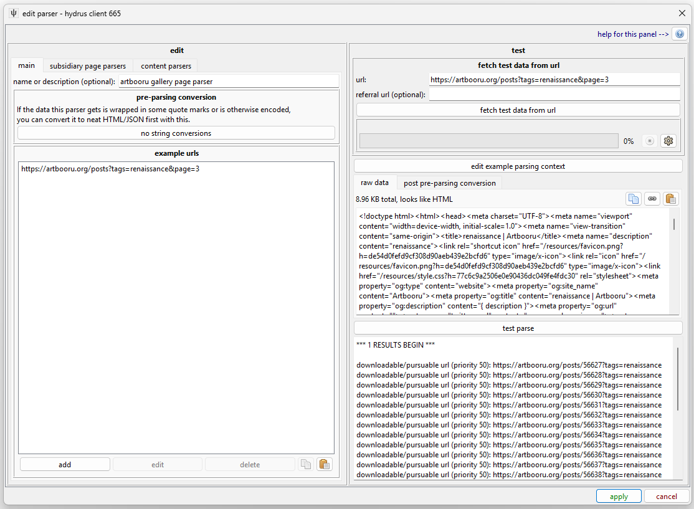
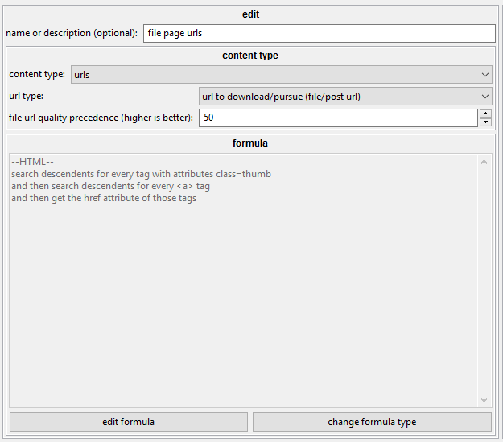
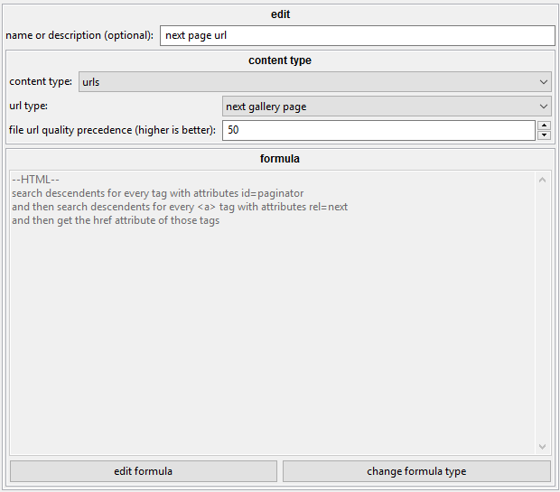

# gallery page example

!!! caution
	These guides should _roughly_ follow what comes with the client by default! You might like to have the actual UI open in front of you so you can play around with the rules and try different test parses yourself.

Let's look at this page: [https://e621.net/post/index/1/rating:safe pokemon](https://e621.net/post/index/1/rating:safe pokemon)

We've got 75 thumbnails and a bunch of page URLs at the bottom.

## first, the main page { id="main_page" }

This is easy. It gets a good name and some example URLs. e621 has some different ways of writing out their queries (and as they use some tags with '/', like 'male/female', this can cause character encoding issues depending on whether the tag is in the path or query!), but we'll put that off for now--we just want to parse some stuff.

## thumbnail links { id="thumbnail_urls" }

Most browsers have some good developer tools to let you Inspect Element and get a better view of the HTML DOM. Be warned that this information isn't always the same as View Source (which is what hydrus will get when it downloads the initial HTML document), as some sites load results dynamically with javascript and maybe an internal JSON API call (when sites move to systems that load more thumbs as you scroll down, it makes our job more difficult--in these cases, you'll need to chase down the embedded JSON or figure out what API calls their JS is making--the browser's developer tools can help you here again). Thankfully, e621 is (and most boorus are) fairly static and simple:

Every thumb on e621 is a `#!html ` with class="thumb" wrapping an `#!html <a>` and an `#!html `. This is a common pattern, and easy to parse:

There's no tricky String Matches or String Converters needed--we are just fetching hrefs. Note that the links get relative-matched to example.com for now--I'll probably fix this to apply to one of the example URLs, but rest assured that IRL the parser will 'join' its url up with the appropriate Gallery URL used to fetch the data. Sometimes, you might want to add a rule for `search descendents for the first 
 tag with id=content` to make sure you are only grabbing thumbs from the main box, whether that is a `#!html 
` or a `#!html `, and whether it has `id="content`" or `class="mainBox"`, but unless you know that booru likes to embed "popular" or "favourite" 'thumbs' up top that will be accidentally caught by a `#!html `'s with `class="thumb"`, I recommend you not make your rules overly specific--all it takes is for their dev to change the name of their content box, and your whole parser breaks. I've ditched the `#!html ` requirement in the rule here for exactly that reason--`class="thumb"` is necessary and sufficient.

Remember that the parsing system allows you to go up ancestors as well as down descendants. If your thumb-box has multiple links--like to see the artist's profile or 'set as favourite'--you can try searching for the `#!html `s, then down to the `#!html `, and then _up_ to the nearest `#!html <a>`. In English, this is saying, "Find me all the image link URLs in the thumb boxes."

## next gallery page link { id="next_gallery_url" }

Most boorus have 'next' or '>>' at the bottom, which can be simple enough, but many have a neat `#!html <link href="/post/index/2/rating:safe%20pokemon" rel="next" />` in the `#!html <head>`. The `#!html <head>` solution is easier, if available, but my default e621 parser happens to pursue the 'paginator':

As it happens, e621 also apply the `rel="next"` attribute to their "Next >>" links, which makes it all that easier for us to find. Sometimes there is no "next" id or class, and you'll want to add a String Match to your html formula to test for a string value of '>>' or whatever it is. A good trick is to View Source and then search for the critical `/post/index/2/` phrase you are looking for--you might find what you want in a `#!html <link>` tag you didn't expect or even buried in a hidden 'share to tumblr' button. `#!html <form>`s for reporting or commenting on content are another good place to find content ids.

Note that this finds two URLs. e621 apply the `rel="next"` to both the "2" link and the "Next >>" one. The download engine merges the parser's dupes, so don't worry if you end up parsing both the 'top' and 'bottom' next page links, or if you use multiple rules to parse the same data in different ways.

## summary { id="summary" }

With those two rules, we are done. Gallery parsers are nice and simple.