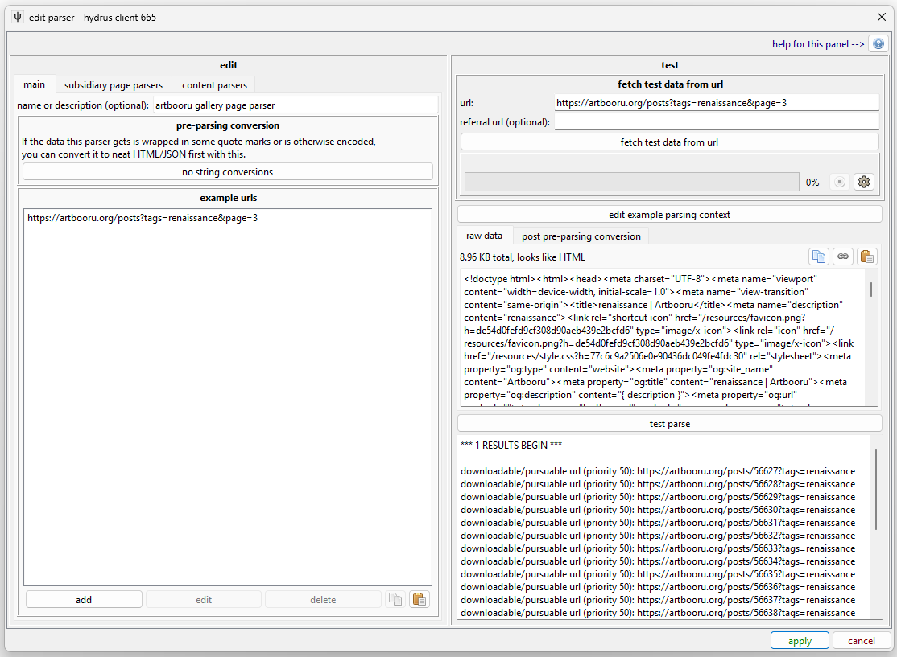
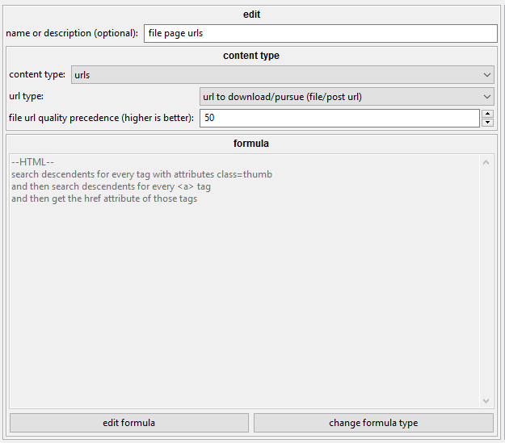
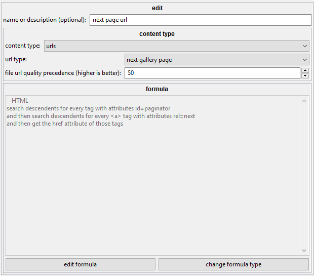

# gallery page example

This tutorial is very general. You might like to load up a parser you already have in this edit UI and follow along to see how it implements its specific solution.

Load up an html gallery page for a typical booru. You've probably got a bunch of thumbnails--maybe 20, 40, 42, or 75--and some page links at the bottom for navigation.

## first, the main edit panel { id="main_page" }

Get your page loaded up in the main UI. Set an example URL and fetch some test data. It is usually a good idea to copy the test data to clipboard/.txt just so you have a quick copy hanging around.

## thumbnail links { id="thumbnail_urls" }

Most browsers have some good developer tools to let you Inspect Element and get a better view of the HTML DOM. Be warned that this information isn't always the same as View Source (which is what hydrus will get when it downloads the initial HTML document), as some sites load results dynamically with javascript. Most older boorus, though, are fairly static and simple.

You might discover that every thumbnail link is a `#!html ` with class="thumb" wrapping an `#!html <a>` and an `#!html `. This sort of pattern is easy to parse in a new content parser:

There's no tricky String Matches or String Converters needed--we are just fetching hrefs. Other situations are not so easy.

Sometimes, you might want to add a rule for `search descendents for the first 
 tag with id=content` to make sure you are only grabbing thumbs from the main box, whether that is a `#!html 
` or a `#!html `, and whether it has `id="content`" or `class="mainBox"`, but unless you know that booru likes to embed "popular" or "favourite" 'thumbs' up top that will be accidentally caught by a `#!html `'s with `class="thumb"`, I recommend you not make your rules overly specific--all it takes is for their dev to change the name of their content box, and your whole parser breaks. I've ditched the `#!html ` requirement in the rule here for exactly that reason--`class="thumb"` is necessary and sufficient.

Remember that the parsing system allows you to go up ancestors as well as down descendants. If your thumb-box has multiple links--like to see the artist's profile or 'set as favourite'--you can try searching for the `#!html `s, then down to the `#!html `, and then _up_ to the nearest `#!html <a>`. In English, this is saying, "Find me all the image link URLs in the thumb boxes."

## next gallery page link { id="next_gallery_url" }

Most boorus have 'next' or '>>' "paginator" at the bottom, which can be simple enough, but many have a neat `#!html <link href="/post/index/2/search_string" rel="next" />` in the `#!html <head>`. You'll often have something like this:

A good trick is to View Source and then search for the critical `/post/index/2/` phrase you are looking for--you might find what you want in a `#!html <link>` tag you didn't expect or even buried in some 'share' button you hadn't thought of.

If your parser gets multiple duplicates, let's say the 'top' and 'bottom' page links, don't worry--the system merges all duplicates after the parse. Sometimes it is good to parse the same thing from multiple locations, although you should always set a 'quality precedence' based on how stable you think each source is. Unreliable fallbacks should obviously be the last thing considered.

## summary { id="summary" }

With those two rules, we are done. Gallery parsers are nice and simple.
