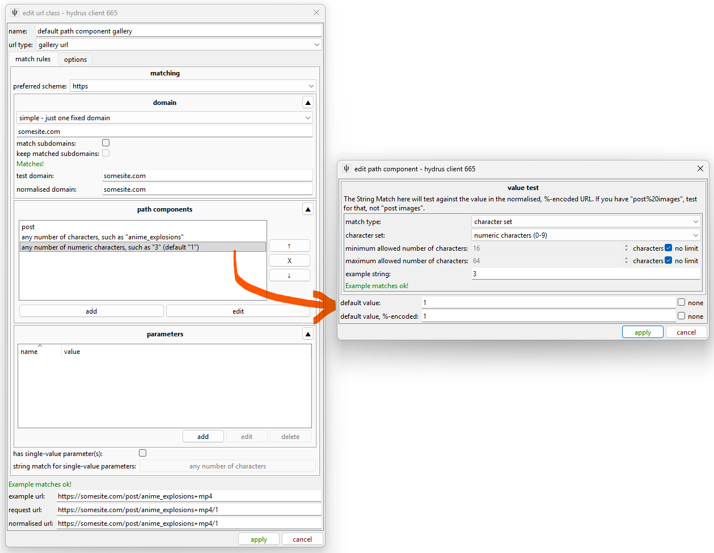
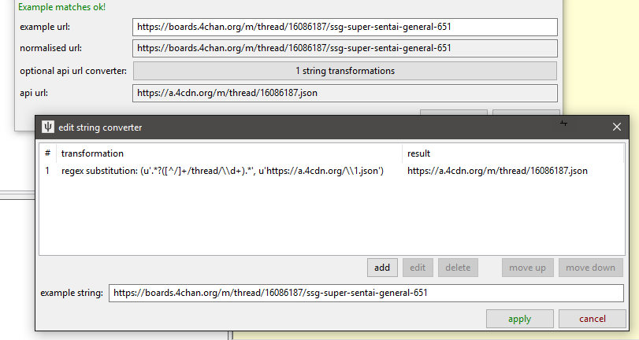

# URL Classes

The fundamental connective tissue of the downloader system is the 'URL Class'. This object identifies and normalises URLs and links them to other components. Whenever the client handles a URL, it tries to match it to a URL Class to figure out what to do.

## the types of url { id="url_types" }

For hydrus, an URL is useful if it is one of:

File URL
:   
    This returns the full, raw media file with no HTML wrapper. They typically end in a filename like [http://safebooru.org//images/2333/cab1516a7eecf13c462615120ecf781116265f17.jpg](http://safebooru.org//images/2333/cab1516a7eecf13c462615120ecf781116265f17.jpg), but sometimes they have a more complicated fetch command ending like 'file.php?id=123456' or '/post/content/123456'.
    
    These URLs are remembered for the file in the 'known urls' list, so if the client happens to encounter the same URL in future, it can determine whether it can skip the download because the file is already in the database or has previously been deleted.
    
    It is not important that File URLs be matched by a URL Class. File URL is considered the 'default', so if the client finds no match, it will assume the URL is a file and try to download and import the result. You might want to particularly specify them if you want to present them in the media viewer or discover File URLs are being confused for Post URLs or something.
    
Post URL

:   
    This typically return some HTML that contains a File URL and metadata such as tags and post time. They sometimes present multiple sizes (like 'sample' vs 'full size') of the file or even different formats (like 'ugoira' vs 'webm'). The Post URL for the file above, [http://safebooru.org/index.php?page=post&s=view&id=2429668](http://safebooru.org/index.php?page=post&s=view&id=2429668) has this 'sample' presentation. Finding the best File URL in these cases can be tricky!
    
    This URL is also saved to 'known urls' and will usually be similarly skipped if it has previously been downloaded. It will also appear in the media viewer as a clickable link.
    
Gallery URL
:   
    This presents a list of Post URLs or File URLs. They often also present a 'next page' URL. It could be a page like [http://safebooru.org/index.php?page=post&s=list&tags=yorha\_no.\_2\_type\_b&pid=0](http://safebooru.org/index.php?page=post&s=list&tags=yorha_no._2_type_b&pid=0) or an API URL like [http://safebooru.org/index.php?page=dapi&s=post&tags=yorha\_no.\_2\_type\_b&q=index&pid=0](http://safebooru.org/index.php?page=dapi&s=post&tags=yorha_no._2_type_b&q=index&pid=0).

Watchable URL
:   
    This is the same as a Gallery URL but represents an ephemeral page that receives new files much faster than a gallery but will soon 'die' and be deleted. For our purposes, this typically means imageboard threads.

## the components of a url { id="url_components" }

As far as we are concerned, a URL string has four parts:

*   **Scheme:** `http` or `https`
*   **Location/Domain:** `safebooru.org` or `i.4cdn.org` or `cdn002.somebooru.net`
*   **Path Components:** `index.php` or `tesla/res/7518.json` or `pictures/user/daruak/page/2` or `art/Commission-animation-Elsa-and-Anna-541820782`
*   **Parameters:** `page=post&s=list&tags=yorha_no._2_type_b&pid=40` or `page=post&s=view&id=2429668`

So, let's look at the 'edit url class' panel, which is found under _network->downloader components->manage url classes_:

A TBIB File Page like [https://tbib.org/index.php?page=post&s=view&id=6391256](https://tbib.org/index.php?page=post&s=view&id=6391256) is a Post URL. Let's look at the metadata first:

Name and type
:    
    Like with GUGs, we should set a good unambiguous name so the client can clearly summarise this url to the user. 'tbib file page' is good.
    
    This is a Post URL, so we set the 'post url' type.
    
Association logic
:   
    All boorus and most sites only present one file per page, but some sites present multiple files on one page, usually several pages in a series/comic, as with pixiv. Danbooru-style thumbnail links to 'this file has a post parent' do not count here--I mean that a single URL embeds multiple full-size images, either with shared or separate tags. It is **very important** to the hydrus client's downloader logic (making decisions about whether it has previously visited a URL, so whether to skip checking it again) that if a site can present multiple files on a single page that 'can produce multiple files' is checked.
    
    Related is the idea of whether a 'known url' should be associated. Typically, this should be checked for Post and File URLs, which are fixed, and unchecked for Gallery and Watchable URLs, which are ephemeral and give different results from day to day. There are some unusual exceptions, so give it a brief thought--but if you have no special reason, leave this as the default for the url type.
    

And now, for matching the string itself, let's revisit our four components:

Scheme
:   
    TBIB supports http and https, so I have set the 'preferred' scheme to https. Any 'http' TBIB URL a user inputs will be automatically converted to https.
    
Location/Domain
:   
    For Post URLs, the domain is always "tbib.org".
    
    The 'allow' and 'keep' subdomains checkboxes let you determine if a URL with "artistname.artsite.com" will match a URL Class with "artsite.com" domain and if that subdomain should be remembered going forward. Most sites do not host content on subdomains, so you can usually leave 'match' unchecked. The 'keep' option (which is only available if 'keep' is checked) is more subtle, only useful for rare cases, and unless you have a special reason, you should leave it checked. (For keep: In cases where a site farms out File URLs to CDN servers on subdomains--like randomly serving a mirror of "https://muhbooru.org/file/123456" on "https://srv2.muhbooru.org/file/123456"--and removing the subdomain still gives a valid URL, you may not wish to keep the subdomain.) Since TBIB does not use subdomains, these options do not matter--we can leave both unchecked.
    
    'www' and 'www2' and similar subdomains are automatically matched. Don't worry about them.
    
Path Components
:   
    TBIB just uses a single "index.php" on the root directory, so the path is not complicated. Were it longer (like "gallery/cgi/index.php", we would add more ("gallery" and "cgi"), and since the path of a URL has a strict order, we would need to arrange the items in the listbox there so they were sorted correctly.
    
Parameters
:   
    TBIB's index.php takes many parameters to render different page types. Note that the Post URL uses "s=view", while TBIB Gallery URLs use "s=list". In any case, for a Post URL, "id", "page", and "s" are necessary and sufficient.
    

## string matches { id="string_matches" }

As you edit these components, you will be presented with the Edit String Match Panel:

This lets you set the type of string that will be valid for that component. If a given path or query component does not match the rules given here, the URL will not match the URL Class. Most of the time you will probably want to set 'fixed characters' of something like "post" or "index.php", but if the component you are editing is more complicated and could have a range of different valid values, you can specify just numbers or letters or even a regex pattern. If you try to do something complicated, experiment with the 'example string' entry to make sure you have it set how you think.

Don't go overboard with this stuff, though--most sites do not have super-fine distinctions between their different URL types, and hydrus users will not be dropping user account or logout pages or whatever on the client, so you can be fairly liberal with the rules.

## how do they match, exactly? { id="match_details" }

This URL Class will be assigned to any URL that matches the location, path, and query. Missing path component or parameters in the URL will invalidate the match but additonal ones will not!

For instance, given:

*   URL A: https://8ch.net/tv/res/1002432.html
*   URL B: https://8ch.net/tv/res
*   URL C: https://8ch.net/tv/res/1002432
*   URL D: https://8ch.net/tv/res/1002432.json
*   URL Class that looks for "(characters)/res/(numbers).html" for the path

Only URL A will match

And:

*   URL A: https://boards.4chan.org/m/thread/16086187
*   URL B: https://boards.4chan.org/m/thread/16086187/ssg-super-sentai-general-651
*   URL Class that looks for "(characters)/thread/(numbers)" for the path

Both URL A and B will match

And:

*   URL A: https://www.pixiv.net/member\_illust.php?mode=medium&illust\_id=66476204
*   URL B: https://www.pixiv.net/member\_illust.php?mode=medium&illust\_id=66476204&lang=jp
*   URL C: https://www.pixiv.net/member_illust.php?mode=medium
*   URL Class that looks for "illust_id=(numbers)" in the query

Both URL A and B will match, URL C will not

If multiple URL Classes match a URL, the client will try to assign the most 'complicated' one, with the most path components and then parameters.

Given two example URLs and URL Classes:

*   URL A: https://somebooru.com/post/123456
*   URL B: https://somebooru.com/post/123456/manga_subpage/2
*   URL Class A that looks for "post/(number)" for the path
*   URL Class B that looks for "post/(number)/manga_subpage/(number)" for the path

URL A will match URL Class A but not URL Class B and so will receive A.

URL B will match both and receive URL Class B as it is more complicated.

This situation is not common, but when it does pop up, it can be a pain. It is usually a good idea to match exactly what you need--no more, no less.

## normalising urls { id="url_normalisation" }

Different URLs can give the same content. The http and https versions of a URL are typically the same, and:

*   [https://gelbooru.com/index.php?page=post&s=view&id=3767497](https://gelbooru.com/index.php?page=post&s=view&id=3767497)
*   gives the same as:
*   [https://gelbooru.com/index.php?id=3767497&page=post&s=view](https://gelbooru.com/index.php?id=3767497&page=post&s=view)

And:

*   [https://e621.net/post/show/1421754/abstract\_background-animal\_humanoid-blush-brown_ey](https://e621.net/post/show/1421754/abstract_background-animal_humanoid-blush-brown_ey)
*   is the same as:
*   [https://e621.net/post/show/1421754](https://e621.net/post/show/1421754)
*   _is the same as:_
*   [https://e621.net/post/show/1421754/help\_computer-made\_up_tags-REEEEEEEE](https://e621.net/post/show/1421754/help_computer-made_up_tags-REEEEEEEE)

Since we are in the business of storing and comparing URLs, we want to 'normalise' them to a single comparable beautiful value. You see a preview of this normalisation on the edit panel. Normalisation happens to all URLs that enter the program.

Note that in e621's case (and for many other sites!), that text after the id is purely decoration. It can change when the file's tags change, so if we want to compare today's URLs with those we saw a month ago, we'd rather just be without it.

On normalisation, all URLs will get the preferred http/https switch, and their parameters will be alphabetised. File and Post URLs will also cull out any surplus path or query components. This wouldn't affect our TBIB example above, but it will clip the e621 example down to that 'bare' id URL, and it will take any surplus 'lang=en' or 'browser=netscape_24.11' garbage off the query text as well. URLs that are not associated and saved and compared (i.e. normal Gallery and Watchable URLs) are not culled of unmatched path components or query parameters, which can sometimes be useful if you want to match (and keep intact) gallery URLs that might or might not include an important 'sort=desc' type of parameter.

Since File and Post URLs will do this culling, be careful that you not leave out anything important in your rules. Make sure what you have is both necessary (nothing can be removed and still keep it valid) and sufficient (no more needs to be added to make it valid). It is a good idea to try pasting the 'normalised' version of the example URL into your browser, just to check it still works.

## 'default' values { id="default_values" }

Some sites present the first page of a search like this:

[https://danbooru.donmai.us/posts?tags=skirt](https://danbooru.donmai.us/posts?tags=skirt)

But the second page is:

[https://danbooru.donmai.us/posts?tags=skirt&page=2](https://danbooru.donmai.us/posts?tags=skirt&page=2)

Another example is:

[https://www.hentai-foundry.com/pictures/user/Mister69M](https://www.hentai-foundry.com/pictures/user/Mister69M)

[https://www.hentai-foundry.com/pictures/user/Mister69M/page/2](https://www.hentai-foundry.com/pictures/user/Mister69M/page/2)

What happened to 'page=1' and '/page/1'? Adding those '1' values in works fine! Many sites, when an index is absent, will secretly imply an appropriate 0 or 1. This looks pretty to users looking at a browser address bar, but it can be a pain for us, who want to match both styles to one URL Class. It would be nice if we could recognise the 'bare' initial URL and fill in the '1' values to coerce it to the explicit, automation-friendly format. Defaults to the rescue:

After you set a path component or parameter String Match, you will be asked for an optional 'default' value. You won't want to set one most of the time, but for Gallery URLs, it can be hugely useful--see how the normalisation process automatically fills in the missing path component with the default! There are plenty of examples in the default Gallery URLs of this, so check them out. Most sites use page indices starting at '1', but Gelbooru-style imageboards use 'pid=0' file index (and often move forward 42, so the next pages will be 'pid=42', 'pid=84', and so on, although others use deltas of 20 or 40).

## can we predict the next gallery page? { id="next_gallery_page_prediction" }

Now we can harmonise gallery urls to a single format, we can predict the next gallery page! If, say, the third path component or 'page' parameter is always a number referring to page, you can select this under the 'next gallery page' section and set the delta to change it by. The 'next gallery page url' section will be automatically filled in. This value will be consulted if the parser cannot find a 'next gallery page url' from the page content.

It is neat to set this up, but I only recommend it if you actually cannot reliably parse a next gallery page url from the HTML later in the process. It is neater to have searches stop naturally because the parser said 'no more gallery pages' than to have hydrus always one page beyond and end every single search on an uglier 'No results found' or 404 result.

Unfortunately, some sites will either not produce an easily parsable next page link or randomly just not include it due to some issue on their end (Gelbooru is a funny example of this). Also, APIs will often have a kind of 'start=200&num=50', 'start=250&num=50' progression but not include that state in the XML or JSON they return. These cases require the automatic next gallery page rules (check out Artstation and tumblr api gallery page URL Classes in the defaults for examples of this).

## how do we link to APIs? { id="api_links" }

If you know that a URL has an API backend, you can tell the client to use that API URL when it fetches data. The API URL needs its own URL Class.

To define the relationship, click the "String Converter" button, which gives you this:

You may have seen this panel elsewhere. It lets you convert a string to another over a number of transformation steps. The steps can be as simple as adding or removing some characters or applying a full regex substitution. For API URLs, you are mostly looking to isolate some unique identifying data ("m/thread/16086187" in this case) and then substituting that into the new API path. It is worth testing this with several different examples!

When the client links regular URLs to API URLs like this, it will still associate the human-pretty regular URL when it needs to display to the user and record 'known urls' and so on. The API is just a quick lookup when it actually fetches and parses the respective data.
