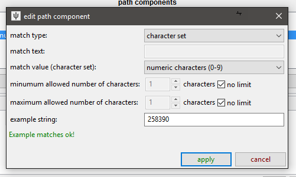
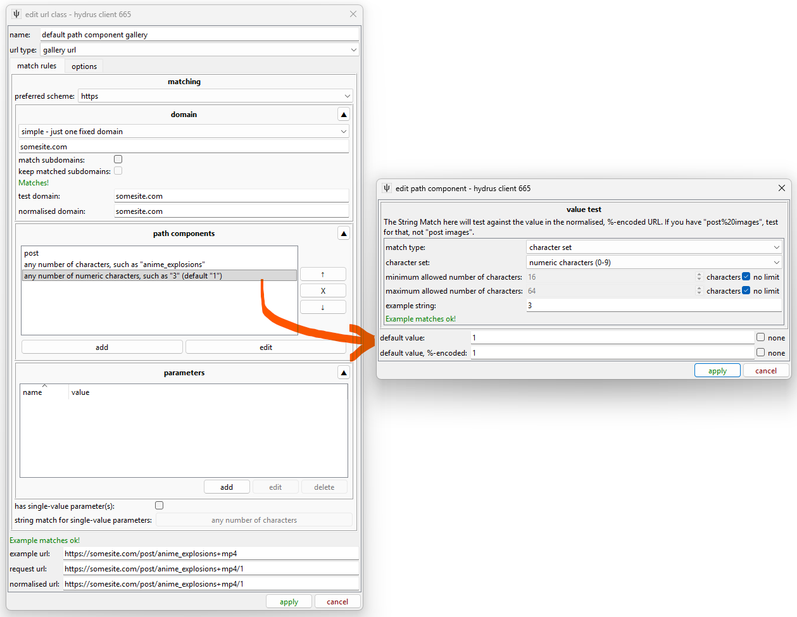

# URL Classes

This tutorial is very general. If you have imported some downloaders made by other users, you might like to check out `network->downloader components->manage url classes` and poke around. See how different things implement their specific solutions.

The fundamental connective tissue of the downloader system is the 'URL Class'. This object identifies and normalises URLs and links them to other components. Whenever the client handles a URL, it tries to match it to a URL Class to figure out what to do.

## the types of url { id="url_types" }

For hydrus, an URL is useful if it is one of:

File URL
:   
    This returns the full, raw media file with no HTML wrapper. They typically end in a filename, but sometimes they only look like `file.php?id=123456` or `/post/content/123456`.
    
    These URLs are remembered for the file in the 'known urls' list, so if the client happens to encounter the same URL in future, it can determine whether it can skip the download because the file is already in the database or has previously been deleted.
    
    You do not have to make URL Classes for direct file URLs. File URL is considered the 'default' type, so if the client finds no match for something, it will assume the URL is actually to a real file and try to download and import the result. You only need to particularly specify them if you want to present them in the media viewer or if your file URLs are being incorrectly matched to a Post URL class by accident.
    
Post URL

:   
    This is your primary workhorse. A Post URL is the page that generally shows a single file and some tags and so on. They sometimes present multiple sizes (like 'sample' vs 'full size') of the file or even different formats (like 'ugoira' vs 'webm'). A few even have multiple files, like a short manga.
    
    This URL is also saved to 'known urls' and will usually be similarly skipped if it has previously been downloaded. It will also appear in the media viewer as a clickable link.
    
Gallery URL
:   
    This presents a list of Post URLs or File URLs. In a web browser it usually looks like a page of thumbnails in a grid. They usually have a navigation bar with previous/next page buttons.

Watchable URL
:   
    This is similar to a Gallery URL but represents an ephemeral page that receives new files much faster than a gallery but will soon 'die' and be deleted. For our purposes, this typically means imageboard threads.

## the components of a url { id="url_components" }

As far as we are concerned, a URL string has four parts:

*   **Scheme:** `http` or `https`
*   **Location/Domain:** `somebooru.org` or `www.mysite.com` or `cdn002.otherbooru.net`
*   **Path Components:** `index.php` or `diy/res/7518.json` or `pictures/user/creatorname/page/2` or `art/Animation-Cool-Stuff-123456`
*   **Parameters:** `page=post&s=list&tags=gothic+mouse+trap&pid=40` or `page=post&s=view&id=2429668`

Load up something you have under _network->downloader components->manage url classes_. Let's look at the metadata first:

Name and type
:    
    Like with GUGs, we should set a good unambiguous name so the client can clearly summarise this url to the user.
    
    We also need to set whether the URL Class is a Post URL, Gallery URL, or what.
    

And now, for matching the string itself, let's revisit our four components:

Scheme
:   
    This is going to be 'https' unless you are connecting to some special loopback/local-network service.
    
Location/Domain
:   
    For Post URLs, the domain is always going to be the basic 'example.com' part. Always set 'one fixed domain' until you know what you are doing. In the future, if you figure out an URL Class that matches a particular hosting engine that operates on several sites, you can set an URL Class to instead match many possible domains, all with the same path components and parameters otherwise.
    
    The 'allow' and 'keep' subdomains checkboxes let you determine if a URL with "artistname.artsite.com" will match a URL Class with "artsite.com" domain and if that subdomain should be remembered going forward. Most sites do not host content on subdomains, so you can usually leave 'match' unchecked. The 'keep' option (which is only available if 'keep' is checked) is more subtle, only useful for rare cases, and unless you have a special reason, you should leave it checked. (For keep: In cases where a site farms out File URLs to CDN servers on subdomains--like randomly serving a mirror of "https://muhbooru.org/file/123456" on "https://srv2.muhbooru.org/file/123456"--and removing the subdomain still gives a valid URL, you may not wish to keep the subdomain.)
    
    Subdomains that start 'www' are automatically matched. Don't worry about them.
    
Path Components
:   
    This splits by `/`, so if you URL is just `https://example.com/index.php?blahblah`, then the path component is just `index.php`. If it were `gallery/cgi/index.php`, then that would be three components.
    
Parameters
:   
    If there are parameters after the path, let's say something like `index.php?s=view&id=123456`, then you have two parameters--`v=view` and `id=123456`. The `view` here is probably fixed and defines this URL Class different from a `v=search` alternate, but the `123456` could be any number. We'd want to tell hydrus that.
    

## string matches { id="string_matches" }

As you edit these components, you will be presented with the Edit String Match Panel:

This lets you filter the type of string that will be valid for that component. If a given path or query component does not match the rule given here, the URL will not match the URL Class. Most of the time you will probably want to set 'fixed characters' of something like "post" or "index.php", but if the component you are editing could have a range of different valid values, you can specify just numbers or letters or even a regex pattern. If you try to do something complicated, experiment with the 'example string' entry to make sure you have it set how you think.

## how do they match, exactly? { id="match_details" }

This URL Class will be assigned to any URL that matches the location, path, and query. Missing path component or parameters in the URL will invalidate the match but, by default, additonal ones will not!

For instance, given:

*   URL A: `https://someimageboard.org/cool/res/12345.html`
*   URL B: `https://someimageboard.org/cool/res`
*   URL C: `https://someimageboard.org/cool/res/12345`
*   URL D: `https://someimageboard.org/cool/res/12345.json`
*   URL Class that looks for "(characters)/res/(numbers).html" for the path

Only URL A will match

And:

*   URL A: `https://differentimageboard.org/diy/thread/16086187`
*   URL B: `https://differentimageboard.org/diy/thread/16086187/how-to-drill`
*   URL Class that looks for "(characters)/thread/(numbers)" for the path

Both URL A and B will match

And:

*   URL A: `https://www.gallerysite.net/member\_work.php?mode=medium&work\_id=123456`
*   URL B: `https://www.gallerysite.net/member\_work.php?mode=medium&work\_id=123456&lang=fr`
*   URL C: `https://www.gallerysite.net/member\_work.php?mode=medium`
*   URL Class that looks for "work_id=(numbers)" in the query

Both URL A and B will match, URL C will not

If an URL matches URL Classes, the client will try to assign the most 'complicated' one, with the most path components and then parameters.

Given two example URLs and URL Classes:

*   URL A: `https://somebooru.com/post/123456`
*   URL B: `https://somebooru.com/post/123456/manga_subpage/2`
*   URL Class A that looks for "post/(number)" for the path
*   URL Class B that looks for "post/(number)/manga_subpage/(number)" for the path

URL A will match URL Class A but not URL Class B and so will receive A.

URL B will match both and receive URL Class B as it is the more complicated Class.

This situation is not common, but when it does pop up, it can be a pain. It is usually a good idea to match exactly what you need--no more, no less. There are tweak options in the URL Class panel to explicitly disable extra-parameter matching and so on, so have a play around if you need to. You can paste an URL into the top of 'manage url classes' to see what it currently matches as.

## normalising urls { id="url_normalisation" }

Different URLs can give the same content. The http and https versions of a URL are typically the same, and:

*   `https://somesite.com/index.php?page=post&s=view&id=123456`
*   gives the same as:
*   `https://somesite.com/index.php?id=123456&page=post&s=view`

And, with descriptive fluff:

*   `https://gallerysite.net/post/show/123456/digital\_inkwork\_character`
*   is the same as:
*   `https://gallerysite.net/post/show/123456`
*   _is the same as:_
*   `https://gallerysite.net/post/show/123456/help\_computer-made\_up_tags-REEEEEEEE`

Since we are in the business of storing and comparing URLs, we want to 'normalise' them to a single comparable beautiful value. You see a preview of this normalisation on the edit panel. Normalisation happens to all URLs that enter the program.

Note that the descriptive fluff is purely decorative. It can also change when the file's tags change, so if we want to compare today's URLs with those we saw a month ago, we'd rather just be without it.

On normalisation, all URLs will get the preferred http/https switch, and their parameters will be alphabetised. File and Post URLs will also cull out any surplus path or query components. Stuff like 'lang=en' or 'browser=netscape_24.11' is typical and will be stripped. URLs that are not associated and saved and compared (i.e. normal Gallery and Watchable URLs) are not culled of unmatched path components or query parameters, so you can relax more on this end. If the user throws in a `sort=desc` that you didn't expect, it'll probably still propagate through and work fine.

Since File and Post URLs will do this culling, be careful that you not leave out anything important in your rules. Make sure what you have is both necessary (nothing can be removed and still keep it valid) and sufficient (no more needs to be added to make it valid). It is a good idea to try pasting the 'normalised' version of the example URL into your browser, just to check it still works.

## 'default' values { id="default_values" }

Some sites present the first page of a search like this:

`https://somesite.com/posts?tags=baseball`

But the second page is:

`https://somesite.com/posts?tags=baseball&page=2`

Another example is:

`https://www.gallerysite.com/pictures/UserName`

`https://www.gallerysite.com/pictures/UserName/page/2`

What happened to 'page=1' and '/page/1'? Adding those '1' values in works fine! Many sites, when an index is absent, will secretly imply an appropriate 0 or 1. This looks pretty to users looking at a browser address bar, but it can be a pain for us who want to match both styles to one URL Class. It would be nice if we could recognise the 'bare' initial URL and fill in the '1' values to coerce it to the explicit, automation-friendly format. Defaults to the rescue:

When you set the String match for a path component or parameter value, you can set a 'default' value. You won't want to set this most of the time, but for Gallery URLs, it can be hugely useful--see how the normalisation process automatically fills in the missing path component with the default!

Most sites use page indices starting at '1', but others use 'pid=0' file index and move forward 42 for 'pid=42', 'pid=84', and so on, or with a delta of 20 or 40 or something else.

## it gets complicated

Check the 'options' tab for a whole bunch of other stuff! We've had to solve a variety of weird problems over the years. Check the tooltips, see other examples, read on in the help here to figure out what is going on. The defaults are fine for all normal situations, so you don't need to make a habit of going through everything every time.

One thing on association logic, though:
:   
    Most sites only present one file per page, but some have multiple, usually several pages in a series/comic. Thumbnail links to 'this file has a post parent' do not count here--I mean that a single Post URL embeds multiple full-size images, either with shared or separate tags. It is **very important** to the hydrus client's downloader logic that URLs that can present multiple files on a single page have `can produce multiple files` checked.
    
    Related is the idea of whether a 'known url' should be associated. Typically, this should be checked for Post and File URLs, which are fixed, and unchecked for Gallery and Watchable URLs, which are ephemeral and give different results from day to day. There are some unusual exceptions, but if you have no special reason, leave this as the default for the url type.
    
