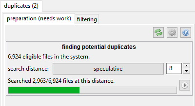
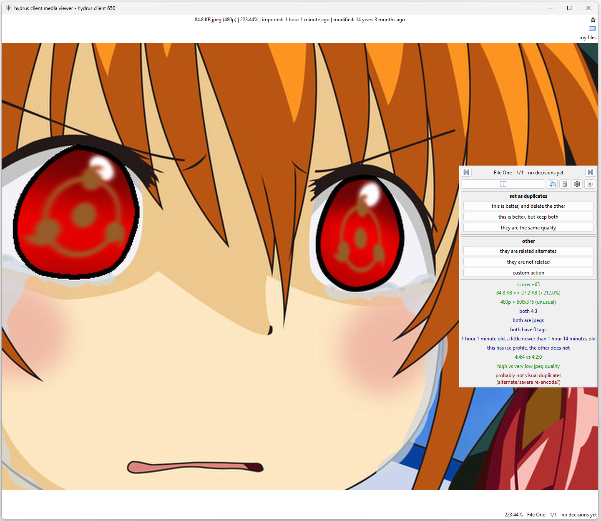
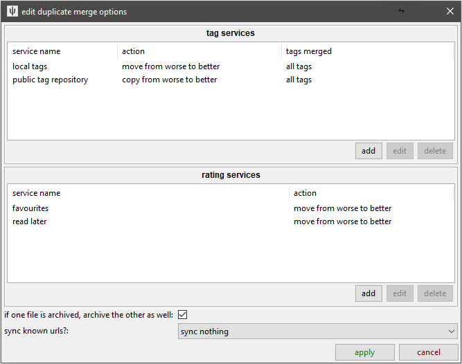
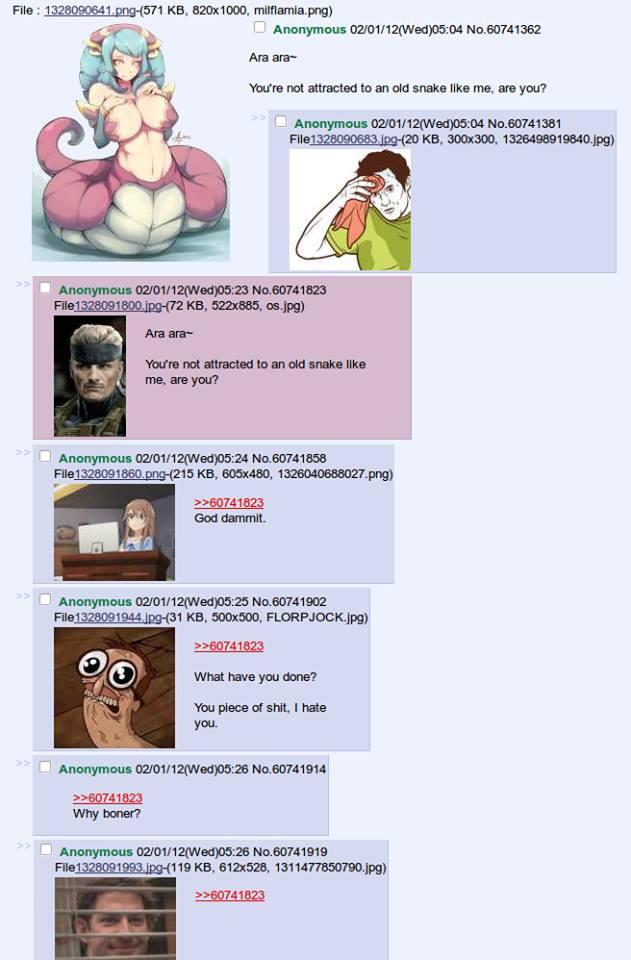
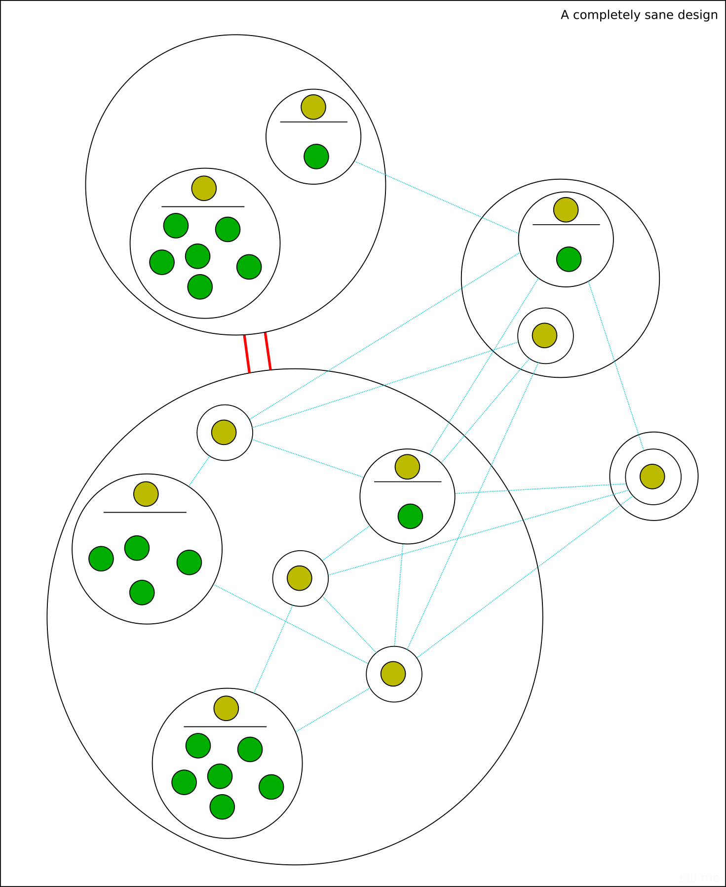

# duplicates { id="intro" }

**This is not a simple topic. If you only just started hydrus, this is the checkpoint where you stop, spend a couple weeks getting more comfortable with stuff, and come back later. I recommend you take it slow and set time aside to read this whole document.**

As files are shared on the internet, they are often resized, cropped, or converted to a new file format. They can also be edited to a new file, whether than is just a small alteration or correction, or turned into a template and reinterpreted over and over and over. Even if you have a very restrictive importing workflow, your client is almost certainly going to get some **duplicates**. We would like to keep the interesting similar-looking **alternates**, like costume changes or work-in-progress transitions, while deleting the lower-quality duplicates where the only notable difference is some muddy jpeg artifacting. Along the way, it would be nice to merge the metadata from the worse files to the better so we do preserve what is useful.

Finding and processing duplicates within a large collection is impossible to do by hand, so I have written a system to do the heavy lifting for you. It works on still images like jpegs and pngs, but advanced users have some ways to inject animation and video matches into the system.

Hydrus finds pairs of _potential_ duplicates using a search algorithm that compares images by their shape. It is sensitive enough to recognise two images of the same character in the exact same pose, but it will not recognise smaller differences like a hair or finger placement correction by the artist, a tear or sweat drops, or basic colour swaps.

Once it discovers potential duplicate pairs, they are presented to you through a filter like the archive/delete filter so you can tell the client their true relationship and if you would like to delete any 'worse' duplicate. All of your decisions build up in the database to form logically consistent groups of duplicates and 'alternate' relationships that can be used to infer future information. For instance, if you say that file A is a duplicate of B and B is a duplicate of C, A and C are automatically recognised as duplicates as well.

Note that 'potential duplicates' are not the same as 'duplicates'. Some common terms:

- _Potential duplicates_ are pairs of files that could be duplicates; most likely hydrus has determined look very similar to each other during its background potential duplicate discovery work.
- _Duplicates_ are pairs or larger groups of files that you have confirmed are different quality or resolution copies of the same source file. Every duplicate group has one 'king' or 'best quality file'.
- _Alternates_ are pairs or larger groups of files that are related in some way but are not duplicates (e.g. costume change, WIPs).

When you are using the systems described on this page, you will usually be preparing queues of 'potential duplicate' pairs to process into confirmed 'duplicates' or 'alternates'. Setting a firm file relationship will remove an existing 'potential duplicates' relationships they have; similarly, files that currently _are_ duplicates or alternates will not naturally appear again as 'potential duplicates'--the question has been resolved.

!!! info "What this system is and is not"
    At the moment, this system is heavily on the side of dealing with duplicates by deleting bad files and merging metadata. The logic and inference is very smart and makes your life easier, but it is mostly hidden away. There is no nice UI to review and rearrange file relationships, nor a detailed audit log for every single decision you made.
    
    Support for 'alternates' and file relationship categorisation is planned for a future expansion but for now is essentially non-existent. We just dump these files in a special place for now.    
    
    We are here to get work done. If you are good to clear out some wasteful stuff, let's go. If you want to curate things to a very fine degree, I recommend you only dip your toes in here and pick what works for you.
    
    Also, there is a little wiggle room between a duplicate and an alternate (e.g. if one of a pair has a watermark or a censorship mark). I don't recommend keeping anything you don't want to look at again, nor bothering to record detailed relationship info about something you are going to delete, but you get to decide which you prefer. It isn't a big deal, so don't stress about it. Like the rest of hydrus, play around with it and see what you like.

This all starts on--

## the duplicates processing page { id="duplicates_page" }

On the normal 'new page' selection window, hit _special->duplicates processing_. This will open this page:

Let's go to the preparation page first:

The 'similar shape' algorithm includes a _search distance_. Two files with 0 distance are likely exact matches, such as resizes of the same file or lower/higher quality jpegs, whereas those with distance 4 tend to be to be hairstyle or costume changes. There usually isn't much useful beyond 8.

!!! warning "Watch out!"
    Some users get excited to find as many potential duplicates as possible and crank the search distance up to 10 or 12. I strongly recommend you start at 0 and try to clear everything there, where it is easy, before ramping up. Keeping your queue smaller also makes all the search logic in here work faster.
    
    Flooding your queue with false positives does not make the job easier!

??? info "Technical info"
    If you are interested, the current version of this system uses a 64-bit [phash](https://jenssegers.com/perceptual-image-hashes) to represent the image shape and a [VPTree](https://en.wikipedia.org/wiki/VP-tree) to search different files' phashes' relative [hamming distance](https://en.wikipedia.org/wiki/Hamming_distance). The hamming distance is our 'search distance' here.

Finding potential duplicate pairs is fairly fast per file, but with a large client with hundreds of thousands of files the total CPU time will add up, particularly as you boost search distance. By default, the client will catch up on any outstanding work here all the time in the background, but the cog icon lets you tweak things if you like.

Once your client discovers some potential pairs, the 'filtering' page should show a useful count.

## the filtering page { id="duplicate_filtering_page" }

_Processing duplicates can be real trudge-work if you do not set up a workflow you enjoy. It is a little slower than the archive/delete filter, and sometimes takes a bit more cognitive work. For many users, it is a good task to do while listening to a podcast or having a video going on another screen._

If you have a client with tens of thousands of files, you will likely have thousands of potential pairs. This may be intimidating, but it is just like your inbox, and the archive/delete filter--do a little bit every now and then, and be happy with what you bank.

The filter has a regular file search interface attached. It defaults to _system:everything_, but you can limit which pairs you are working on by, for instance, adding a 'creator:' tag, or 'system:archived'.

There are some special additional 'potential duplicate pairs' search variables:  

- You can filter how the prosepective pair matches your search:  
    - **at least one file matches the search** - As it says, one file in the pair will match your search. if you have a search for 'system:filetype is jpeg', then one or both of the files in each pair will be a jpeg. This is generally fast and appropriate for common situations. Stick with this unless you need something special.
    - **both files match the search** - Both files in the pair will match the search. With our 'system:filetype is jpeg' search, both files must be a jpeg.
    - **the two files match different searches** - This opens up two search interfaces. If we did 'system:filetype is jpeg' in one and 'system:filetype is png' in another, then each pair we saw would have one jpeg and one png. This can be useful to find pairs where one file is particularly large and the other small. 
- **maximum search distance of pair** - The client remembers at what search distance pairs are matched. If you have searched wider but only want to deal with some 0-distance pairs for a bit, ramp this down.
- **pixel duplicates** - The client recognises when files are _pixel duplicates_, which is to say when they have the exact same resolution and pixel content, down to the byte. This happens sometimes when an image gets some non-image header data, like EXIF, stripped by an internet hosting service. If you want to require or exclude these pairs, set this.

Try putting in your favourite 'creator:' tag now. As you adjust the search, the count of 'x pairs searched; y matched' will change. Once you have a nice number, click 'show some random potential duplicates' button a few times. It is often interesting and surprising to see what it finds!

The action buttons below the 'show some random...' button allow for quick processing of these pairs and groups. Some users really like doing it this way, particularly for large cg sets with 100+ alternates, but I recommend you leave these alone until you know the system better. Start with the duplicate filter.

??? info "Slow searches?"
    This pair search requires some very complicated database queries. I have put a lot of time into making it work fast and count fast, but some situations are still slow. If a particular search runs really bad for you, please try and re-shape it. If the count is bad, you might have some luck tweaking the cog icon (I do a bunch of count estimates and stuff to cover most unusual situations, but in some edge cases these perform worse). I'm interested in your feedback and profiles of it working badly, but I can't promise I can fix every situation.

When you are ready, click 'launch the filter'.

## the duplicates filter { id="duplicates_filter" }

!!! danger "Just Look Around, Do Not Commit Anything Yet!"
    We have not set up your duplicate 'merge' options yet, so do not get too into this. For this first time, either keep reading, or just poke around, make some pretend choices, and then cancel out and choose to forget them.

Like the archive/delete filter, this uses quick mouse-clicks, keyboard shortcuts, or button clicks to action pairs. It presents two files at a time, called 'File One' and 'File Two', that you can quickly switch between by scrolling your mousewheel, just as in the normal media viewer. Unlike the normal viewer, the two files will have their current position and relative zoom locked so you can flick back and forth to compare the same area. Scroll your mouse wheel a couple of times and see if any obvious differences stand out.

When you click to action the pair, the next pair is shown. Sometimes you might go from '10/100' to '12/100', but don't worry about it--it is just skipping a pair it knows it can action using some transitive logic based on what you just said.

The hover window on the right also presents a number of 'comparison statements' to help you make your decision. Green statements mean this current file is probably 'better', and red the opposite. Larger, older, higher-quality, more-tagged files are generally considered better. These statements have scores associated with them (which you can edit in _file->options->duplicates_), and 'File One' will be the one with the highest quickly-generated score, so you can _generally_ assume that if the two are duplicates, 'File One' is going to be better than 'File Two' most of the time, particularly if there are several green statements.

Since writing the auto-resolution system, I have introduced CPU-intensive comparison statements for 'jpeg quality' and a 'visual duplicates' test. These will pop in a second or so after the pair shows. The jpeg quality one is a good estimate. The 'visual duplicates' test is trustworthy to the extent that it is tuned to not produce false positives--you can trust when it says 'these are visual duplicates' more than when it says 'probably not'. You see in this example that it says they are probably alternates or a severe re-encode, and they were the latter--the smaller image was so crunchy with jpeg artifacts that it couldn't confidently say they were duplicates and not some subtle artist correction:

Your human eyes will do better at figuring this stuff out.

The filter will need to occasionally checkpoint, saving the decisions so far to the database, before it can fetch the next batch. It will present you with a quick interstitial 'confirm/back' dialog just to let you know. This happens more often as the potential count decreases.

## the decisions to make { id="duplicates_decisions" }

There are three ways a file can be related to another in the current duplicates system: duplicates, alternates, or false positive (not related).

**False positive (not related)** is the easiest. You will not see completely unrelated pairs presented very often in the filter, particularly at low search distances, but if the shape of face and hair and clothing happen to line up (or geometric shapes, often), the search system may make a false positive match. In this case, just click 'they are not related'.

**Alternate** relations are files that are not duplicates but obviously related in some way. Perhaps a costume change or a recolour. Hydrus does not have rich alternate support yet (but it is planned, and highly requested), so this relationship is mostly a 'holding area' for files that we will revisit for further processing in the future.

**Duplicate** files are of **the exact same thing**. They may be different resolutions, file formats, encoding quality, or one might even have watermark, but they are fundamentally different views on the exact same art. As you can see with the buttons, you can select one file as the 'better' or say they are about the same. I strongly recommend you say 'this is better, and delete the other' most of the time. If the files are very similar, you can hit 'they are the same quality', but there is no prize for determining which of the two was 0.2% better unless you enjoy pixel hunting. You might have reason to keep both, but we are here to eliminate duplicates, not catalogue history, so I recommend defaulting to 'and delete the other' when you can.

You can customise the shortcuts under _file->options->shortcuts->duplicate_filter_. The defaults are:

*   Left-click: **this is better, delete the other**.
*   Right-click: **they are related alternates**.
*   Middle-click: **Go back one decision.**
*   Enter/Escape: **Stop filtering.**

## merging metadata { id="duplicates_merging" }

If the duplicate filter is open, exit out without committing anything. Let's set up your **default duplicate metadata merge options** before we do anything real.

!!! danger "Turn your brain on"
    This part is important. The defaults should be fine for most users, but if you have additional tag or rating services, or particularly finicky opinions about something, you will want to review it all. Tags, ratings, and archive status are important to get right, and if you add tag or rating services in future, you'll want to revisit this.
    
    I am planning a retroactive duplicate metadata merge tool, so don't worry too much if you miss something--we will be able to re-do it later. 

If the 'worse' duplicate you are about to delete has some tags the 'better' file does not, it would be nice to merge the content from the worse to the better, right? Same deal for archived status--if you already archived the worse and the better is in the inbox, we'd want to auto-archive it.

Click the 'edit default duplicate metadata merge options' button:

These default options are fine. If you have more tag or rating services, add them. I recommend allowing 'all tags' for any tag filter you set up. You might be tempted to set up clever tag filters so certain metatags like 'low quality' or 'censored' are not merged from a worse to a better, but it is tricky to catch things and isn't a big deal in practise. Same deal for copying URLs--it isn't strictly correct to say that a nice file can be found in the same location a bad file could, but it is generally worthwhile for most users to take the rough with the smooth from that cruft. You can, of course, set up whatever you want, though. Have a think about it, and maybe revisit it if something isn't working for you. Remember though: don't try to be perfect, or you'll go crazy.

The settings for better and same quality should probably be similar, but it depends on your situation.

If you choose the 'custom action' in the duplicate filter, you will be presented with a fresh 'edit duplicate merge options' panel for the action you select and can customise the merge specifically for that choice. It is a pain in the neck to set up over and over right now, so don't plan to do this all the time.

## pair grouping and sort

If you look back on the duplicates page, there are some options above the 'launch the filter button'.

You can decide whether to receive 'mixed pairs' or work in 'group mode':

- **mixed pairs** - You get an essentially random selection from all of the pairs in the search space you have defined. You might see the same file appear twice, but it'll probably bounce all over the place. You will work in checkpointed batches of 100 pairs or so.
- **group mode** - Every batch you receive will be the entirety of a particular 'potential duplicates group'. You process everything in the group before moving on to the next.

A potential duplicates group is all the files that look like each other, strictly the union of transitive relations for one randomly selected pair. If we had A potential to B, and B pot C, and B pot D, then the whole group of files that are probably all potential to each other, in some way, is ABCD. A lot of the time, a 'group' is just a single pair, but sometimes it is much larger. The 'show some random potential duplicates' button always provides groups, so if you have seen that produce five files, all similar, then that's the kind of thing you'll see, one after another, in group mode.

Group mode is a little more advanced than 'mixed pairs' mode. Since it sees '1/1' batches a lot, it will commit stuff without asking you more frequently. You can change this behaivour to 'always confirm' under `options->duplicates`.

How to sort the incoming pairs is a complicated question. By default, the duplicate filter will present pairs with the largest files first (sort by filesize of larger file/largest first), and this works well for most purposes. You can play around with the sort more, but we have found that most other sorts modes just increase your workload (just by presenting some inefficient decision logic).

## ???

You should be all set up now. Dive into the duplicate filter and see how you like it. Please let me know how you get on!

## what next? { id="future" }

The duplicate system is still incomplete. The UI still needs a lot of work so users can see what is going on under the hood. Future versions will show duplicate information on thumbnails and the media viewer and allow quick-navigation to a file's duplicates and alternates in the media viewer without breaking the normal navigation flow.

There's also the question of how to categorise alternates. I expect to allow clever labelling like 'these are WIPs' and some support for file ordering when progression is appropriate, and then all the UI to present and navigate that nicely. The system to handle all this will be a huge project, maybe 2027.

For now, if you wish to explore a file's duplicates, right-click it and select the sometimes-fearsomely-complicated `manage->file relationships` submenu. You can review all its current duplicates, open them in a new page, appoint the new 'best file' of a duplicate group, and even mass-action selections of thumbnails. Doing `open->in a new duplicate filter page` is also really useful (it just opens up a new duplicates page with a `system:hashes` pred to limit the search space to those files!).

You can also search for files based on the number of file relations they have using _system:file relationships_. You can also search for best/not best files of groups, which makes it easy, for instance, to find all the spare duplicate files if you decide you no longer want to keep them.

## game cgs { id="game_cgs" }

If you import a lot of game CGs, which frequently have dozens or hundreds of alternates, my 'alternates' storage system fails. It scales badly, and while 4-5 files are fine, if you select and right-click 500 similar files and say 'set all these as alternates', you'll swiftly get dialogs warning you about setting 1+ million relationships. This is not great, and you should not do it! Please try to ignore/exclude these pairs for now. You can keep working on them when they appear in the duplicate filter, but I'll be overhauling the database tech here to more efficiently handle large groups.

## examples and discussion { id="duplicates_examples" }

### better/worse { id="duplicates_examples_better_worse" }

Which of two files is better? We generally want to aim for what is "Original" over anything else. Original files tend to have a mix of these traits:

*   Older
*   Higher resolution
*   Better image quality
*   PNG over Jpeg for screenshots and pixel/vector art
*   Jpeg over PNG for anything else, especially pixel-for-pixel duplicates
*   A wider/fuller crop
*   No watermark or site-frame or undesired blemish
*   Has been tagged by other people, so is likely to be the more 'popular'

However these are not hard rules--rarely, a file has a larger resolution or filesize due to a bad upscaling or encoding decision by the person who 'reinterpreted' it. Sometimes you imported the true original version of a file only two days ago. You sometimes have to look at it and decide for yourself.

Here is a good example of a better/worse pair:

 

The first image is better because it is a png (pngs are always better than jpgs for screenshots of applications--note how obvious the jpg's encoding artifacts look on the flat colour background) and it has a slightly higher (original) resolution, making it less blurry. I presume the second went through some FunnyJunk-tier trash meme site to get automatically cropped to 960px height and converted to the significantly smaller jpeg. Whatever happened, let's drop the second and keep the first.

When both files are jpgs, differences in quality are very common and often significant:

 

Again, this is most often due to some online service resizing and lowering quality to ease on their bandwidth costs. There is usually no reason to keep the lower quality version.

#### saving disk space?

It is nice to save disk space, and many people start filtering duplicates with this idea in mind. I did too. Why not consider a 208KB file as better than a 214KB that looks exactly the same? Don't we want to optimise? Having since dug into the nitty gritty of many IRL situations, I now believe that we should make the opposite decision.

There are many variables that affect duplicate decisions, and filesize is one of the most reliable and easy to think about it. 10KB is 10KB, we think, whereas a file header block might have rich EXIF data or just some old Adobe xml brush descriptions, something that might only be useful one in a thousand times. It is tempting to save the reliable, well-known filesize, since it has quantifiable value, but the exact opposite is true--we should sacrifice some reliable (and inexpensive!) disk space in order to preserve the variable unknown. Files tend to lose their internal metadata as they get washed through the internet, so choosing to save it brings us more in line with the idea of keeping 'originals'.

Most importantly, disk space is cheap in a way that humans do not intuitively understand. If we always chose to select the smaller of two same-quality files 100,000 times, and if we saved an impressive 20KB average, that still only adds up to 2GB. If you think that's a lot of disk space, look up how much an 8TB drive costs and divide it by 4000.

Moreover, we are _already_ saving a bunch of disk space when we delete the 'worse' file. The question of whether to delete 49.5% of the pair's total size or 51.5% is nothing to fuss over, so choose the one that has other value, known or potential.

So, beyond edge-cases, I recommend you consider the question of saving disk space done and err on the side of preserving original metadata. Larger, older, nicer quality files is the way to go.

This only applies within the same filetype though! A .bmp might be huge, but that doesn't mean it is worth more than a jpeg.

### same quality duplicates { id="duplicates_examples_same" }

_I generally do not recommend you set "same quality" unless you really want to keep both files. If you can't tell the difference, pick the one that is older or has the larger filesize._

When are two files the same quality? A good rule of thumb is if you scroll between them and see no obvious differences, and the comparison statements do not suggest anything significant, you can tell the system to set them as the same quality.

Here are two same quality duplicates:

 

There is no obvious different between those two. The filesize is significantly different, so I suspect the smaller is a lossless png optimisation, but in the grand scheme of things, that doesn't matter so much. Many of the big content providers--Facebook, Google, Cloudflare--automatically 'optimise' the data that goes through their networks in order to save bandwidth. Although jpegs are often a slaughterhouse, with pngs it is usually harmless for visual quality.

Given the filesize, it is practical and pragmatic to just select the one with larger filesize in a better/worse pair. But, if you care particularly, maybe one file has tags and could be the 'canonical' version on most boorus. Maybe it is useful to keep both, _just in case_. If so, don't agonise, just set 'same quality' and move on. Your time is more valuable than a few dozen KB, and we'll invent a better system in the future to handle it all.

### alternates { id="duplicates_examples_alternates" }

As I wrote above, hydrus's alternates system is not yet properly ready. It is important to have a basic 'alternates' relationship for now, but it is a holding area until we have a workflow to apply 'WIP'- or 'recolour'-type labels and present that information nicely in the media viewer.

Alternates are not of exactly the same thing, but one is a non-trivial variant of the other or they are both descended from a common original. The precise definition is up to you, but it generally means something like:

*   the files are recolours
*   the files are alternate versions of the same image produced by the same or different artists (e.g. clean/messy or with/without hair ribbon)
*   iterations on a very close template
*   different versions of a file's progress (WIP--'work in progress'), such as the steps from the initial draft sketch to a final shaded version

Here are some recolours of the same image:

And some WIP:

And a costume change:

None of these are duplicates, but they are obviously related. The duplicate search will notice they are similar, so we should let the client know they are 'alternate'.

Here are three files you might or might not consider to be alternates:

These are all based on the same shape of template--which is why the dupe filter found them--but they are not so closely related as those above, and the last one is joking about a different ideology entirely and might deserve to be in its own group. Ultimately, you might prefer just to give them some shared tag and consider them not alternates _per se_. We'll revisit this question when alternates supports something like 'pools'.

### not related/false positive { id="duplicates_examples_false_positive" }

Here are two files that match false positively:

Despite their similar shape, they are neither duplicates nor derived from one another. They are not close enough to be alternates--just adding something like 'screenshot' and 'imageboard' as tags to both is probably the closest connection they have.

Recording the 'false positive' relationship is important to make sure the comparison does not come up again in the duplicate filter.

The incidence of false positives increases as you broaden the search distance--the less precise your search, the less likely it is to be correct. At distance 14, these files all match, but uselessly:

## auto-resolution

I do not recommend rushing into this, but once you are comfortable with the duplicates system and know what you want out of it, there is now a system that allows for [automating simple duplicate-processing](./advanced_duplicates_auto_resolution.md).

## videos

If and when you get comfortable with the Client API, check out this program which can queue up similar videos in your potential pairs:

[https://github.com/hydrusvideodeduplicator/hydrus-video-deduplicator](https://github.com/hydrusvideodeduplicator/hydrus-video-deduplicator)

## the duplicates system { id="duplicates_advanced" }

_(advanced nonsense, you can skip this section. tl;dr: duplicate file groups keep track of their best quality file, sometimes called the King)_

Hydrus achieves duplicate transitivity by treating duplicate files as groups. Although you action pairs, if you set (A duplicate B), that creates a group (A,B). Subsequently setting (B duplicate C) extends the group to be (A,B,C), and so (A duplicate C) is transitively implied.

The first version of the duplicate system attempted to record better/worse/same information for all files in a virtual duplicate group, but this proved very complicated, workflow-heavy, and not particularly useful. The new system instead appoints a single _King_ as the best file of a group. All other files in the group are beneath the King and have no other relationship data retained.

This King represents the group in the duplicate filter (and in potential pairs, which are actually recorded between duplicate media groups--even if most of them at the outset only have one member). If the other file in a pair is considered better, it becomes the new King, but if it is worse or equal, it [merges into the other members](images/dupe_simple_merge.png). When two Kings are compared, [whole groups can merge](images/dupe_group_merge.png)!

Alternates are stored in a similar way, except [the members are duplicate groups](images/dupe_alternate_group_diagram.png) rather than individual files and they have no significant internal relationship metadata yet. If α, β, and γ are duplicate groups that each have one or more files, then setting (α alt β) and (β alt γ) creates an alternate group (α,β,γ), with the caveat that α and γ will still be sent to the duplicate filter once just to check they are not duplicates by chance. The specific file members of these groups, A, B, C and so on, inherit the relationships of their parent groups when you right-click on their thumbnails.

False positive relationships are stored between pairs of alternate groups, so they apply transitively between all the files of either side's alternate group. If (α alt β) and (ψ alt ω) and you apply (α fp ψ), then (α fp ω), (β fp ψ), and (β fp ω) are all transitively implied.

??? example "More examples"
    
    

