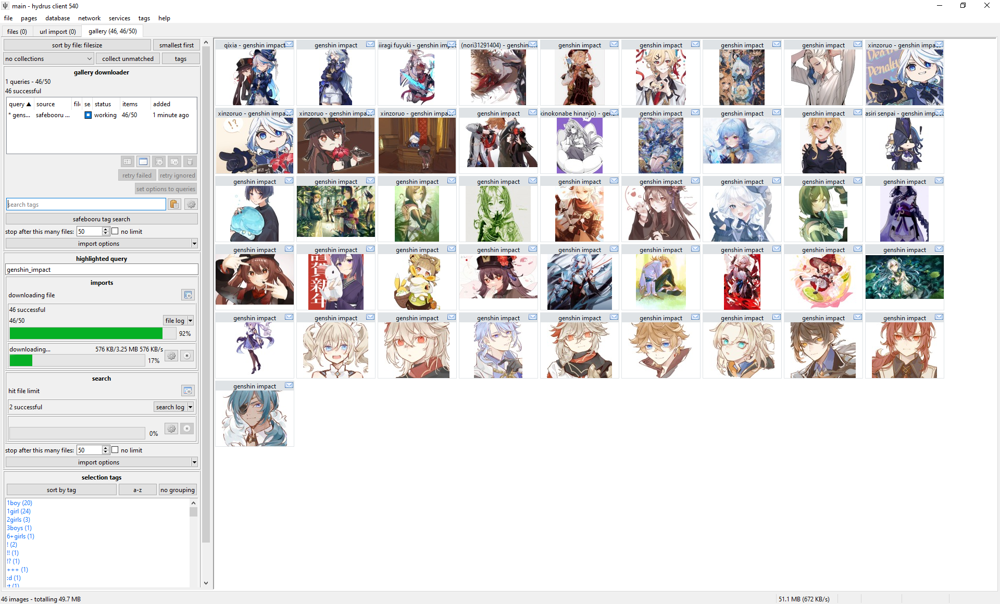
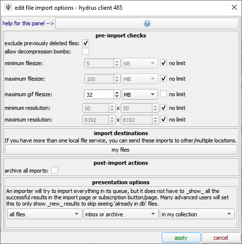
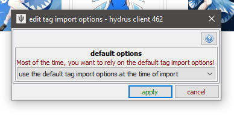
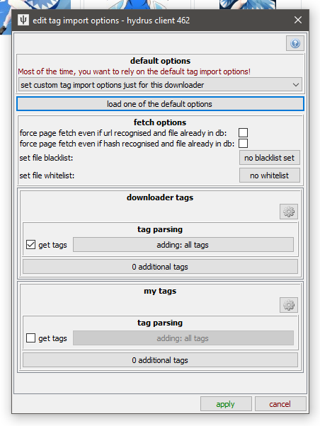
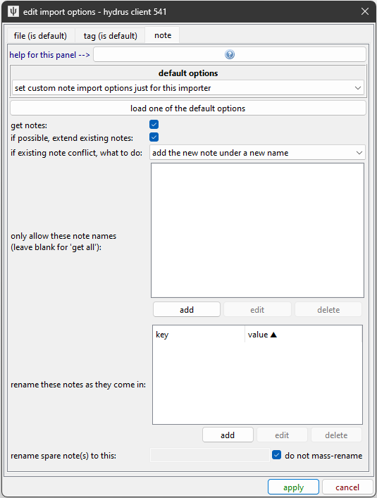
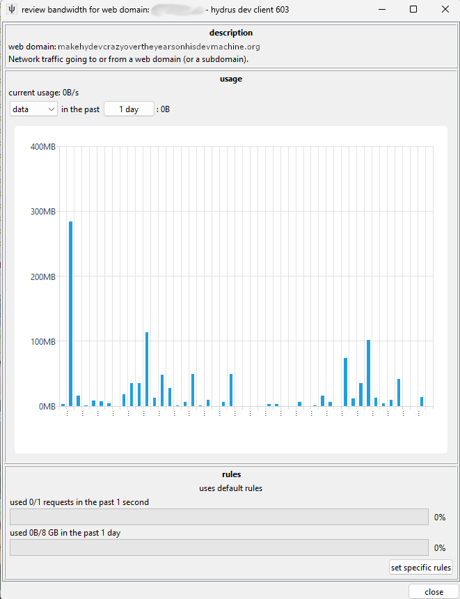

# Getting started with downloading

The hydrus client has a sophisticated and completely user-customisable download system. It can pull from any booru or regular gallery site or imageboard, and also, to a smaller extent, special examples like twitter. A fresh install will by default have support for the bigger sites, but it _is_ possible, with some work, for any user to [create a new shareable downloader](downloader_intro.md) for a new site.

The downloader is highly parallelisable, but the default [bandwidth rules](#bandwidth) should stop you from running too hot and downloading so much at once that you annoy the servers you are downloading from.

!!! danger
    It is very important that you take this slow. Many users get overexcited with their new ability to download 500,000 files _and then do so_, only discovering later that 98% of what they got was junk that they now have to wade through. Figure out what workflows work for you, how fast you process files, what content you _actually_ want, how much bandwidth and hard drive space you have, and prioritise and throttle your incoming downloads to match. If you can realistically only archive/delete filter 50 files a day, there is little benefit to downloading 500 new files a day.
    
    START SLOW.

It also takes a decent whack of CPU to import a file. You'll usually never notice this with just one hard drive import going, but if you have twenty different download queues all competing for database access and individual 0.1-second hits of heavy CPU work, you will discover your client starts to judder and lag. Keep it in mind, and you'll figure out what your computer is happy with. I also recommend you try to keep your total loaded files/urls to be under 20,000 to keep things snappy. Remember that you can pause your import queues, if you need to calm things down a bit.

!!! note "403 errors"
    Hydrus's downloader tech is pretty old, and as the infrastructure of the internet changes, some things are breaking.
    
    You may get a 403 result for a search or file download. This is often because a CDN (e.g. CloudFlare) is gating the site with a captcha-like test. It can hit users in certain IP regions or VPN networks worse. The rules are often applied dynamically, so it sometimes passes within a week.
    
    The situation is, unfortunately, generally getting worse. Some users have had success with tools like [Hydrus Companion](https://gitgud.io/prkc/hydrus-companion), which can synchronise browser User-Agent and cookies to hydrus, but this is proving less reliable these days. Others have been experimenting with alternate downloaders that use official APIs. These are sometimes great; but some are very restricted and need a login. Check out the [user-run downloader repository](https://github.com/CuddleBear92/Hydrus-Presets-and-Scripts) to see what people have figured out. There are also more sophisticated downloader solutions like [hydownloader](https://github.com/hyuugi/hydownloader) and [gallery-dl](https://github.com/mikf/gallery-dl), but these take some time to set up.
    
    Hydev is planning to retire default downloaders that become less reliable. I am not yet sure what I will do long-term, but I am thinking about it. Sorry for the trouble!
    

## Downloader types

There are several different downloader types, each with its own purpose:  

**Gallery**
:    The normal booru-style search interface. You enter tags, and the downloader walks through one or more gallery pages, queueing up many post/file results. Good for big download jobs such as an artist's entire catalogue.

**Subscriptions**
:    Automatic, repeating gallery jobs, for keeping up to date with an artist or tag. **Use the gallery downloader to get everything first** and then set up a subscription to keep updated.

**Watcher**
:    For watching imageboard (e.g. 4chan) threads. It checks and rechecks regularly to keep up with new posts. (The [API](client_api.md) can send URLs to this)

**URL download**
:    You paste or drag-and-drop gallery and post/file URLs into this, and if hydrus understands it, it will import it. Does not do multi-page searching. Useful for one-off jobs. (The [API](client_api.md) can send URLs to this)

**Simple downloader**
:    Advanced. Intended for simple one-off jobs with a single simple parsing rule, like 'get all the linked images from this page'.

### Gallery download

The gallery page can download from multiple sources at the same time. Each entry in the list represents a basic combination of two things:

**Source**
:   The site you are getting from. Safebooru or Danbooru or Deviant Art or twitter or anywhere else. In the example image this is the button labelled `artstation artist lookup`.

**Query text**
:   Something like 'contrapposto' or 'blonde\_hair blue\_eyes' or an artist name like 'incase'. Whatever is searched on the site to return a list of ordered media. In the example image this is the text field with `artist username` in it.

So, when you want to start a new download, you first select the source with the button and then type in a query in the text box and hit enter. The download will soon start and fill in information, and thumbnails should stream in, just like the hard drive importer. The downloader typically works by walking through the search's gallery pages one by one, queueing up the found files for later download. There are several intentional delays built into the system, so do not worry if work seems to halt for a little while--you will get a feel for hydrus's 'slow persistent growth' style with experience.

Do a test download now, for fun! Pause its gallery search after a page or two, and then pause the file import queue after a dozen or so files come in.

The thumbnail panel can only show results from one queue at a time, so double-click on an entry to 'highlight' it, which will show its thumbs and also give more detailed info and controls in the 'highlighted query' panel. I encourage you to explore the highlight panel over time, as it can show and do quite a lot. Double-click again to 'clear' it.

It is a good idea to 'test' larger downloads, either by visiting the site itself for that query, or just waiting a bit and reviewing the first files that come in. Just make sure that you _are_ getting what you thought you would, whether that be verifying that the query text is correct or that the site isn't only giving you bloated gifs or other bad quality files. The 'file limit', which stops the gallery search after the set number of files, is also great for limiting fishing expeditions (such as overbroad searches like 'wide_hips', which on the bigger boorus have 100k+ results and return _variable_ quality). If the gallery search runs out of new files before the file limit is hit, the search will naturally stop (and the entry in the list should gain a ⏹ 'stop' symbol).

_Note that some sites only serve 25 or 50 pages of results, despite their indices suggesting hundreds. If you notice that one site always bombs out at, say, 500 results, it may be due to a decision on their end. You can usually test this by visiting the pages hydrus tried in your web browser._

**In general, particularly when starting out, artist searches are best.** They are usually fewer than a thousand files and have fairly uniform quality throughout.

### Subscriptions { id="subscriptions" }
Let's say you found an artist you like. You downloaded everything of theirs from some site using a Gallery Downloader, but every week, one or two new pieces is posted. You'd like to keep up with the new stuff, but you don't want to manually make a new download job every week for every single artist you like.

Subscriptions are a way to automatically recheck a good query in future, to keep up with new files. Many users come to use them. You set up a number of saved queries, and the client will 'sync' with the latest files in the gallery and download anything new, just as if you were running the download yourself.

!!! info "Sync Mechanics"
    Because they are automatic, subscriptions are designed to be reliable, simple, and fail-safe. They build up an initial list of URLs (usually one hundred) for their search, and then on every normal sync they will re-run the search and stop looking once they hit a list of files they recognise.
    
    Once subscriptions establish a log of recent URLs, they will not go 'beyond' that, to older URLs. They will always get whatever is newest, stop when they catch up to what they have seen before, and integrate those newer URLs into their URL log for the next check.
    
    If you need to get older files and fill in that 'gap', use a one-time Gallery Downloader page.
    
    Subscriptions change how frequently they check based on what they see. If it looks like there are four new files every week, they will typically try to check once a week. A faster or slower 'file velocity' will cause them to automatically throttle up or down. If a source does not post any new files within a long time (usually 180 days), the subscription will be considered DEAD and will stop checking.
    
    **The entire subscription system assumes the source is a typical 'newest first' booru-style search. If you dick around with some order_by:rating/random metatag, it will not work reliably!**

While subscriptions can have multiple queries (even hundreds!), they _generally_ only work on one site. Expect to create one subscription for site x, another for site y, site z, and so on for every source you care about. Advanced users may be able to think of ways to get around this, but I recommend against it as it throws off some of the internal check timing calculations.

#### Setting up subscriptions

Here's the dialog, which is under _network->manage subscriptions_:

This is a very simple example--there is only one subscription, for safebooru. It has two 'queries' (i.e. searches to keep up with).

Before we trip over the advanced buttons here, let's zoom in on the actual subscription:

!!! danger
    **Do not change the max number of new files or checker options until you know _exactly_ what they do and have a good reason to alter them!**

Subscriptions have rich and powerful UI. Despite all the controls, the basic idea is simple: Up top, I have selected the 'safebooru tag search' download source, and then I have added two artists--"hong_soon-jae" and "houtengeki". When the subscription runs, it will put the given search text into the given download source just as if you were running the regular downloader.

!!! warning
    Subscriptions syncs are somewhat fragile, and they work best in the small ~100 file range. Do not try to play with the limits or checker options to download a whole 5,000 file query in one go--**if you want everything for a query, run it in the manual gallery downloader first**, then set up a normal sub for new stuff. A super-large subscription gives no benefit and can run into several problems.

You might want to put subscriptions off until you are more comfortable with galleries. There is more help [here](getting_started_subscriptions.md).

### Watchers
If you are an imageboard user, try going to a thread you like and drag-and-drop its URL (straight from your web browser's address bar) onto the hydrus client. It should open up a new 'watcher' page and import the thread's files!

With only one URL to check, watchers are a little simpler than gallery searches, but as that page is likely receiving frequent updates, it checks it over and over until it dies. By default, the watcher's 'checker options' will regulate how quickly it checks based on the speed at which new files are coming in--if a thread is fast, it will check frequently; if it is running slow, it may only check once per day. When a thread falls below a critical posting velocity or 404s, checking stops.

In general, you can leave the checker options alone, but you might like to revisit them if you are always visiting faster or slower boards and find you are missing files or getting DEAD too early.

#### API
If you use [API-connected](client_api.md) programs such as the Hydrus Companion, then any [watchable](downloader_url_classes.md#url_types) URLs sent to Hydrus through them will end up in a watcher page, the specifics depending on the program's settings.

### URL download
The **url downloader** works like the gallery downloader but does not do searches. You can paste downloadable URLs to it, and it will work through them as one list. Dragging and dropping recognisable URLs onto the client (e.g. from your web browser) will also spawn and use this downloader.

The button next to the input field lets you paste multiple URLs at once such as if you've copied from a document or browser bookmarks. The URLs need to be newline separated.

#### API
If you use [API-connected](client_api.md) programs such as the Hydrus Companion, then any [non-watchable](downloader_url_classes.md#url_types) URLs sent to Hydrus through them will end up in an URL downloader page, the specifics depending on the program's settings. You can't use this to force Hydrus to download paged galleries since the URL downloader page doesn't support traversing to the next page, use the gallery downloader for this.

### Simple downloader
The **simple downloader** will do very simple parsing for unusual jobs. If you want to download all the images in a page, or all the image link destinations, this is the one to use. There are several default parsing rules to choose from, and if you learn the downloader system yourself, it will be easy to make more.

## Import options
Every importer in Hydrus has some 'import options' that change what is allowed, what is blacklisted, and whether tags or notes should be saved.

In previous versions these were split into completely different windows called `file import options` and `tag import options` so if you see those anywhere, this is what they're talking about and not some hidden menu anywhere.

Importers that download from websites rely on a flexible 'defaults' system, so you do not have to set them up every time you start a new downloader. While you should play around with your import options, once you know what works for you, you should set that as the default under _network->downloaders->manage default import options_. You can set them for all file posts generally, all watchers, and for specific sites as well.

### File import options
This deals with the files being downloaded and what should happen to them. There's a few more tickboxes if you turn on advanced mode.

**pre-import checks**
:    Pretty self-explanatory for the most part. If you want to redownload previously deleted files turning off `exclude previously deleted files` will have Hydrus ignore deletion status.  
A few of the options have more information if you hover over them.

**import destinations**
:    See [multiple file services](advanced_multiple_local_file_services.md), an advanced feature.

**post import actions**
:    See the [files section on filtering](getting_started_files.md#inbox_and_archive) for the first option, the other two have information if you hover over them.

### Tag Parsing
By default, hydrus now starts with a local tag domain called 'downloader tags' and it will parse (get) all the tags from normal gallery sites and put them in this service. You don't have to do anything, you will get some decent tags. As you use the client, you will figure out which tags you like and where you want them. On the downloader page, click `import options`:

This is an important dialog, although you will not need to use it much. It governs which tags are parsed and where they go. To keep things easy to manage, a new downloader will refer to the 'default' tag import options for a website, but for now let's set some values just for this downloader:

You can see that each tag service on your client has a separate section. If you add the PTR, that will get a new box too. A new client is set to _get all tags_ for 'downloader tags' service. Things can get much more complicated. Have a play around with the options here as you figure things out. Most of the controls have tooltips or longer explainers in sub-dialogs, so don't be afraid to try things.

It is easy to get tens of thousands of tags by downloading this way. Different sites offer different kinds and qualities of tags, and the client's downloaders (which were designed by me, the dev, or a user) may parse all or only some of them. Many users like to just get everything on offer, but others only ever want, say, `creator`, `series`, and `character` tags. Once you feel comfortable with tags, try clicking that 'adding: all tags' button, which will take you into hydrus's advanced 'tag filter', which allows you to select which of the incoming tags will be added.

The 'additional tags' adds some fixed personal tags to all files coming in--for instance, you might like to add 'this came from the xxxxx subscription' or 'process into favourites' to your 'my tags' so you can find those files again later. That little 'cog' icon button can also do some advanced things.

The blacklist button will let you skip downloading files that have certain tags, again using the tag filter, while the whitelist enables you to only allow files that have at least one of a set of tags.

!!! warning
    The file limit and import options on the upper panel of a gallery or watcher page, if changed, will only apply to **new** queries. If you want to change the options for an existing queue, either do so on its highlight panel below or use the 'set options to queries' button.

#### Force Page Fetch

By default, hydrus will not revisit web pages or API endpoints for URLs it knows A) refer to one known file only, and B) that file is already in your database or has previously been deleted. The way it navigates this can be a complicated mix of hash and URL data, and in certain logical situations hydrus will determine its own records are untrustworthy and decide to check the source again. This saves bandwidth and time as you run successive queries that include the same results. You should not disable the capability for normal operation.

But if you mess up your tag import options somewhere and need to re-run a download with forced tag re-fetching, how to do it?

At the moment, this is in tag import options, the `force page fetch even if...` checkboxes. You can either set up a one-time downloader page with specific tag import options that check both of these checkboxes and then paste URLs in, or you can right-click a selection of thumbnails and have hydrus create the page for you under the _urls->force metadata refetch_ menu. Once you are done with the downloader page, delete it and do not use it for normal jobs--again, this method of downloading is inefficient and should not be used for repeating, long-term, or speculative jobs. Only use it to fill in specific holes.

### Note Parsing

Hydrus also parses 'notes' from some sites. This is a young feature, and a little advanced at times, but it generally means the comments that artists leave on certain gallery sites, or something like a tweet text. Notes are editable by you and appear in a hovering window on the right side of the media viewer.

Most of the controls here ensure that successive parses do not duplicate existing notes. The default settings are fine for all normal purposes, and you can leave them alone unless you know you want something special (e.g. turning note parsing off completely).

## Bandwidth

**Hydrus deals with very large numbers of files, and its file store is expected to last many years. Its downloaders are designed to run a marathon, not a sprint.**

It will not be too long until you see a "bandwidth free in xxxxx..." message. As a long-term storage solution, hydrus is designed to be polite in its downloading--both to the source server and your computer. It has complicated bandwidth rules that can operate in several different domains, and the default rules are capped conservatively to stop big mistakes and spread out larger jobs. For instance, at a bare minimum, no domain will be hit more than once a second.

If you want to download 10,000 files, set up the queue and let it work. The client will take breaks, likely even to the next day, but it will get there in time. Many users like to leave their clients on all the time, just running in the background, which makes these sorts of downloads a breeze--you check back in the evening and discover your download queues, watchers, and subscriptions have given you another thousand things to deal with.

That said, all the bandwidth rules are completely customisable and are found in `network > data > review bandwidth usage and edit rules`. They can get quite complicated.

This is the main 'review' panel. It shows where you have been downloading from. It also displays current usage and if a particular domain is currently blocked due to the rules.

When a new network job appears, it will belong to multiple 'contexts'--usually, it will be 'global', any domain and subdomains, and then 'downloader page', 'subscription', or 'watcher page' (which are special contexts that attach to the particular downloader)--and all of these have to pass in order for the job to start. If 'site a' is blocked but 'global' is ok, then a request to 'site b' will start immediately; if 'global' is blocked, then nothing will work.

You can double-click any row to see more detail:

A context will start using the 'default' rules, but if you like you can set specific rules for one you want to be careful or aggressive with. To edit the default rules, go back to the main 'review' panel. If you find your network jobs are halting too much, you probably want to relax the daily rules for 'web domain' default and then the 'global' context specifically.

I **strongly** recommend you not poke around here until you have more experience. I **especially strongly** recommend you not ever turn them all off, thinking that will improve something, as you'll probably render the client too laggy to function and get yourself an IP ban from the next server you pull from.

Again: the real problem with downloading is not finding new things, it is keeping up with what you get. Start slow and figure out what is important to your bandwidth budget, hard drive budget, and free time budget. Almost everyone fails at this.

## Logins

!!! warning
    Never use important accounts with hydrus. Hydrus does not store credentials securely. Also, if you accidentally download too much at once, or a site suddenly changes their policies, a linked account can get banned. If you link an account to hydrus, always use a throwaway account you don't care much about.

**This system often breaks and is sometimes a hassle deal with! If you need to log in to anything more clever than a booru, use Hydrus Companion or similar to copy your cookies across!**

The client supports a very basic and ugly login system. It can handle simple sites and is as [completely user-customisable as the downloader system](downloader_login.md). The client starts with multiple login scripts by default, which you can review under _network->logins->manage logins_:

Many sites grant all their content without you having to log in at all, but others require it for NSFW or special content, or you may wish to take advantage of site-side user preferences like personal blacklists. If you wish, you can give hydrus some login details here, and it will try to login--just as a browser would--before it downloads anything from that domain.

To start using a login script, select the domain and click 'edit credentials'. You'll put in your username/password, and then 'activate' the login for the domain, and that should be it! The next time you try to get something from that site, the first request will wait (usually about ten seconds) while a login popup performs the login. Most logins last for about thirty days (and many refresh that 30-day timer every time you make a new request), so once you are set up, you usually never notice it again, especially if you have a subscription on the domain.

Most sites only have one way of logging in, but hydrus does support more. Hentai Foundry is a good example--by default, the client performs the 'click-through' login as a guest, which requires no credentials and means any hydrus client can get any content from the start. But this way of logging in only lasts about 60 minutes or so before having to be refreshed, and it does not hide any spicy stuff, so if you use HF a lot, I recommend you create a throwaway account, set the filters you like in your HF profile (e.g. no guro content), and then click the 'change login script' in the client to the proper username/pass login.

The login system is not very clever. Don't try to pull off anything too weird with it! If anything goes wrong, it will likely delay the script (and hence the whole domain) from working for a while, or invalidate it entirely. If the error is something simple, like a password typo or current server maintenance, go back to this dialog to fix and scrub the error and try again. If the site just changed its layout, you may need to update the login script. If it is more complicated, please contact me, hydrus_dev, with the details!

If you would like to login to a site that is not yet supported by hydrus (usually ones with a Captcha in the login page), you have two options:

1. Get a web browser add-on that lets you export a cookies.txt (either for the whole browser or just for that domain) from a browser that is logged in, and then drag and drop that cookies.txt file onto the hydrus _network->data->review session cookies_ dialog. This sometimes does not work if your add-on's export formatting is unusual. If it does work, hydrus will import and use those cookies, which skips the login by making your hydrus pretend to be your browser directly. This is obviously advanced and hacky, so if you need to do it, let me know how you get on and what tools you find work best!
2. Use [Hydrus Companion](https://gitgud.io/prkc/hydrus-companion) browser add-on to do the same basic thing automatically. This also gives hydrus the browser's `User-Agent` header, which some logins or CDN gateways sync to their cookie record.

## Difficult Sites

Boorus are usually easy to parse from, and there are many hydrus downloaders available that work well. Other sites are less easy to download from. Some will purposefully disguise access behind captchas or difficult login tokens that the hydrus downloader just isn't clever enough to handle. In these cases, it can be best just to go to an external downloader program that is specially tuned for these complex sites.

It takes a bit of time to set up these sorts of programs--and if you get into them, you'll likely want to make a script to help automate their use--but if you know they solve your problem, it is well worth it!

- [yt-dlp](https://github.com/yt-dlp/yt-dlp) - This is an excellent video downloader that can download from hundreds of different websites. Learn how it works, it is useful for all sorts of things!
- [gallery-dl](https://github.com/mikf/gallery-dl) - This is an excellent image and small-vid downloader that works for pretty much any booru and many larger/professional gallery sites, particularly when those sites need logins. Check the documentation, since you may be able to get it to rip cookies right out of your firefox, or you can give it your actual user/password for many sites and it'll handle all the login for you.
- [imgbrd-grabber](https://github.com/Bionus/imgbrd-grabber) - Another excellent, mostly booru downloader, with an UI. You can export some metadata to filenames, which you might like to then suck up with hydrus filename-import-parsing.

With these tools, used manually and/or with some scripts you set up, you may be able to set up a regular import workflow to hydrus (especilly with an `Import Folder` as under the `file` menu) and get _most_ of what you would with an internal downloader. Some things like known URLs and tag parsing may be limited or non-existant, but it is better than nothing, and if you only need to do it for a couple sources on a couple sites every month, you can fill in the most of the gap manually yourself.

Hydev is planning to roll yt-dlp and gallery-dl support into the program natively in a future update of the downloader engine.
