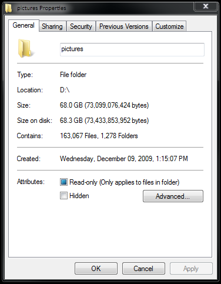
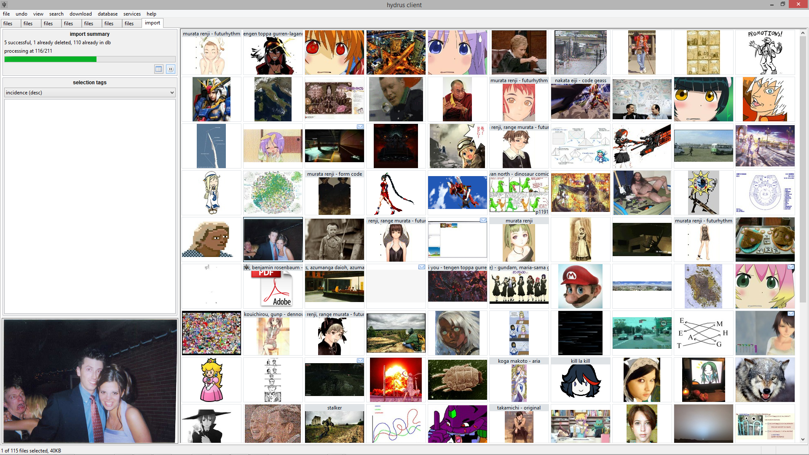
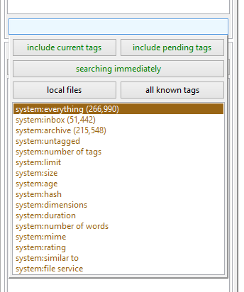
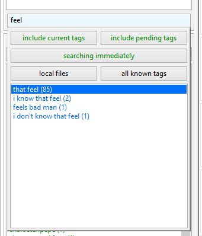
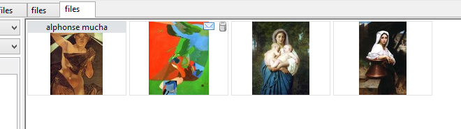

# Getting started with files

!!! warning "Use your brain"

	Hydrus can be powerful, and you control everything. By default, you are not connected to any servers and absolutely nothing is shared with other users. You cannot accidentally one-click your way to exposing your whole collection. However, if you tag private files with real names and click to upload that data to a tag repository that other people have access to, the program won't try to stop you.
    
    If you want to do private sexy slideshows of your shy wife, that's great, but if you have set up a repository or Client API connection to share content with friends, use your brain! It is **impossible** to contain leaks of private information.
    

!!! info "Do not rush"
	It is easy to import millions of files. For many new users, their first mistake is downloading too much too fast in overexcitement and becoming overwhelmed. We are in this for the long haul, so take things slow and figure out good processing workflows that work for your schedule before you start adding 5,000 new subscriptions.

## The problem

If you have ever seen something like this--

--then you already know the problem: using a filesystem to manage a lot of images sucks.

Finding the right picture quickly can be difficult. Finding everything by a particular artist at a particular resolution is unthinkable. Integrating new files into the whole nested-folder mess is a further pain, and most operating systems bug out when displaying 10,000+ thumbnails.

## The client

Let's first focus on [_importing_ files](getting_started_importing.md).

When you first boot the client, you will see a blank page. There are no files in the database and so there is nothing to search. To get started, I suggest you simply drag-and-drop a folder with a hundred or so images onto the main window. A dialog will appear affirming what you want to import. Ok that, and a new page will open. Thumbnails will stream in as the software processes each file.

The files are being imported into the client's database. [The client discards their filenames.](faq.md#filenames)

Notice your original folder and its files are untouched. You can move the originals somewhere else, delete them, and the client will still return searches fine. In the same way, you can delete from the client, and the original files will remain unchanged--import is a **copy**, not a move, operation. The client performs all its operations on its internal database, which holds copies of the files it imports. If you find yourself enjoying using the client and decide to completely switch over, you can delete the original files you import without worry. You can always export them back again later.

[FAQ: can the client manage files from their original locations?](faq.md#external_files)

Now:

*   Click on a thumbnail; it'll show in the preview screen, bottom left.
*   Double- or middle-click the thumbnail to open the media viewer. You can hit ++f++ to switch between giving the fullscreen a frame or not. You can use your scrollwheel or page up/down to browse the media and ctrl+scrollwheel to zoom in and out.
*   Move your mouse to the top-left, top-middle and top-right of the media viewer. You should see some 'hover' panels pop into place.
    
    
    
    The one on the left is for tags, the middle is for browsing and zoom commands, and the right is for status and ratings icons. You will learn more about these things as you get more experience with the program.
    
*   Press ++enter++ or double/middle-click again to close the media viewer.
*   You can quickly select multiple files by shift- or ctrl- clicking. Notice how the status bar at the bottom of the screen updates with the number selected and their total size. Right-clicking your selection will present another summary and many actions.
*   You can quickly copy-export files out of the client by drag-and-dropping to a folder or external program, including web browser upload boxes. Discord support may need a special checkbox set under _options->exporting_. 
*   Hit ++f9++ to bring up a new page chooser. You can navigate it with the arrow keys, your numpad, or your mouse.
*   On the left of a normal search page is a text box. When it is focused, a dropdown window appears. It looks like this:
    
    
    
    This is where you enter the predicates that define the current search. If the text box is empty, the dropdown will show 'system' tags that let you search by file metadata such as file size or animation duration. To select one, press the up or down arrow keys and then enter, or double click with the mouse.
    
    When you have some tags in your database, typing in the text box will search them:
    
    
    
    The (number) shows how many files have that tag, and hence how large the search result will be if you select that tag.
    
    Clicking 'searching immediately' will pause the searcher, letting you add several tags in a row without sending it off to get results immediately. Ignore the other buttons for now--you will figure them out as you gain experience with the program.
    
*   You can remove from the list of 'active tags' in the box above with a double-click, or by entering the exact same tag again through the dropdown.
*   Play with the system tags more if you like, and the sort-by dropdown. The collect-by dropdown is advanced, so wait until you understand _namespaces_ before expecting it to do anything.
*   To close a page, middle-click its tab.

### Filetype support

Hydrus supports many filetypes. A full list can be viewed on the [Supported Filetypes](filetypes.md) page.

Although some support is imperfect for the complicated filetypes. For the Windows and Linux built releases, hydrus now embeds an MPV player for video, audio and gifs, which provides smooth playback and audio, but some other environments may not support MPV and so will default when possible to the native hydrus software renderer, which does not support audio. When something does not render how you want, right-clicking on its thumbnail presents the option 'open externally', which will open the file in the appropriate default program (e.g. ACDSee, VLC).

The client can also download files from several websites, including 4chan and other imageboards, many boorus, and gallery sites like deviant art and hentai foundry. You will learn more about this later.

## Inbox and archive

The client sends newly imported files to an **inbox**, just like your email. Inbox acts like a tag, matched by 'system:inbox'. A small envelope icon is drawn in the top corner of all inbox files:

If you are sure you want to keep a file long-term, you should **archive** it, which will remove it from the inbox. You can archive from your selected thumbnails' right-click menu, or by pressing ++f7++. If you make a mistake, you can spam ++ctrl+z++ for undo or hit ++shift+f7++ on any set of files to explicitly return them to the inbox.

Anything you do not want to keep should be deleted by selecting from the right-click menu or by hitting the delete key. Deleted files are sent to the trash. They will get a little trash icon:

A trashed file will not appear in subsequent normal searches, although you can search the trash specifically by clicking the 'my files' button on the autocomplete dropdown and changing the file domain to 'trash'. Undeleting a file (++shift+delete++) will return it to 'my files' as if nothing had happened. Files that remain in the trash will be permanently deleted, usually after a few days. You can change the permanent deletion behaviour in the client's options.

A quick way of processing new files is&ndash;

### Filtering your inbox

Lets say you just downloaded a good thread, or perhaps you just imported an old folder of miscellany. You now have a whole bunch of files in your inbox--some good, some awful. You probably want to quickly go through them, saying _yes, yes, yes, no, yes, no, no, yes_, where _yes_ means 'keep and archive' and _no_ means 'delete this trash'. **Filtering** is the solution.

Select some thumbnails, and either choose _filter->archive/delete_ from the right-click menu or hit F12. You will see them in a special version of the media viewer, with the following default controls:

*   ++left-button++ or ++f7++: **keep and archive the file, move on**
*   ++right-button++ or ++delete++: **delete the file, move on**
*   ++up++: **Skip this file, move on**
*   ++middle-button++ or ++backspace++: **I didn't mean that, go back one**
*   ++escape++, ++return++, or ++f12++: **stop filtering now**

Your choices will not be committed until you finish filtering.

This saves time.

## What Hydrus is for

The hydrus client's workflows are not designed for half-finished files that you are still working on. Think of it as a giant archive for everything excellent you have decided to store away. It lets you find and remember these things quickly.

Similarly, hydrus does not expect its files to ever change! Do not go into the `client_files` folder and edit files in-place. The file storage is strictly read-only, and if you violate that, hydrus will eventually notice and assume it was hard drive damage. If you want to transform files, you should export them, edit them, and re-import them.

In general, Hydrus is good for individual files like you commonly find on imageboards or boorus. Although advanced users can cobble together some page-tag-based solutions, it is not yet great for multi-file media like comics and definitely not as a typical playlist-based music player.

If you are looking for a comic manager to supplement hydrus, check out this user-made guide to other archiving software [here](https://github.com/CuddleBear92/Hydrus-Presets-and-Scripts/wiki/0-Alternative-Programs-and-Resources#software)! [ComicRackCE](https://github.com/maforget/ComicRackCE) and [Lanraragi](https://github.com/Difegue/LANraragi) are both worth looking into. For ebooks, I personally use and recommend [Calibre](https://github.com/kovidgoyal/calibre).

And although the client can manage millions of files, it starts to creak and chug when displaying or otherwise tracking more than about 40,000 or so in a single gui window. As you learn to use it, please try not to let your download queues or general search pages regularly sit at more than 40 or 50k total _items_, or you'll start to slow other things down. Another common mistake is to leave one large 'system:everything' or 'system:inbox' page open with 70k+ files. For these sorts of 'ongoing processing' pages, try adding a 'system:limit=256' to keep them snappy. One user mentioned he had regular gui hangs of thirty seconds or so, and when we looked into it, it turned out his handful of download pages had three million URLs queued up! Just try and take things slow until you figure out what your computer's limits are.
