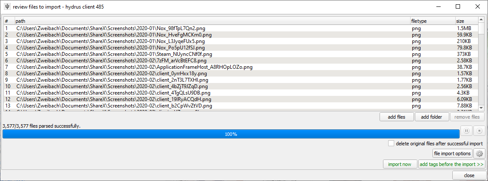
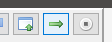
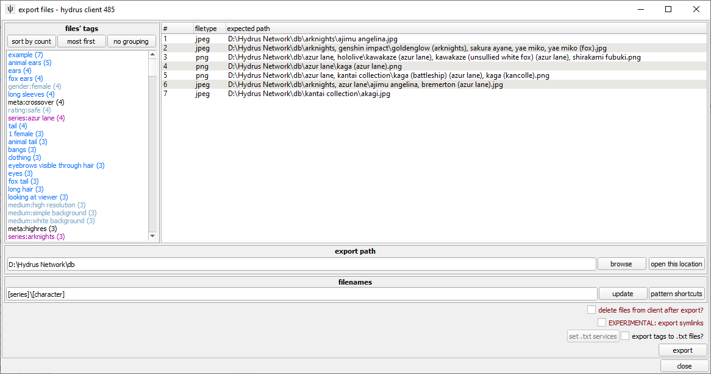
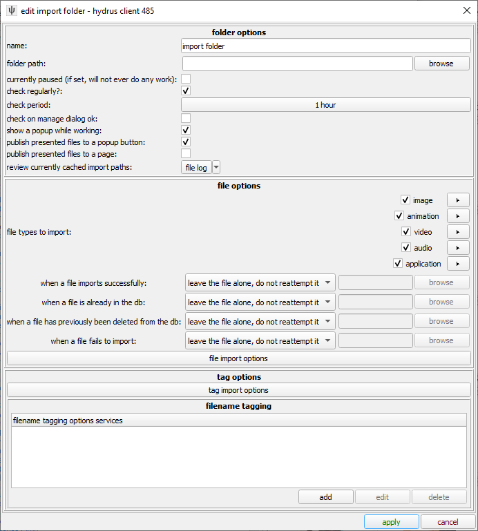
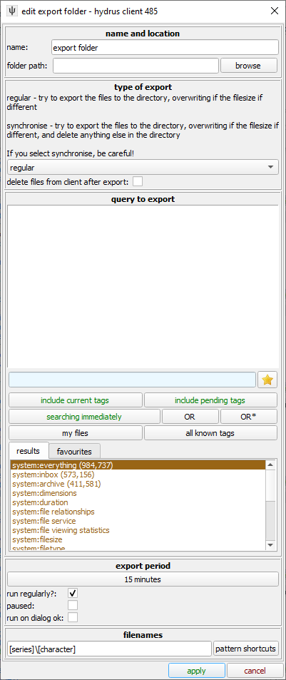
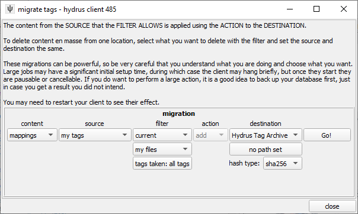

# Importing and exporting

By now you should have launched Hydrus. If you're like most new users you probably already have a fair bit of images or other media files that you're looking at getting organised.

!!! note
    If you're planning to import or export a large amount of files it's recommended to use the [automated folders](#automation) since Hydrus can have trouble dealing with large, single jobs. Splitting them up in this manner will make it much easier on the program.

## Importing files
Navigate to `file -> import files` in the toolbar.  
**OR**  
Drag-and-drop one or more folders or files into Hydrus.

This will open the `import files` window. Here you can add files or folders, or delete files from the import queue. Let Hydrus parse what it will update and then look over the options. By default the option to delete original files after succesful import (if it's ignored for any reason or already present in Hydrus for example) is not checked, activate on your own risk. In `file import options` you can find some settings for minimum and maximum file size, resolution, and whether to import previously deleted files or not.

From here there's two options: `import now` which will just import as is, and `add tags before import >>` which lets you set up some rules to add tags to files on import.  
Examples are keeping filename as a tag, add folders as tag (useful if you have some sort of folder based organisation scheme), or load tags from an [accompanying text file](advanced_sidecars.md) generated by some other program.

Once you're done click apply (or `import now`) and Hydrus will start processing the files. Exact duplicates are not imported so if you had dupes spread out you will end up with only one file in the end. If files *look* similar but Hydrus imports both then that's a job for the [dupe filter](duplicates.md) as there is some difference even if you can't tell it by eye. A common one is compression giving files with different file sizes, but otherwise looking identical or files with extra meta data baked into them.

## Exporting files
If you want to share your files then export is the way to go. Basic way is to mark the files in Hydrus, dragging from there and dropping the files where you want them. You can also copy files or use export files to, well, export your files to a select location. All (or at least most) non-drag'n'drop export options can be found on right-clicking the select files and going down `share` and then either `copy` or `export`.

### Drag'n'drop
Just dragging from the thumbnail view will export (copy) all the selected files to wherever you drop them. You can also start a drag and drop for single files from the media viewer using this arrow button on the top hover window:
    

    
If you want to drag and drop to discord, check the special BUGFIX option under `options > gui`. You also find a filename pattern setting for that drag and drop here.
    
By default, the files will be named by their ugly hexadecimal [hash](faq.md#hashes), which is how they are stored inside the database.
    
If you use a drag and drop to open a file inside an image editing program, remember to hit 'save as' and give it a new filename in a new location! The client does not expect files inside its db directory to ever change.

### Copy
You can also copy the files by right-clicking and going down `share -> copy -> files` and then pasting the files where you want them.

### Export
You can also export files with tags, either in filename or as a [sidecar file](advanced_sidecars.md) by right-clicking and going down `share -> export -> files`. Have a look at the settings and then press `export`.  
You can create folders to export files into by using backslashes on Windows (`\`) and slashes on Linux (`/`) in the filename. This can be combined with the patterns listed in the pattern shortcut button dropdown. As example `[series]\{filehash}` will export files into folders named after the `series:` namespaced tags on the files, all files tagged with one series goes into one folder, files tagged with another series goes into another folder as seen in the image below.

Clicking the `pattern shortcuts` button gives you an overview of available patterns.

The EXPERIMENTAL option is only available under advanced mode, use at your own risk.

## Automation
Under `file -> import and export folders` you'll find options for setting up automated import and export folders that can run on a schedule. Both have a fair deal of options and rules you can set so look them over carefully.

### Import folders

Like with a manual import, if you wish you can import tags by parsing filenames or [loading sidecars](advanced_sidecars.md).

### Export folders

Like with manual export, you can set the filenames using a tag pattern, and you can [export to sidecars](advanced_sidecars.md) too.

## Importing and exporting tags
While you can import and export tags together with images sometimes you just don't want to deal with the files.

Going to `tags -> migrate tags` you get a window that lets you deal with just tags. One of the options here is what's called a Hydrus Tag Archive, a file containing the hash <-> tag mappings for the files and tags matching the query.

