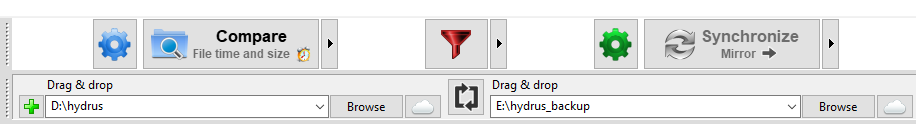

# Installing and Updating

If any of this is confusing, a simpler guide is [here](https://github.com/Zweibach/text/blob/master/Hydrus/Hydrus%20Help%20Docs/00_tableOfContents.md), and some video guides are [here](https://github.com/CuddleBear92/Hydrus-guides)!

## Downloading

You can get the latest release at [the github releases page](https://github.com/hydrusnetwork/hydrus/releases).

I try to release a new version every Wednesday by 8pm EST and write an accompanying post on [my tumblr](http://hydrus.tumblr.com/) and a Hydrus Network General thread on [8chan.moe /t/](https://8chan.moe/t/catalog.html).

## Installing

=== "Windows"

    *   If you want the easy solution, download the .exe installer. Run it, hit ok several times.
    *   If you know what you are doing and want a little more control, get the .zip. Don't extract it to Program Files unless you are willing to run it as administrator every time (it stores all its user data inside its own folder). You probably want something like D:\\hydrus.
    *   _If you run <Win10, you need [Visual C++ Redistributable for Visual Studio 2015](https://www.microsoft.com/en-us/download/details.aspx?id=48145) if you don't already have it for vidya._
    *   _If you use Windows 10 N (a version of Windows without some media playback features), you will likely need the 'Media Feature Pack'. There have been several versions of this, so it may best found by searching for the latest version or hitting Windows Update, but otherwise check [here](https://support.microsoft.com/en-us/help/3145500/media-feature-pack-list-for-windows-n-editions)._  
    *   _If you run Win7, you cannot run Qt6 programs, so you cannot run the official executable release. You have options by [running from source](running_from_source.md)._
    *   **Third parties (not maintained by Hydrus Developer)**:  
        * [Chocolatey](https://community.chocolatey.org/packages/hydrus-network)
        * [Scoop](https://github.com/ScoopInstaller/Scoop) (`hydrus-network` in the 'Extras' bucket)    
        * Winget. The command is `winget install --id=HydrusNetwork.HydrusNetwork  -e --location "\PATH\TO\INSTALL\HERE"`, which can, if you know what you are doing, be `winget install --id=HydrusNetwork.HydrusNetwork  -e --location ".\"`, maybe rolled into a batch file.
        * [User guide for Anaconda](https://gist.github.com/jufogu/b78509695c6c65cdb2866a56fb14a820)

=== "macOS"

    * I used to have an Intel App, but unfortunately the move to Apple Silicon presented too many technical hurdles to keep going.
    * The program has always worked better on macOS when [run from source](running_from_source.md), and this is now the only option here.

    !!! info "mpv on macOS"
        macOS users have no mpv support for now, so no audio, and video (which has to be rendered with the software-based native viewer) may be laggy. Sorry!

=== "Linux"
    
    ??? warning "Wayland (and MPV)"
        Unfortunately, hydrus has several bad bugs in Wayland. The mpv window will often not embed properly into the media viewer, menus and windows may position on the wrong screen, and the taskbar icon may not work at all. [Running from source](running_from_source.md) may improve the situation, but some of these issues seem to be intractable for now.
        
        User testing suggests that the best solution for now is just to launch the program in X11, and I now encourage this for all Wayland users. Launching with the environment variable `QT_QPA_PLATFORM=xcb` (e.g. by putting `export QT_QPA_PLATFORM=xcb` in a boot script that launches `hydrus_client`) should do it. The 'xcb' should force X11.
        
        It does not work for everyone, though. If it fails, another user says setting `WAYLAND_DISPLAY= ` (as in setting it to nothing), which forces hydrus (and its embedded mpv windows) to use Xwayland, is another solution. You might need to do `sudo apt install xwayland` first.
        
        I expect to revisit this question in future versions of Qt and Wayland--we'll see if the situation stabilises.
    
    ??? warning "MangoHUD and MPV"
        A user notes that MangoHUD may also interfere with mpv, causing crashes.
        
        Try `unset MANGOHUD` or `export MANGOHUD=0` to remove the MangoHUD environment variable in your hydrus launch script to fix this!
    
    !!! note "Qt compatibility"
        
        If `hydrus_client` fails to run, and from terminal it says something like this:
        
        `qt.qpa.plugin: From 6.5.0, xcb-cursor0 or libxcb-cursor0 is needed to load the Qt xcb platform plugin`
        
        Then Qt6 may need a couple additional packages:
        
        * `libicu-dev`
        * `libxcb-cursor-dev`
        
        With `apt` that will be:
        
        * `sudo apt install libicu-dev`
        * `sudo apt install libxcb-cursor-dev`
        
        Or check your OS's package manager.
        
    
    *   Get the .tag.gz. Extract it somewhere useful and create shortcuts to 'hydrus_client' and 'hydrus_server' as you like. The build is made on Ubuntu, so if you run something else, compatibility is hit and miss.
    *   If you have problems running the Ubuntu build, [running from source](running_from_source.md) is usually an improvement, and it is easy to set up these days.
    *   You might need to get 'libmpv1' or 'libmpv2' to get mpv working and playing video/audio. This is the mpv _library_, not the necessarily the player. Check _help->about_ to see if it is available--if not, see if you can get it like so:
        * `apt install libmpv1` or `apt install libmpv2`
        * Use _options->media_ to set your audio/video/animations to 'show using mpv' once you have it installed.
        * If the about window provides you an mpv error popup like this:  
    ```
    OSError: /lib/x86_64-linux-gnu/libgio-2.0.so.0: undefined symbol: g_module_open_full
    (traceback)
    pyimod04_ctypes.install.<locals>.PyInstallerImportError: Failed to load dynlib/dll 'libmpv.so.1'. Most likely this dynlib/dll was not found when the application was frozen.
    ```  
    Then please do this:  
            1. Search your /usr/ dir for `libgmodule*`. You are looking for something like `libgmodule-2.0.so`. Users report finding it in `/usr/lib64/` and `/usr/lib/x86_64-linux-gnu`.
            2. Copy that .so file to the hydrus install base directory.
            3. Boot the client and hit _help->about_ to see if it reports a version.
            4. If it all seems good, hit _options->media_ to set up mpv as your player for video/audio and try to view some things.
            5. If it still doesn't work, see if you can do the same for libmpv.so and libcdio.so--or consider [running from source](running_from_source.md)
    *   You can also try [running the Windows version in wine](wine.md).
    *   **Third parties (not maintained by Hydrus Developer)**:  
        * (These both run from source, so if you have trouble with the built release, they may work better for you!)
        * [AUR package](https://aur.archlinux.org/packages/hydrus/) - *Although please note that since AUR packages work off your system python, this has been known to cause issues when Arch suddenly updates to the latest Qt or something before we have had a chance to test things and it breaks hydrus. If you can, try just [running from source](running_from_source.md) yourself instead, where we can control things better!*
        * [flatpak](https://flathub.org/apps/details/io.github.hydrusnetwork.hydrus) 
    

=== "Docker"

    * A rudimentary documentation for the [container](https://github.com/hydrusnetwork/hydrus/pkgs/container/hydrus) setup can be found [here](docker.md).

=== "From Source"

    *   You can also [run from source](running_from_source.md). This is often the best way to fix compatibility problems, the only way to run on macOS, and the most pleasant way to run and update the program (you can update in five seconds!), although it requires a bit more work to set up the first time. It is not too complicated to do, though--my guide will walk you through each step.

By default, hydrus stores all its data—options, files, subscriptions, _everything_—entirely inside its own directory. You can extract it to a usb stick, move it from one place to another, have multiple installs for multiple purposes, wrap it all up inside an encrypted volume, whatever you like. The .exe installer writes some unavoidable uninstall registry stuff to Windows, but the 'installed' client itself will run fine if you manually move it.

!!! danger "Bad Locations"
    **Do not install to a network location!** (i.e. on a different computer's hard drive) The SQLite database is sensitive to interruption and requires good file locking, which network interfaces often fake. There are [ways of splitting your client up](database_migration.md) so the database is on a local SSD but the files are on a network--this is fine--but you really should not put the database on a remote machine unless you know what you are doing and have a backup in case things go wrong.
    
    **Be careful installing to a location with filesystem-level compression or versioning enabled!** It may work ok to start, but when the SQLite database grows to large size, this can cause extreme access latency. I have been told that BTRFS works well these days, and they have been working specifically to improve SQLite performance, but keep it in mind if you are using anything else. Using NTFS compression mode on the database files is not a good idea. Compressing a hydrus database backup is fine, but the live db is sensitive.

## Anti-virus { id="anti_virus" }

Hydrus is made by an Anon out of duct tape and string. It combines file parsing tech with lots of network and database code in unusual and powerful ways, and all through a hacked-together executable that isn't signed by any big official company.

Unfortunately, we have been hit by anti-virus false positives throughout development. Every few months, one or more of the larger anti-virus programs sees some code that looks like something bad, or they run the program in a testbed and don't like something it does, and then they quarantine it. Every single instance of this so far has been a false positive. They usually go away the next week or two when the next set of definitions roll out. Some hydrus users are kind enough to report the program as a false positive to the anti-virus companies themselves, which also helps.

Some users have never had the problem, some get hit regularly. The situation is obviously worse on Windows. If you try to extract the zip and hydrus_client.exe or the whole folder suddenly disappears, please check your anti-virus software.

I am interested in reports about these false-positives, just so I know what is going on. Sometimes I have been able to reduce problems by changing something in the build (one of these was, no shit, an anti-virus testbed running the installer and then opening the help html at the end, which launched Edge browser, which then triggered Windows Update, which hit UAC and was considered suspicious. I took out the 'open help' checkbox from the installer as a result).

You should be careful about random software online. For my part, the program is completely open source, and I have a long track record of designing it with privacy foremost. There is no intentional spyware of any sort--the program never connects to another computer unless you tell it to. Furthermore, the exe you download is now built on github's cloud, so there are few worries about a trojan-infected build environment putting something I did not intend into the program. That doesn't stop Windows Defender from sometimes calling it an ugly name like "Tedy.4675" and definitively declaring "This program is dangerous and executes commands from an attacker" but that's the modern anti-virus ecosystem.

There aren't excellent solutions to this problem. I don't like to say 'just exclude the program directory from your anti-virus settings', but some users are comfortable with this and say it works fine. One thing I do know that helps (with other things too), if you are using the default Windows Defender, is going into the Windows Security shield icon on your taskbar, and 'virus and threat protection' and then 'virus and threat protection settings', and turning off 'Cloud-delivered protection' and 'Automatic sample submission'. It seems with these on, Windows will talk with a central server about executables you run and download early updates, and this gives a lot of false positives.

If you are still concerned, please feel free to run from source, as above. You are controlling everything, then, and can change anything about the program you like. Or you can only run releases from four weeks ago, since you know the community would notice by then if there ever were a true positive. Or just run it in a sandbox and watch its network traffic.

## Running

To run the client:

=== "Windows"

    *   For the installer, run the Start menu shortcut it added.
    *   For the extract, run 'hydrus_client.exe' in the base directory, or make a shortcut to it.

=== "Linux"

    *   Run the 'client' executable in the base directory. You may be able to double-click it, otherwise you are running `./hydrus_client` from the terminal.
    *   If you experience virtual memory crashes, please review [this thorough guide](Fixing_Hydrus_Random_Crashes_Under_Linux.md) by a user.
    *   Making a .desktop shortcut is ideal--check `install_dir/static/io.github.hydrusnetwork.hydrus.desktop` for an example template.

## Updating

!!! warning
    Hydrus is imageboard-tier software, wild and fun--but also unprofessional. It is written by one Anon spinning a lot of plates. Mistakes happen from time to time, usually in the update process. There are also no training wheels to stop you from accidentally overwriting your whole db if you screw around. Be careful when updating. Make backups beforehand!

**Hydrus does not auto-update. It will stay the same version unless you download and install a new one.**

Although I put out a new version every week, you can update far less often if you prefer. The client keeps to itself, so if it does exactly what you want and a new version does nothing you care about, you can just leave it. Other users enjoy updating every week, simply because it makes for a nice schedule. Others like to stay a week or two behind what is current, just in case I mess up and cause a temporary bug in something they like.

The update process:

* If the client is running, close it!
* If you maintain a backup, run it now!
* Update your install:
    1. **If you use the installer**, just download the new installer and run it. It should detect where the last install was and overwrite everything automatically.
    2. **If you use the extract**, then just extract the new version right on top of your current install and overwrite manually. *It is wise to extract it straight from the archive to your install folder.*
    4. **If you run from source**, then run `git pull` as normal. If it has been a few months since you made your venv, or the changelog talks about a new library version specifically, you might like to run `setup_venv` again.
* Start your client or server. It may take a few minutes to update its database. I will say in the release post if it is likely to take longer.

A user has written a longer and more formal guide to updating [here](update_guide.rtf).

??? warning "Be extremely careful making test runs of the Extract release"
    **Do not test-run the extract before copying it over your install!** Running the program anywhere will create database files in the /db/ dir, and if you then copy that once-run folder on top of your real install, you will overwrite your real database! <span class="spoiler">Of course it doesn't really matter, because you made a full backup before you started, right? :^)</span>
    
    If you need to perform tests of an update, make sure you have a good backup before you start and then remember to delete any functional test extracts before extracting from the original archive once more for the actual 'install'.

**Several older versions, like 334, 526, and 570 have [special update instructions](#big_updates).**

Unless the update specifically disables or reconfigures something, all your files and tags and settings will be remembered after the update.

Releases typically need to update your database to their version. New releases can retroactively perform older database updates, so if the new version is v255 but your database is on v250, you generally only need to get the v255 release, and it'll do all the intervening v250->v251, v251->v252, etc... update steps in order as soon as you boot it. If you need to update from a release more than, say, ten versions older than current, see below. You might also like to skim the release posts or [changelog](changelog.md) to see what is new.

Clients and servers of different versions can usually connect to one another, but from time to time, I make a change to the network protocol, and you will get polite error messages if you try to connect to a newer server with an older client or _vice versa_. There is still no _need_ to update the client--it'll still do local stuff like searching for files completely fine. Read my release posts and judge for yourself what you want to do.

## Clean installs

**This is usually only relevant if you use the extract release and have a dll conflict or otherwise update and cannot boot at all. A handful of hydrus updates through its history have needed this.**

Very rarely, hydrus needs a clean install. This can be due to a special update like when we moved from 32-bit to 64-bit or needing to otherwise 'reset' a custom install situation. The problem is usually that a library file has been renamed in a new version and hydrus has trouble figuring out whether to use the older one (from a previous version) or the newer.

In any case, if you cannot boot hydrus and it either fails silently or you get a crash log or system-level error popup complaining in a technical way about not being able to load a dll/pyd/so file, you may need a clean install, which essentially means clearing any old files out and reinstalling.

However, you need to be careful not to delete your database! It sounds silly, but at least one user has made a mistake here. The process is simple, do not deviate:

*   Make a backup if you can!
*   Go to your install directory.
*   Delete all the files and folders except the 'db' dir (and all of its contents, obviously).
*   Extract the new version of hydrus as you normally do.

After that, you'll have a 'clean' version of hydrus that only has the latest version's dlls. If hydrus still will not boot, I recommend you roll back to your last working backup and let me, hydrus dev, know what your error is.

*Note that macOS App users will not ever have to do a clean install because every App is self-contained and non-merging with previous Apps. Source users similarly do not have to worry about this issue, although if they update their system python, they'll want to recreate their venv. Windows Installer users basically get a clean install every time, so they shouldn't have to worry about this.*

## Big updates { id="big_updates" }

If you have not updated in some time--say twenty versions or more--doing it all in one jump, like v290->v330, may not work. I am doing a lot of unusual stuff with hydrus, change my code at a fast pace, and do not have a ton of testing in place. Hydrus update code often falls to [bit rot](https://en.wikipedia.org/wiki/Software_rot), and so some underlying truth I assumed for the v299->v300 code may not still apply six months later. If you try to update more than 50 versions at once (i.e. trying to perform more than a year of updates in one go), the client will give you a polite error rather than even try.

As a result, if you get a failure on trying to do a big update, try cutting the distance in half--try v290->v310 first, and boot it. If the database updates correctly and the program boots, then shut down and move on to v310->v330. If the update does not work, cut down the gap and try v290->v300, and so on. **Again, it is very important you make a backup before starting a process like this so you can roll back and try a different version if things go wrong.**

If you narrow the gap down to just one version and still get an error, please let me know. If the problem is ever quick to appear and ugly/serious-looking, and perhaps talking about a "bootloader" or "dll" issue, then try doing a clean install as above. I am very interested in these sorts of problems and will be happy to help figure out a fix with you (and everyone else who might be affected).

_All that said, and while updating is complex and every client is different, various user reports over the years suggest this route works and is efficient: 204 > 238 > 246 > 291 > 328 > 335 (clean install) > 376 > 421 > 466 (clean install) > 474 > 480 > 521 (maybe clean install) > 527 (special clean install) > 535 > 558 > 571 (clean install) > 603_ 

??? note "334->335"
    We moved from python 2 to python 3.
        
    If you need to update from 334 or before to 335 or later, then:
    
    * If you use the Windows installer, install as normal.
    * If you use one of the normal extract builds, you will have to do a 'clean install', as above.
    * If you use the macOS app, there are no special instructions. Update as normal.
    * If you run from source, there are no special instructions. Update as normal.
    

??? note "427->428"
    Some new dlls cause a potential conflict.
    
    If you need to update from 427 or before to 428 or later, then:
    
    * If you use the Windows installer, install as normal.
    * If you use one of the normal extract builds, you will have to do a 'clean install', as above.
    * If you use the macOS app, there are no special instructions. Update as normal.
    * If you run from source, there are no special instructions. Update as normal.

??? note "526->527"
    527 changed the program executable name from 'client' to 'hydrus_client'. There was also a library update that caused a dll conflict with previous installs.
    
    If you need to update from 526 or before to 527 or later, then:
    
    * If you use the Windows installer, install as normal. Your start menu 'hydrus client' shortcut should be overwritten with one to the new executable, but if you use a custom shortcut, you will need to update that too.
    * If you use one of the normal extract builds, you will have to do a 'clean install', as above.
    * If you use the macOS app, there are no special instructions. Update as normal.
    * If you run from source, `git pull` as normal. If you haven't already, feel free to run setup_venv again to get the new OpenCV. Update your launch scripts to point at the new `hydrus_client.py` boot scripts.

??? note "570->571"
    571 updated the python version, which caused a dll conflict with previous installs.
    
    If you need to update from 570 or before to 571 or later, then:
    
    * If you use the Windows installer, install as normal.
    * If you use one of the normal extract builds, you will have to do a 'clean install', as above.
    * If you use the macOS app, there are no special instructions. Update as normal.
    * If you run from source, there are no special instructions. Update as normal.

## Backing up

!!! danger "I am not joking around: if you end up liking hydrus, you should back up your database"

**Maintaining a regular backup is important for hydrus.** The program stores a lot of complicated data that you will put hours and hours of work into, and if you only have one copy and your hard drive breaks, you could lose everything. This has happened before--to people who thought it would never happen to them--and it sucks big time to go through. **Don't let it be you.**

Hydrus's database engine, SQLite, is excellent at keeping data safe, but it cannot work in a faulty environment. Ways in which users of hydrus have damaged/lost their database:

* Hard drive hardware failure (age, bad ventilation, bad cables, etc...)
* Lightning strike on non-protected socket or rough power cut on non-UPS'd power supply
* RAM failure
* Motherboard/PSU power problems
* Accidental deletion
* Accidental overwrite (usually during a borked update)
* Encrypted partition auto-dismount/other borked settings
* Cloud backup interfering with ongoing writes
* An automatic OS backup routine misfiring and causing a rollback, wiping out more than a year of progress
* A laptop that incorrectly and roughly disconnected an external USB drive on every sleep
* Network drive location not guaranteeing accurate file locks
* Windows NVMe driver bugs necessitating a different SQLite journalling method

Some of those you can mitigate (don't run the database over a network!) and some will always be a problem, but if you have a backup, none of them can kill you.

!!! note "This mostly means your database, not your files"
    Note that nearly all the serious and difficult-to-fix problems occur to the _database_, which is four large .db files, not your media. All your images and movies are read-only in hydrus, and there's less worry if they are on a network share with bad locks or a machine that suddenly loses power. The database, however, maintains a live connection, with regular complex writes, and here a hardware failure can lead to corruption (basically the failure scrambles the data that is written, so when you try to boot back up, a small section of the database is incomprehensible garbage).

If you do not already have a backup routine for your files, this is a great time to start. I now run a backup every week of all my data so that if my computer blows up or anything else awful happens, I'll at worst have lost a few days' work. Before I did this, I once lost an entire drive with tens of thousands of files, and it felt awful. If you are new to saving a lot of media, I hope you can avoid what I felt. ;\_;

I use [ToDoList](http://abstractspoon.com/) to remind me of my jobs for the day, including backup tasks, and [FreeFileSync](http://sourceforge.net/projects/freefilesync/) to actually mirror over to an external usb drive. I recommend both highly (and for ToDoList, I recommend hiding the complicated columns, stripping it down to a simple interface). It isn't a huge expense to get a couple-TB usb drive either--it is **absolutely** worth it for the peace of mind.

By default, hydrus stores all your user data in one location, so backing up is simple:

#### The simple way - inside the client
:   
    Go _database->set up a database backup location_ in the client. This will tell the client where you want your backup to be stored. A fresh, empty directory on a different drive is ideal.

    Once you have your location set up, you can thereafter hit _database->update database backup_. It will lock everything and mirror your files, showing its progress in a popup message. The first time you make this backup, it may take a little while (as it will have to fully copy your database and all its files), but after that, it will only have to copy new or altered files and should only ever take a couple of minutes.

    Advanced users who have migrated their database and files across multiple locations will not have this option--use an external program in this case.
    
#### The powerful (and best) way - using an external program
:   
    Doing it yourself is best. If you are an advanced user with a complicated hydrus install migrated across multiple drives, then you will have to do it this way--the simple backup will be disabled.

    You need to backup two things, which are both, by default, beneath install\_dir/db: the four client\*.db files and your client\_files directory(ies). The .db files contain absolutely everything about your client and files--your settings and file lists and metadata like inbox/archive and tags--while the client\_files subdirs store your actual media and its thumbnails.

    If everything is still under install\_dir/db, then it is usually easiest to just backup the whole install dir, keeping a functional 'portable' copy of your install that you can restore no prob. Make sure you keep the .db files together--they are not interchangeable and mostly useless on their own!

    An example FreeFileSync profile for backing up a database will look like this:

    

    Note it has 'file time and size' and 'mirror' as the main settings. This quickly ensures that changes to the left-hand side are copied to the right-hand side, adding new files and removing since-deleted files and overwriting modified files. You can save a backup profile like that and it should only take a few minutes every week to stay safely backed up, even if you have hundreds of thousands of files.

    **Shut the client down while you run the backup, obviously.**

    
##### A few options
There are a host of other great alternatives out there, probably far too many to count. These are a couple that are often recommended and used by Hydrus users and are, in the spirit of Hydrus Network itself, free and open source.


[FreeFileSync](https://freefilesync.org/)  
Linux, MacOS, Windows.  
Recommended and used by dev. Somewhat basic but does the job well enough.

[Borg Backup](https://www.borgbackup.org/)  
FreeBSD, Linux, MacOS.  
More advanced and featureful backup tool.

[Restic](https://restic.net/)  
Almost every OS you can name.

!!! danger
    Do not put your live database in a folder that continuously syncs to a cloud backup. Many of these services will interfere with a running client and can cause database corruption. If you still want to use a system like this, either turn the sync off while the client is running, or use the above backup workflows to safely backup your client to a separate folder that syncs to the cloud.
    
    I am told that programs that dynamically alter the priority of processes, such as Process Lasso, can also introduce instability to hydrus.

There is significantly more information about the database structure [here](database_migration.md).

I recommend you always backup before you update, just in case there is a problem with my update code that breaks your database. If that happens, please [contact me](contact.md), describing the problem, and revert to the functioning older version. I'll get on any problems like that immediately.

## Backing up with not much space { id="backing_up_small" }

If you decide not to maintain a backup because you cannot afford drive space for all your files, please please at least back up your actual database files. Use FreeFileSync or a similar program to back up the four 'client*.db' files in install_dir/db when the client is not running. Just make sure you have a copy of those files, and then if your main install becomes damaged, we will have a reference to either roll back to or manually restore data from. Even if you lose a bunch of media files in this case, with an intact database we'll be able to schedule recovery of anything with a URL.

If you are really short on space, note also that the database files are very compressible. A very large database where the four files add up to 70GB can compress down to 17GB zip with 7zip on default settings. Better compression ratios are possible if you make sure to put all four files in the same archive and turn up the quality. This obviously takes some additional time to do, but if you are really short on space it may be the only way it fits, and if your only backup drive is a slow USB stick, then you might actually save time from not having to transfer the other 53GB! Media files (jpegs, webms, etc...) are generally not very compressible, usually 5% at best, so it is usually not worth trying.

It is best to have all four database files. It is generally easy and quick to fix problems if you have a backup of all four. If client.caches.db is missing, you can recover but it might take ten or more hours of CPU work to regenerate. If client.mappings.db is missing, you might be able to recover tags for your local files from a mirror in an intact client.caches.db. However, client.master.db and client.db are the most important. If you lose either of those, or they become too damaged to read and you have no backup, then your database is essentially dead and likely every single archive and view and tag and note and url record you made is lost. This has happened before, do not let it be you.
