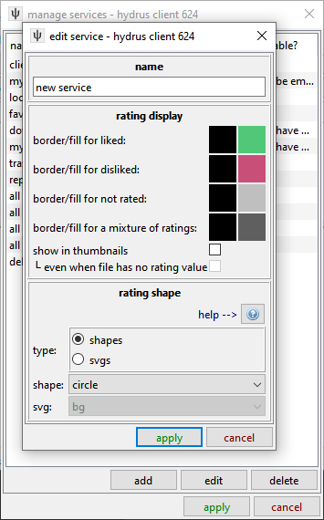
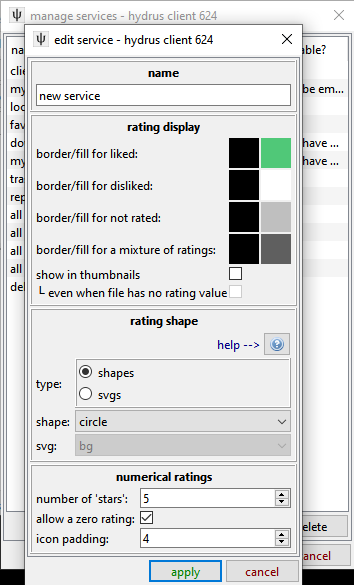

# getting started with ratings  

The hydrus client supports two kinds of ratings: _like/dislike_ and _numerical_. Let's start with the simpler one:

## like/dislike { id="like_dislike" }

A new client starts with one of these, called 'favourites'. It can set one of two values to a file. It does not have to represent like or dislike--it can be anything you want, like 'send to export folder' or 'explicit/safe' or 'cool babes'. Go to _services->manage services->local->like/dislike ratings_:

You can set a variety of colours and shapes.

## numerical

This is '3 out of 5 stars' or '8/10'. You can set the range to whatever whole numbers you like:

As well as the shape and colour options, you can set how many 'stars' to display and whether 0/10 is permitted.

If you change the star range at a later date, any existing ratings will be 'stretched' across the new range. As values are collapsed to the nearest integer, this is best done for scales that are multiples. 2/5 will neatly become 4/10 on a zero-allowed service, for instance, and 0/4 can nicely become 1/5 if you disallow zero ratings in the same step. If you didn't intuitively understand that, just don't touch the number of stars or zero rating checkbox after you have created the numerical rating service!

## now what? { id="using_ratings" }

Ratings are displayed in the top-right of the media viewer:

Hovering over each control will pop up its name, in case you forget which is which. You can set then them with a left- or right-click. Like/dislike and numerical have slightly different click behaviour, so have a play with them to get their feel. Pressing F4 on a selection of thumbnails will open a dialog with a very similar layout, which will let you set the same rating to many files simultaneously.

Once you have some ratings set, you can search for them using system:rating, which produces this dialog:

On my own client, I find it useful to have several like/dislike ratings set up as one-click pseudo-tags, like the 'OP images' above.
