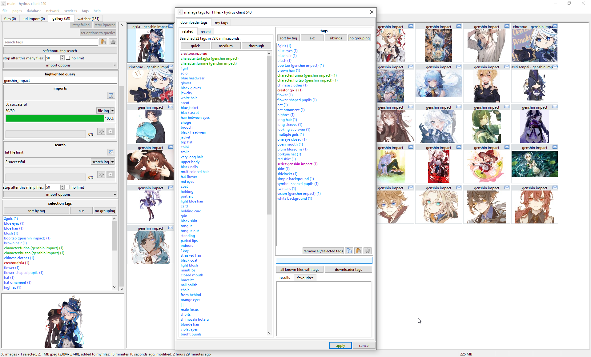
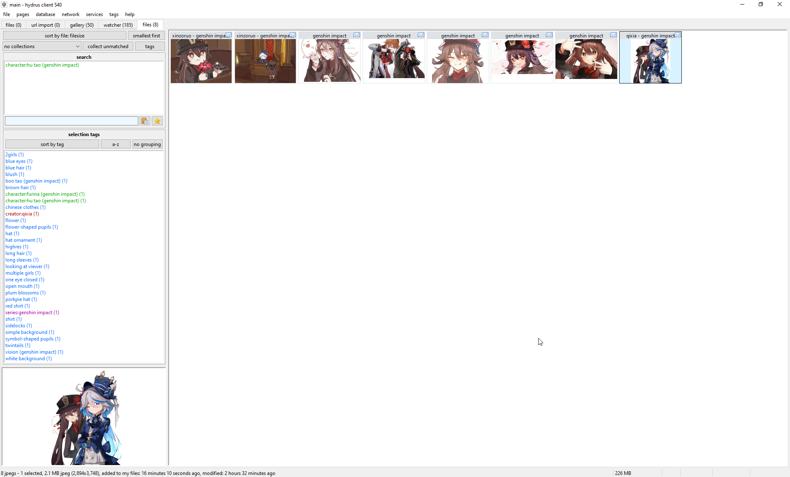
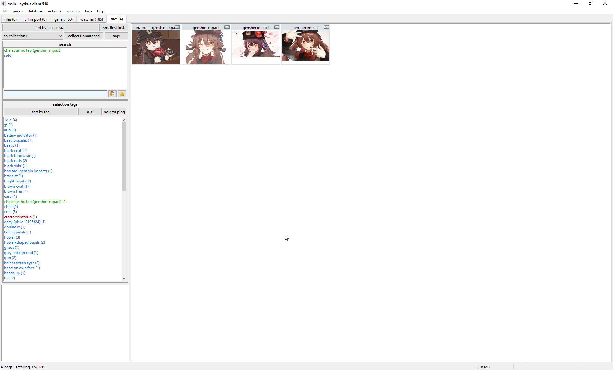

# Getting started with tags
A _tag_ is a small bit of text describing a single property of something. They make searching easy. Good examples are "flower" or "nicolas cage" or "the sopranos" or "2003". By combining several tags together ( e.g. \[ 'tiger woods', 'sports illustrated', '2008' \] or \[ 'cosplay', 'the legend of zelda' \] ), a huge image collection is reduced to a tiny and easy-to-digest sample.

## How do we find files? { id="intro" }

So, you have some files imported. Let's give them some tags so we can find them again later.

[FAQ: what is a tag?](faq.md#tags)

Your client starts with two [local tags services](getting_started_tags.md#tag_services), called 'my tags' and 'downloader tags' which keep all of their file->tag mappings in your client's database where only you can see them. 'my tags' is a good place to practise.

Select a file and press F3 to open the _manage tags dialog_:

The area below where you type is the 'autocomplete dropdown'. You will see this on normal search pages too. Type part of a tag, and matching results will appear below. Since you are starting out, your 'my tags' service won't have many tags in it yet, but things will populate fast! Select the tag you want with the arrow keys and hit enter. If you want to remove a tag, enter the exact same thing again or double-click it in the box above.

Prefixing a tag with a category and a colon will create a [_namespaced_ tag](faq.md#namespaces). This helps inform the software and other users about what the tag is. Examples of namespaced tags are:

*   `character:batman`
*   `series:street fighter`
*   `person:jennifer lawrence`
*   `title:vitruvian man`

The client is set up to draw common namespaces in different colours, just like boorus do. You can change these colours in the options.

Once you are happy with your tag changes, click 'apply', or hit F3 again, or simply press Enter on the text box while it is empty. The tags are now saved to your database.

!!! note "Media Viewer Manage Tags"
    You can also open the _manage tags dialog_ from the full media viewer, but note that this one does not have 'apply' and 'cancel' buttons, only 'close'. It makes its changes instantly, and you can keep using the rest of the program while it is open (it is a non-'modal' dialog).
    
    Also, you need not close the media viewer's _manage tags dialog_ while you browse. Just like you can hit Enter on the empty text box to close the dialog, hitting Page Up/Down navigates the parent viewer Back/Forward!
    
    ??? Also
        Hit Arrow Up/Down on an empty text input to switch between the tag service tabs!

Once you have some tags set, typing the first few characters of one in on a search page will show the counts of all the tags that start with that. Enter the one you want, and the search will run:

If you add more 'predicates' to a search, you will limit the results to those files that match every single one:

You can also exclude a tag by prefixing it with a hyphen (e.g. `-solo`).

You can add as many tags as you want. In general, the more search predicates you add, the smaller and faster the results will be, but some types of tag (like excluded `-tags`), or the cleverer `system` tags that you will soon learn about, can be suddenly CPU expensive. If a search takes more than a few seconds to run, a 'stop' button appears by the tag input. It cancels things out pretty quick in most cases.
