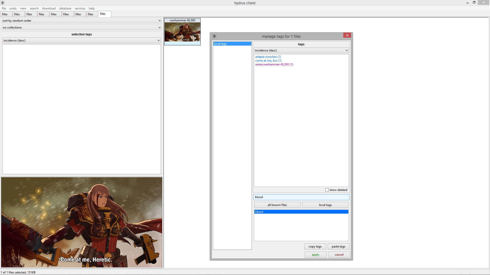

# Getting started with tags
A _tag_ is a small bit of text describing a single property of something. They make searching easy. Good examples are "flower" or "nicolas cage" or "the sopranos" or "2003". By combining several tags together ( e.g. \[ 'tiger woods', 'sports illustrated', '2008' \] or \[ 'cosplay', 'the legend of zelda' \] ), a huge image collection is reduced to a tiny and easy-to-digest sample.

## How do we find files? { id="intro" }

So, you have some files imported. Let's give them some tags so we can find them again later.

[FAQ: what is a tag?](faq.md#tags)

Your client starts with two [local tags services](getting_started_tags.md#tag_services), called 'my tags' and 'downloader tags' which keep all of their file->tag mappings in your client's database where only you can see them. 'my tags' is a good place to practise.

Select a file and press F3:

The area below where you type is the 'autocomplete dropdown'. You will see this on normal search pages too. Type part of a tag, and matching results will appear below. Since you are starting out, your 'my tags' service won't have many tags in it yet, but things will populate fast! Select the tag you want with the arrow keys and hit enter. If you want to remove a tag, enter the exact same thing again or double-click it in the box above.

Prefixing a tag with a category and a colon will create a [_namespaced_ tag](faq.md#namespaces). This helps inform the software and other users about what the tag is. Examples of namespaced tags are:

*   `character:batman`
*   `series:street fighter`
*   `person:jennifer lawrence`
*   `title:vitruvian man`

The client is set up to draw common namespaces in different colours, just like boorus do. You can change these colours in the options.

Once you are happy with your tags, hit 'apply' or just press enter on the text box when it is empty.

The tags are now saved to your database. On any search page, you can now type one in and be able to find everything with that tag::

If you add more 'search predicates' to a search, you will limit the results to those files that match every single one:

You can also exclude a tag by prefixing it with a hyphen (e.g. `-heresy`).
