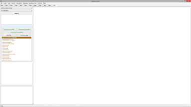
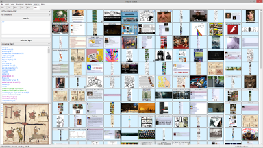
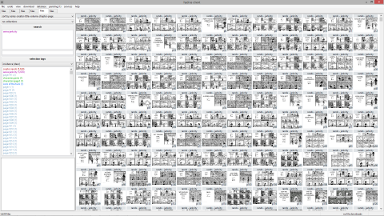
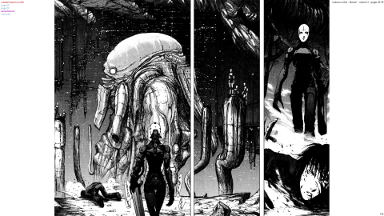
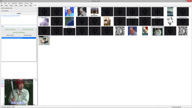

# hydrus network - client and server

The hydrus network client is a file-management application written for internet-fluent media nerds who have large file collections. It browses with tags instead of folders, a little like a booru on your desktop. If they wish, users can easily share tags anonymously through a public server. Everything is free, no ads, and privacy is the first concern. If you have 10,000+ files and cannot find anything, hydrus might help!

Hydrus supports various filetypes for images, video and audio files, image project files, and more. A full list of supported filetypes is [here](filetypes.md). On the Windows and Linux builds, an MPV window is embedded to play video and audio smoothly. Some supported filetypes cannot be viewed directly in the client, such as PDF, but it is easy to launch any file with your OS's default program.

I am continually working on the software and try to put out a new release every Wednesday by 8pm EST. Executable releases are available for Windows and Linux, but the program is in python, so you can also just run it straight from the source code in Windows, Linux, or macOS. I welcome feedback of any sort and will try to get back to any pings every Saturday.

The client can download files and parse tags and other metadata from a number of websites, including the popular imageboards and boorus, and some gallery sites. It can be extended to download from more locations using easily shareable user-made downloaders. It can also be set to 'subscribe' to any gallery search, repeating it every few days to keep up with new results.

The program's emphasis is on your freedom. You control everything, and the program never phones home. In the same way, it is quite an advanced program, and not a beautiful one, so it isn't for everyone. Try it out, see if you like it!

## Start Here

If you would like to try hydrus, I _**strongly**_ recommend you check out the **[help and getting started guide](introduction.md)**. It will take you through all the main systems.

## links

* [homepage](https://hydrusnetwork.github.io/hydrus/)
* [github](https://github.com/hydrusnetwork/hydrus) ([latest build](https://github.com/hydrusnetwork/hydrus/releases/latest)) ([releases](https://github.com/hydrusnetwork/hydrus/releases))
* [issue tracker](https://github.com/hydrusnetwork/hydrus/issues)
* [email](mailto:hydrus.admin@gmail.com)
* [discord](https://discord.gg/wPHPCUZ)
* [tumblr](https://hydrus.tumblr.com)
* [x](https://x.com/hydrusnetwork)
* [patreon](https://www.patreon.com/hydrus_dev)
* [user-run repository and wiki (including download presets for several non-default boorus)](https://github.com/CuddleBear92/Hydrus-Presets-and-Scripts)
* [more links and contact info](contact.md)

## Screenshots

 
 
 
 
 
 
 
 
 

