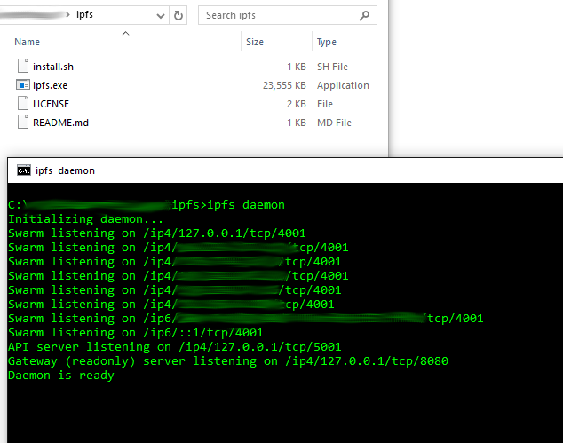
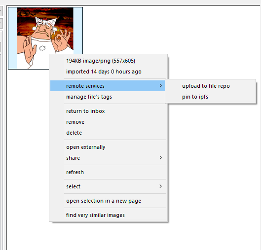
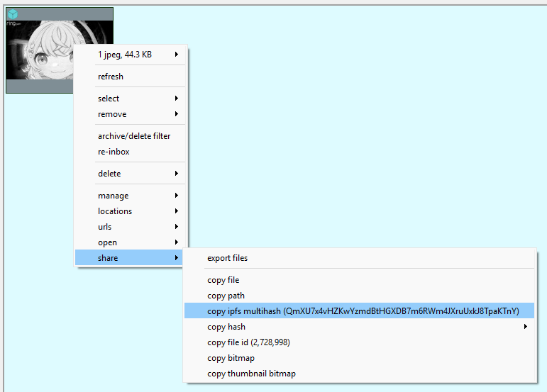
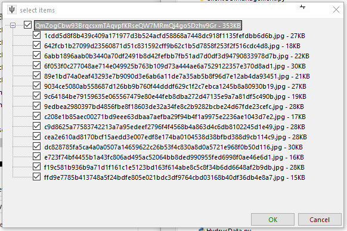
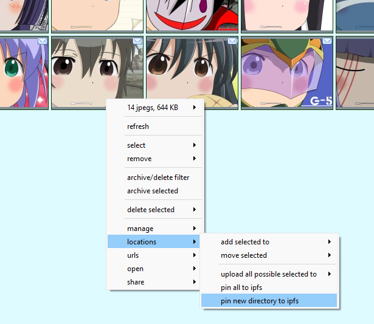
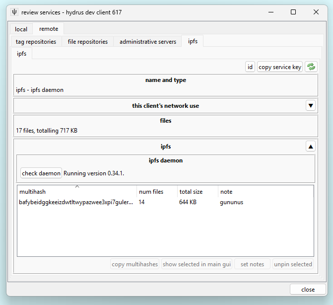

# IPFS

IPFS is a p2p protocol that makes it easy to share many sorts of data. The hydrus client can communicate with an IPFS daemon to send and receive files.

You can read more about IPFS from [their homepage](http://ipfs.io), or [this guide](https://medium.com/@ConsenSys/an-introduction-to-ipfs-9bba4860abd0) that explains its various rules in more detail.

For our purposes, we only need to know about these concepts:

*   **IPFS daemon** \-\- A running instance of the IPFS executable that can talk to the larger network.
*   **IPFS multihash** \-\- An IPFS-specific identifier for a file or group of files.
*   **pin** \-\- To tell our IPFS daemon to host a file or group of files.
*   **unpin** \-\- To tell our IPFS daemon to stop hosting a file or group of files.

## getting ipfs { id="getting_ipfs" }

_Note there is now a nicer desktop package [here](https://docs.ipfs.io/install/ipfs-desktop/). I haven't used it, but it may be a nicer intro to the program._

Get the prebuilt executable [here](https://docs.ipfs.io/install/command-line/). Inside should be a very simple 'ipfs' executable that does everything. Extract it somewhere and open up a terminal in the same folder, and then type:

*   `ipfs init`
*   `ipfs daemon`

The IPFS exe should now be running in that terminal, ready to respond to requests:

You can kill it with ++ctrl+c++ and restart it with the `ipfs daemon` call again (you only have to run `ipfs init` once).

When it is running, opening [this page](http://127.0.0.1:8080/ipfs/QmfM2r8seH2GiRaC4esTjeraXEachRt8ZsSeGaWTPLyMoG) should download and display an example 'Hello World!' file from \~\~\~across the internet\~\~\~.

Your daemon listens for other instances of ipfs using port 4001, so if you know how to open that port in your firewall and router, make sure you do.

## connecting your client { id="connecting" }

IPFS daemons are treated as services inside hydrus, so go to _services->manage services->remote->ipfs daemons_ and add in your information. Hydrus uses the API port, default 5001, so you will probably want to use credentials of `127.0.0.1:5001`. You can click 'test credentials' to make sure everything is working.

Thereafter, you will get the option to 'pin' and 'unpin' from a thumbnail's right-click menu, like so:

This works like hydrus's repository uploads--it won't happen immediately, but instead will be queued up at the pending menu. Commit all your pins when you are ready:

Notice how the IPFS icon appears on your pending and pinned files. You can search for these files using 'system:file service'.

Unpin works the same as pin, just like a hydrus repository petition.

Right-clicking any pinned file will give you a new 'share' action:

Which will put it straight in your clipboard. In this case, it is [QmP6BNvWfkNf74bY3q1ohtDZ9gAmss4LAjuFhqpDPQNm1S](http://127.0.0.1:8080/ipfs/QmP6BNvWfkNf74bY3q1ohtDZ9gAmss4LAjuFhqpDPQNm1S).

If you want to share a pinned file with someone, you have to tell them this multihash. They can then:

*   View it through their own ipfs daemon's gateway, at `http://127.0.0.1:8080/ipfs/[multihash]`
*   View it through a public web gateway, such as the one the IPFS people run, at `http://ipfs.io/ipfs/[multihash]`
*   Download it through their ipfs-connected hydrus client by going _pages->new download popup->an ipfs multihash_.

## directories { id="directories" }

If you have many files to share, IPFS also supports directories, and now hydrus does as well. IPFS directories use the same sorts of multihash as files, and you can download them into the hydrus client using the same _pages->new download popup->an ipfs multihash_ menu entry. The client will detect the multihash represents a directory and give you a simple selection dialog:

You may recognise those hash filenames--this example was created by hydrus, which can create ipfs directories from any selection of files from the same right-click menu:

Hydrus will pin all the files and then wrap them in a directory, showing its progress in a popup. Your current directory shares are summarised on the respective _services->review services_ panel:

## additional links { id="additional_links" }

If you find you use IPFS a lot, here are some add-ons for your web browser, as recommended by /tech/:

This script changes all bare ipfs hashes into clickable links to the ipfs gateway (on page loads):

- [https://greasyfork.org/en/scripts/14837-ipfs-hash-linker](https://greasyfork.org/en/scripts/14837-ipfs-hash-linker)

These redirect all gateway links to your local daemon when it's on, it works well with the previous script:

- [https://github.com/lidel/ipfs-firefox-addon](https://github.com/lidel/ipfs-firefox-addon)
- [https://github.com/dylanPowers/ipfs-chrome-extension](https://github.com/dylanPowers/ipfs-chrome-extension)
