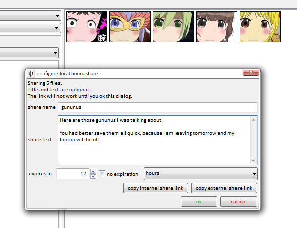

# local booru  

!!! warning
	This was a fun project, but it never advanced beyond a prototype. The future of this system is other people's nice applications plugging into the [Client API](client_api.md).

The hydrus client has a simple booru to help you share your files with others over the internet.

First of all, this is **hosted from your client**, which means other people will be connecting to your computer and fetching files you choose to share from your hard drive. If you close your client or shut your computer down, the local booru will no longer work.

## how to do it { id="setting_up" }

First of all, turn the local booru server on by going to _services->manage services_ and giving it a port:

It doesn't matter what you pick, but make it something fairly high. When you ok that dialog, the client should start the booru. You may get a firewall warning.

Then right click some files you want to share and select _share->local booru_. This will throw up a small dialog, like so:

This lets you enter an optional _name_, which titles the share and helps you keep track of it, an optional _text_, which lets you say some words or html to the people you are sharing with, and an _expiry_, which lets you determine if and when the share will no longer work.

You can also copy either the internal or external link to your clipboard. The internal link (usually starting something like `http://127.0.0.1:45866/`) works inside your network and is great just for testing, while the external link (starting `http://[your external ip address]:[external port]/`) will work for anyone around the world, **as long as your booru's port is being forwarded correctly**.

If you use a dynamic-ip service like [No-IP](https://www.noip.com/), you can replace your external IP with your redirect hostname. You have to do it by hand right now, but I'll add a way to do it automatically in future.

!!! danger
	Note that anyone with the external link will be able to see your share, so make sure you only share links with people you trust.

## forwarding your port { id="port_forwarding" }

Your home router acts as a barrier between the computers inside the network and the internet. Those inside can see out, but outsiders can only see what you tell the router to permit. Since you want to let people connect to your computer, you need to tell the router to forward all requests of a certain kind to your computer, and thus your client.

If you have never done this before, it can be a headache, especially doing it manually. Luckily, a technology called UPnP makes it a ton easier, and this is how your Skype or Bittorrent clients do it automatically. Not all routers support it, but most do. You can have hydrus try to open a port this way back on _services->manage services_. Unless you know what you are doing and have a good reason to make them different, you might as well keep the internal and external ports the same.

Once you have it set up, the client will try to make sure your router keeps that port open for your client. If it all works, you should see the new mapping appear in your _services->manage local upnp_ dialog, which lists all your router's current port mappings.

If you want to test that the port forward is set up correctly, going to `http://[external ip]:[external port]/` should give a little html just saying hello. Your ISP might not allow you to talk to yourself, though, so ask a friend to try if you are having trouble.

If you still do not understand what is going on here, [this](http://www.howtogeek.com/66214/how-to-forward-ports-on-your-router/) is a good article explaining everything.

If you do not like UPnP or your router does not support it, you can set the port forward up manually, but I encourage you to keep the internal and external port the same, because absent a 'upnp port' option, the 'copy external share link' button will use the internal port.

## so, what do you get? { id="example" }

The html layout is very simple:

* * *

* * *

It uses a very similar stylesheet to these help pages. If you would like to change the style, have a look at the html and then edit install\_dir/static/local\_booru_style.css. The thumbnails will be the same size as in your client.

## editing an existing share { id="editing_shares" }

You can review all your shares on _services->review services_, under _local->booru_. You can copy the links again, change the title/text/expiration, and delete any shares you don't want any more.

## future plans { id="future" }

This was a fun project, but it never advanced beyond a prototype. The future of this system is other people's nice applications plugging into the [Client API](client_api.md).