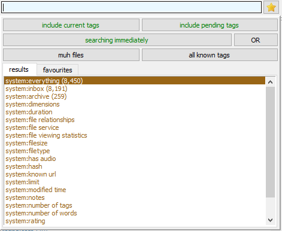

# Searching and sorting
The primary purpose of tags is to be able to find what you've tagged again. For this we have the search feature of Hydrus.

## Searching
Just open a new search page (`pages > new file search page` or <kbd>Ctrl+T</kbd> `> file search`) and start typing away in the search field which should be focused when you first open the page.

### The dropdown controls

Let's look at the tag autocomplete dropdown:

*   **favourite searches star**
    
    Once you get experience with the client, have a play with this. Rather than leaving common search pages open, save them in here and load them up as needed. You will keep your client lightweight and save time.
    
*   **include current/pending tags**
    
    Turn these on and off to control whether tag _search predicates_ apply to tags the exist, or limit just to those pending to be uploaded to a tag repository. Just searching 'pending' tags is useful if you want to scan what you have pending to go up to the PTR--just turn off 'current' tags and search `system:num tags > 0`.
    
*   **searching immediately**
    
    This controls whether a change to the search tags will instantly run the new search and get new results. Turning this off is helpful if you want to add, remove, or replace several heavy search terms in a row without getting UI lag.
    
*   **[OR](/hydrus/docs/searching_and_sorting.md#or-searching)**
    
    You only see this if you have 'advanced mode' on. It lets you enter some pretty complicated tags!
    
*   **file/tag domains**
    
    By default, you will search in 'my files' and 'all known tags' domain. This is the intersection of your local media files (on your hard disk) and the union of all known tag searches. If you search for `character:samus aran`, then you will get file results from your 'my files' domain that have `character:samus aran` in any tag service. For most purposes, this search domain is fine, but as you use the client more, you may want to access different search domains.
    
    For instance, if you change the file domain to 'trash', then you will instead get files that are in your trash. Setting the tag domain to 'my tags' will ignore other tag services (e.g. the PTR) for all tag search predicates, so a `system:num_tags` or a `character:samus aran` will only look 'my tags'.
    
    Turning on 'advanced mode' gives access to more search domains. Some of them are subtly complicated and only useful for clever jobs--most of the time, you still want 'my files' and 'all known tags'.

Hydrus will treat a space the same way as an underscore when searching so the query `character:samus aran` will find files tagged with `character:samus aran` and `character:samus_aran`.

Tags will be searchable by all its [siblings](/advanced_siblings.md). If there's a sibling for `large` -> `huge` then the query `large` will find files tagged with either and so will a search for `huge`. This goes for the whole sibling chain, no matter how deep or a tag's position in it.

### Wildcards

The autocomplete tag dropdown supports wildcard searching with `*`.

The `*` will match any number of characters. Every normal autocomplete search has a secret `*` on the end that you don't see, which is how full words get matched from you only typing in a few letters.

This is useful when you can only remember part of a word, or can't spell part of it. You can put `*` characters anywhere, but you should experiment to get used to the exact way these searches work. Some results can be surprising!

You can select the special predicate inserted at the top of your autocomplete results (the highlighted `*gelion` and `*va*ge*` above). **It will return all files that match that wildcard,** i.e. every file for every other tag in the dropdown list.

This is particularly useful if you have a number of files with commonly structured over-informationed tags, like this:

In this case, selecting the `title:cool pic*` predicate will return all three images in the same search, where you can conveniently give them some more-easily searched tags like `series:cool pic` and `page:1`, `page:2`, `page:3`.

### System predicates
Tags are intended to tell you about content in the file while system predicates on the other hand deals with the files themselves for the most part: How big a file is, resolution, number of pixels, sound or no sound, number of tags assigned to the file, time imported, and quite a few other things. System predicates are the things prefixed with `system:` in the window that appear when you click in the search box.

## OR searching
Searches find files that match every search 'predicate' in the list (it is an **AND** search), which makes it difficult to search for files that include one **OR** another tag. For example the query `red eyes` **AND** `green eyes` (aka what you get if you enter each tag by itself) will only find files that has both tags. While the query `red eyes` **OR** `green eyes` will present you with files that are tagged with red eyes or green eyes, or both.

More recently, simple OR search support was added. All you have to do is hold down ++shift++ when you enter/double-click a tag in the autocomplete entry area. Instead of sending the tag up to the active search list up top, it will instead start an under-construction 'OR chain' in the tag results below:

You can keep searching for and entering new tags. Holding down ++Shift++ on new tags will extend the OR chain, and entering them as normal will 'cap' the chain and send it to the complete and active search predicates above.

Any file that has one or more of those OR sub-tags will match.

If you enter an OR tag incorrectly, you can either cancel or 'rewind' the under-construction search predicate with these new buttons that will appear:

You can also cancel an under-construction OR by hitting Esc on an empty input. You can add any sort of search term to an OR search predicate, including system predicates. Some unusual sub-predicates (typically a `-tag`, or a very broad system predicate) can run very slowly, but they will run much faster if you include non-OR search predicates in the search:

This search will return all files that have the tag `fanfic` and one or more of `medium:text`, a positive value for the like/dislike rating 'read later', or PDF mime.

There's a more advanced OR search function available by pressing the OR button. Previous knowledge of operators expected and required.

## Sorting
At the top-left of most pages there's a `sort by: ` dropdown menu. Most of the options are self-explanatory. They do nothing except change in what order Hydrus presents the currently searched files to you.

Default sort order and more `sort by: namespace` are found in `file -> options -> sort/collect`.

### Sorting with `system:limit`

If you add `system:limit` to a search, the client will consider what that page's file sort currently is. If it is simple enough--something like file size or import time--then it will sort your results before they come back and clip the limit according to that sort, getting the n 'largest file size' or 'newest imports' and so on. This can be a great way to set up a lightweight filtering page for 'the 256 biggest videos in my inbox'.

If you change the sort, hydrus will not refresh the search, it'll just re-sort the n files you have. Hit F5 to refresh the search with a new sort.

Not all sorts are supported. Anything complicated like tag sort will result in a random sample instead.

## Collecting
Collection is found under the `sort by: ` dropdown and uses namespaces listed in the `sort by: namespace` sort options. The new namespaces will only be available in new pages.